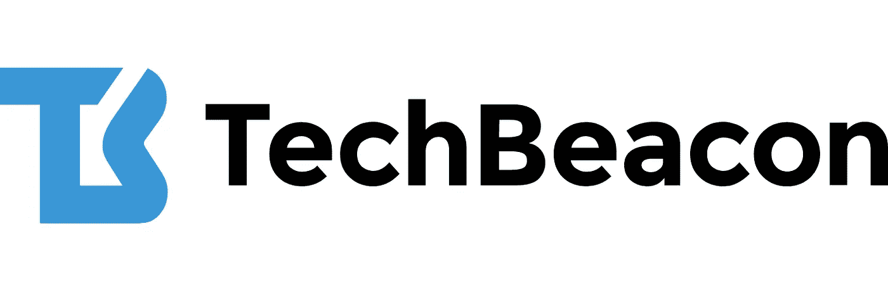

# 改变我软件测试工程师生活的 5 个博客

> 原文：<https://blog.devgenius.io/5-blogs-that-changed-my-software-test-engineer-life-9846a72a7647?source=collection_archive---------3----------------------->

明白了。读一下。分享一下。

由 [Freepik](https://www.freepik.com/free-photo/joyful-black-author-works-writing-new-book-readers_12084411.htm#&position=0) 上的 [wayhomestudio](https://www.freepik.com/wayhomestudio) 拍摄的照片

发现 5 个博客，它们改变了我的工作方式，并让我作为一名软件测试工程师不断学习。

[**谷歌测试博客**](https://testing.googleblog.com/)

这个博客彻底改变了我的工作方式，我真希望我能早点发现这一点。我很惊讶地看到 Google 有一个关于软件测试的博客，而且它经常更新，包含许多非常有趣的文章。

**S** [**软件测试周报**](https://softwaretestingweekly.com/)

《软件测试周刊》是一个博客，每周提供由 Dawid Dylowicz 亲自挑选的最好的软件测试新闻，并发送到你的邮箱。

它提供了通用软件测试知识、测试自动化、测试工具等等的链接。

[**TestProject 博客**](https://blog.testproject.io/)

关于 TestProject 博客，我最喜欢的是文章作者的真实观点。只要你有有趣和有帮助的内容，任何人都可以对博客做出贡献。当你进入软件测试自动化时，我有机会分享我获得这些长期利益的方法。
发现[测试自动化的 10–1O-1O 规则。](https://blog.testproject.io/2021/07/21/the-10-10-10-rule-of-test-automation/)

[**TechBeacon**](https://techbeacon.com/app-dev-testing)

TechBeacon 是一个面向软件工程、IT 和安全专业人员的数字中心，分享应对现实世界挑战的实用而热情的指导。

[all 4 test](https://www.all4test.fr/)

如果你像我一样说法语，并且你正在用法语寻找一个关于软件测试的博客？那么这个博客是给你的。法语中通常没有太多关于软件测试的内容，所以这个博客就像一块宝石。真的很有趣，很有用。

**奖金:**看看[测试部博客供稿](https://www.ministryoftesting.com/feeds/blogs)。你会发现有趣的链接。

感谢阅读！