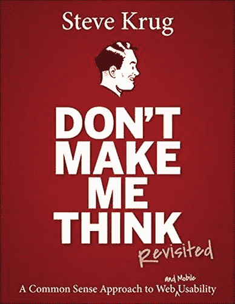
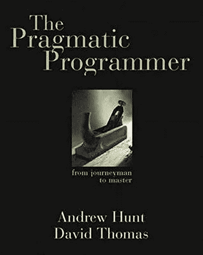
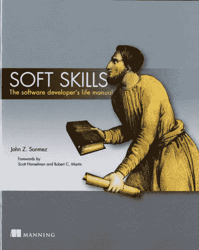
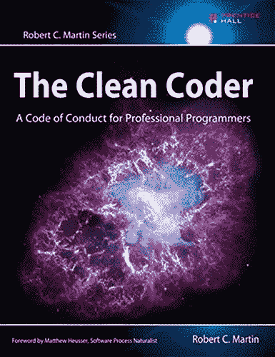
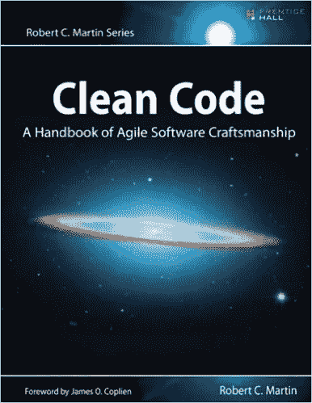

# 2020 年底前，每个网络开发者都应该阅读的 5 本书

> 原文：<https://blog.devgenius.io/5-books-every-web-developer-should-read-before-the-end-of-2020-f32252a5f7e0?source=collection_archive---------12----------------------->

## 软件开发

[粘土银行](https://unsplash.com/@claybanks?utm_source=unsplash&utm_medium=referral&utm_content=creditCopyText)在 [Unsplash](https://unsplash.com/s/photos/library?utm_source=unsplash&utm_medium=referral&utm_content=creditCopyText) 拍摄的照片

我知道你想提高自己作为一名网站开发者的水平。我是说，你为什么会点击这篇文章？虽然有大量的文章告诉你应该阅读哪些书籍来提高 web 开发，但是我想给你一个书籍列表来帮助你作为一个开发人员提高。

以下书籍涵盖了广泛的主题，包括:

*   Web 开发术语(可访问性、浏览器特性等。)
*   前端框架
*   提高代码质量和开发实践
*   让你成为更好的开发者的软技能
*   改善职业生涯的提示和指南

我的目标是给你一个列表，它涵盖了你作为一个 web 开发者想要提高的几乎所有方面。

我们开始吧！

# 1.[前端开发者手册 2019](https://frontendmasters.com/books/front-end-handbook/2019/)

[书的封面](https://frontendmasters.com/books/front-end-handbook/2019/)

这可能是学习所有 web 开发的最大的集中资源。它的主题范围很广，从学习[前端框架](https://frontendmasters.com/books/front-end-handbook/2019/#6.15) (Angular，React，Vue.js)到网站实践([可访问性](https://frontendmasters.com/books/front-end-handbook/2019/#4.14)，[测试](https://frontendmasters.com/books/front-end-handbook/2019/#4.35)， [HTML & CSS](https://frontendmasters.com/books/front-end-handbook/2019/#4.8) )到大量的前端[工具](https://frontendmasters.com/books/front-end-handbook/2019/#6)。我相信这个网站有你在学习网络开发时需要寻找的一切。

网站上有多个部分，每个部分都有一个资源列表，供您了解特定主题。这本书足以让你扩展和理解 web 开发的所有方面，并有助于增加你以前没有研究过的主题的知识广度。

这本书更好的地方是什么？是**免费**！

您可以点击访问网站[并开始使用！](https://frontendmasters.com/books/front-end-handbook/2019/)

# 2.[不要让我思考，重温:网站可用性的常识方法](https://amzn.to/32pr1Vr)

[书的封面](https://amzn.to/32pr1Vr)

前端开发人员手册涵盖了 UI(用户界面)的所有内容，但是这本书涵盖了 UX(用户体验)的所有内容。这本书的主要目的是教你直观导航和信息设计的重要性。这些概念将帮助你理解用户如何与你的网站互动，以及你如何提高网站的可用性。

理解用户如何使用你的网站是网站开发最重要的方面之一。如果用户不知道如何使用，拥有一个漂亮的网站是没有意义的。这将提高你对网站交互性的了解，并提高你作为一名网站开发人员的整体能力。

你可以在这里购买这本书！

# 3.[务实的程序员:从熟练工到大师](https://amzn.to/3jaipYL)

[书的封面](https://amzn.to/3jaipYL)

这是迄今为止我最喜欢的编程书籍之一！这本书讲述了软件开发的最基本的概念——接受一个需求并从中产生可工作的、可维护的代码。这本书教你很多内容，从与业务人员交流到正确估计项目时间到重构代码等等！

我从这本书中学到的东西真正改变了我对软件开发的看法。它指导我做出正确的决定，这帮助我成长并成为一名更好的软件开发人员(甚至是 10 倍的开发人员)。你会惊讶于有多少开发人员没有遵循书中的简单概念。当你遵循书中的实践时，你的代码会更加突出。

[这里](https://amzn.to/3jaipYL)是书的链接！

# 4.[软技能:软件开发人员的生活手册](https://amzn.to/2Oz9cLo)

[书的封面](https://amzn.to/2Oz9cLo)

这是关于软件开发人员职业生涯的最佳书籍之一。这本书会给你一些建议和指导，告诉你应该如何对待你的职业，以及你应该朝哪个方向发展。它教你一系列的主题，如如何对待你的工作，工作面试，工资谈判，合同，以及开发人员的整体福利。

我个人在日常生活中使用了这本书里的很多概念，它让我的整体生活方式增加了很多。大学毕业后，我不知道如何接近我的职业生涯。我只是去找工作，当我找到工作后，我就开始在那里工作，差不多就是这样。读这本书让我从一个不同的角度看待这个问题，让我意识到我可以在我的职业生涯中取得更多成就。

你可以在这里购买这本书！

# 5.[清洁编码](https://amzn.to/2CHbPbo) / [清洁编码](https://amzn.to/2Wu2fj4)

[书籍封面](https://www.amazon.ca/s?k=clean+code&i=stripbooks&ref=nb_sb_noss_2)

我在这一部分包括了两本书，因为它们可以互换阅读。

干净代码处理技术技能，这是适当的编码标准和实践，以确保您的代码是高质量的。它涉及的主题包括正确的文档、变量命名、测试实践等等。阅读这本书将大大提高你的整体代码质量，并帮助你生产更多。

干净的程序员处理行为技能，这是作为开发人员应该采用的标准。这包括处理倦怠、如何编写代码、工作环境、时间管理等主题。阅读这本书将有助于你作为一个整体开发人员的提高。

你可以先看哪本书，这取决于你想先了解的主题。尽管如此，我相信你阅读这两本书是为了充分获得作为一名 web 开发人员的好处。

你可以在这里购买干净的代码[，在这里](https://amzn.to/2CHbPbo)购买干净的编码器[！](https://amzn.to/2Wu2fj4)

# 外卖食品

阅读这些书将帮助你在各个方面成为一名更好的 web 开发人员。从学习实际的前端开发概念，适当的编码技术，成为一个更好的软件开发人员，以及如何接近你的软件开发生涯，你会以不同的视角接近 2021 年。

你应该如何阅读这些书完全取决于你。首先解决你想改变的事情，但我认为今年应该专注于提高你的知识(通过阅读这本书)，明年应该应用你学到的东西。这会让你收获最大的收益。

希望这有所帮助！