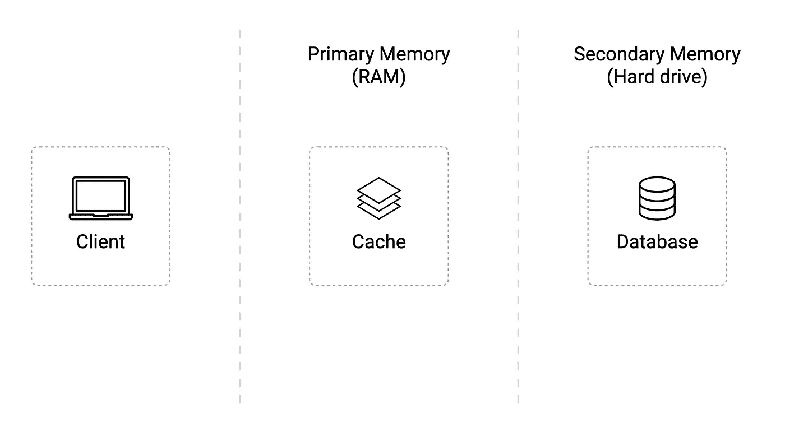
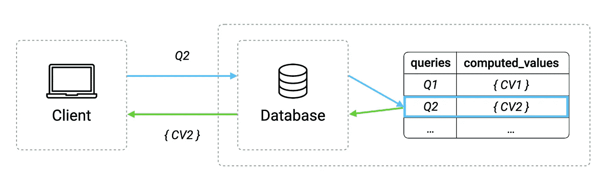
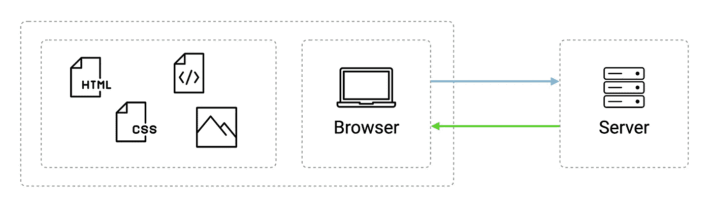
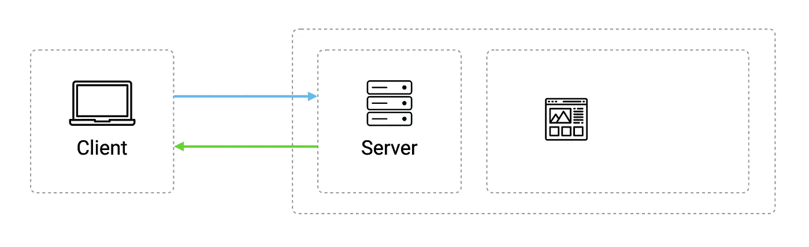
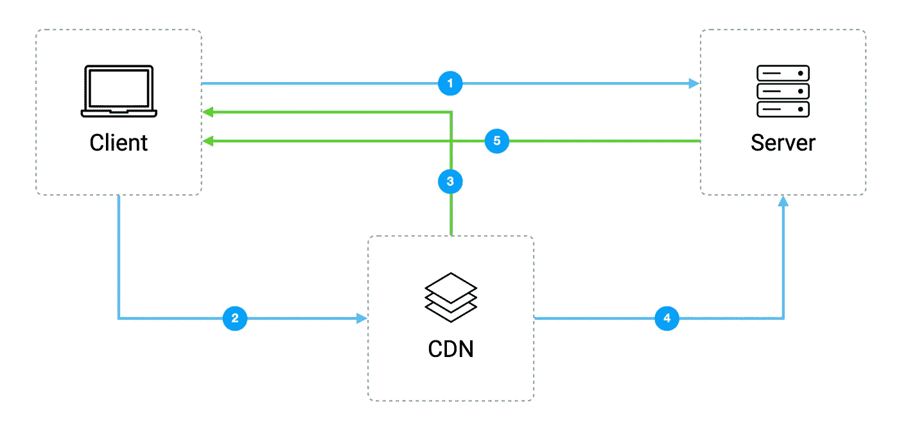

# 您应该知道的 5 个缓存实现

> 原文：<https://blog.devgenius.io/5-caching-implementations-you-should-know-d4c6c7affdc9?source=collection_archive---------6----------------------->

🚀 [**打造分层微服务**](https://learnbackend.dev/books/build-layered-microservices) 这本书出来了！现在就在 [learnbackend.dev](https://learnbackend.dev/books/build-layered-microservices) 购买你自己的副本。

在文章“[缓存模式简介](https://medium.com/@rldsn/an-introduction-to-caching-patterns-839111a4a150)中，我们介绍了用于缓存数据的 4 种不同技术，以及与之相关的 3 个最大挑战。现在让我们来看看作为开发人员应该知道的 5 个最著名和最常用的缓存实现，从内存缓存开始。

# 内存缓存

**内存缓存**指的是存储在随机存取内存中的数据，它通常比传统的数据库和基于磁盘的硬件更快，因为它支持更高的请求速率或 IOPS(代表每秒输入/输出操作数)，最终提高数据检索性能并大规模降低成本。

这种类型的缓存最常见的实现是基于键值存储，这基本上意味着每当您向存储提供唯一的键或标识符时，它将提供相应的值，如数字、字符串、数组、列表和各种其他数据类型。

这种方法是开发人员最喜欢的方法之一，因为它快速、高效且易于理解。

# 数据库缓存

**数据库缓存**是指数据库将频繁查询数据的结果存储在内部缓存中，以避免不必要或过多的查询执行，从而减少其工作量。

例如，在任何社交媒体应用程序上加载用户的个人资料信息都涉及到对多个数据表的复杂查询，在短时间内运行数千次这种查询而不进行缓存可能会给数据库带来太大的压力，最终可能会崩溃或响应过慢，导致级联超时。

# 浏览器缓存

**浏览器缓存**又名 **HTTP 缓存**指的是您的浏览器存储资源，如文本、图像、样式表、脚本和首次加载网页时通过 HTTP 下载的媒体文件。

该缓存用于使访问过的文档可用于后退和前进导航、保存、作为源查看等。不需要额外访问服务器，这也改善了当您试图访问的网站或互联网连接中断时的离线浏览。

因此，下次您访问同一页面时，浏览器可以在您机器上自己的缓存中查找以前存储的资源，最终减少加载延迟和网络流量。

# Web 服务器缓存

**服务器缓存**指的是一种专用的缓存服务，通常是代理服务器，用于存储经常请求和动态生成的内容，如复杂的网页或文件，创建这些内容需要时间。

这样可以减少要做的工作，防止服务器过载，并提高页面交付速度。

# CDN 缓存

最后， **CDN** 或**内容交付网络**是指位于用户和源服务器之间的代理服务器网络，这些代理服务器缓存网页、样式表、脚本和媒体文件等内容。

通常在物理上更靠近客户端的位置，它的目标是拦截客户端对资源的请求，如果它拥有资源的副本，就立即传递它或将请求转发到源服务器。

它可以极大地减少网络延迟和对源服务器的资源请求数量，这些资源被大量请求或需要快速加载。

# 下一步是什么？

不要忘记👏🏻x50 如果你喜欢读我的作品！

👉你喜欢这种内容？在 https://learnbackend.dev 上查看《如何使用 Express framework 构建生产就绪的分层认证微服务》一书 [**构建分层微服务**](https://learnbackend.dev/books/build-layered-microservices) ，该书从第一行代码到最后一行文档都符合开发实践和软件架构方面的行业标准。