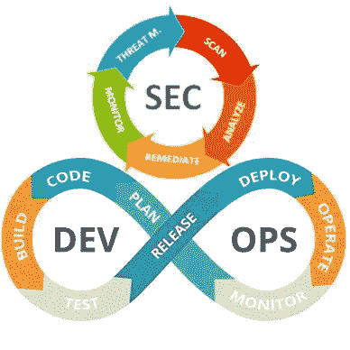

# DevSecOps 中 Sec 的 5 个循环阶段

> 原文：<https://blog.devgenius.io/5-circular-phases-of-sec-in-devsecops-f5c00068d1e3?source=collection_archive---------9----------------------->

在 Appsec 和 DevOps 不断变化的格局中，我们最近开始谈论转移中心而不是左移。这是因为在 DevOps symbol 完美演示的软件开发的循环运动中没有右或左。您还可以通过 5 个连续的循环阶段转移中心并将 Sec 整合到整个 DevOps 中；

–威胁建模

–扫描

–分析

–补救

–监视器

在深入每个阶段之前，值得注意的是，与 DevOps 一样，DevSecOps 也是一个文化问题。除了测试你的技术专长，建立一个可靠的 DevSecOps 管道也将测试你的软技能。与各种团队成员合作并定义双方同意的流程和指标将是可持续工作流的关键。

一旦您定义了流程并说服了人们，AppSec 工具就会在第三个位置发挥作用，这应该是您最不需要担心的。工具和人员会随着时间的推移而改变，但是您通过流程和指标创建的文化决定了 DevSecOps 的可持续性。

现在让我们来看看成功采用 DevSecOps 需要经历的步骤。

# **威胁建模**

没有意识到通过主动思考可以节省的时间，威胁建模通常是 DevSecOps 中最容易被忽略的阶段。一个合适的威胁模型会考虑可能的攻击场景，规划应用程序中敏感数据的流动，寻找威胁的缓解措施，并在每次应用程序的设计发生变化或出现新功能时重复这一过程。

不仅有助于提高所有利益相关者对安全架构的了解，甚至在漏洞存在之前就将其消除，而且威胁建模还允许在分析阶段更快地做出决策。

在自助服务模型中，每个团队为 sprint 中包含的每个工作项进行威胁建模，这对于在组织内传播防御性编程方法是非常有用的。可以在规划阶段填写包含某些问题的问卷模板，以便以标准化的方式识别风险因素，并相应地进行编码。评估风险时要问的一些一级问题可能是:

*   成功攻击的技术难度是什么？
*   成功攻击的最坏结果可能是什么？
*   有多少用户会受到影响？
*   可以被窃取的数据有多敏感？
*   目标有多容易接近？

OWASP Threat Dragon 是一个开源的威胁建模工具，可以作为初学者的有用垫脚石。STRIDE 是一种用于识别和分类安全威胁的模型，代表六种类型的威胁:

*   电子欺骗
*   篡改
*   拒绝
*   信息披露
*   拒绝服务
*   特权提升

# **扫描**

这个阶段包括用于识别漏洞的所有手动或自动方法。

直到几年前，渗透测试还是大多数企业的唯一解决方案。在识别复杂的漏洞(如业务逻辑缺陷)方面，它们仍然比自动扫描器好得多。然而，它们的不连续性质迫使企业采用 AppSec 工具，在其开发管道中连续运行安全性测试。

在 DevOps 的不同阶段运行的自动扫描器在发现易受攻击的漏洞方面发挥着至关重要的作用，这些漏洞是复杂攻击中利用链中最常见的元素。令人惊讶的是，大多数时候网络攻击的目标不是零日漏洞，而是这些众所周知且容易发现的漏洞。

虽然使用 SAST 或 SCA 工具在开发运维的编码和构建阶段执行安全测试对于通过尽早发现漏洞来最大限度地降低修复漏洞的成本至关重要，但在测试阶段仍然需要 DAST，以通过攻击者的视角执行块盒测试，并确保在生产前没有门未锁。

IAST，没有假阳性结果，易于补救，也越来越受欢迎。不利的一面是，代码插装使其成为特定于语言的，不同编程语言之间的性能会有很大差异。IAST 的覆盖率也依赖于测试人员所执行的测试场景，这使得它的效率依赖于用户。

无论在编码和测试阶段使用什么技术，安全扫描在部署阶段之后都会继续进行，以确保运行应用程序的容器和基础设施(如端口和操作系统)不会受到攻击。

尽管在 DevOps 中有各种各样的工具用于不同的目的，但最近我们在市场上看到了整合的努力。被称为软件开发平台的工具现在正在启用 CI/CD 功能，或者将源代码分析器添加到它们的产品中，并且主要的云托管服务也添加了某些扫描功能。这对于从一个地方管理 AppSec 和 DevOps 交叉点上的任务是一个积极的发展。

强烈建议您检查您的软件开发平台和云托管服务中的任何嵌入式扫描器，以便在其他人投入生产之前开始扫描您的代码并找出漏洞。

还有许多开源的 SAST、DAST、SCA 和容器安全工具，您可以立即开始使用。如果你仍然声称你没有足够的资金来开始在 DevSecOps 的 Sec 上工作，是时候停止抱怨并卷起袖子了。

Bug bounty 程序还可以方便地发现根深蒂固的漏洞，这对于拥有足够人力资源来检查所报告漏洞的可靠性以及为项目提供资金的组织来说是理想的。因此，如果你依靠你的组织的资源，值得给他们一个机会。

# **分析**

扫描只是在外部攻击者之前识别漏洞的一种手段。决定你成功的是你之后如何处理这些漏洞。您需要关联来自多个扫描器的漏洞，消除误报，并优先考虑最关键的漏洞，以便快速补救。此时的一个主要挑战是将漏洞分散在不同的扫描器中，并进行耗时的手动整合活动。

无论组织的规模如何，在当今世界，安全团队几乎总是人手不足。不久的将来希望渺茫，预计到 2021 年，全球网络安全领域的空缺职位将达到 350 万个。对于 AppSec 来说更是如此，因为它是网络安全的一个相对较新的领域，人才储备不像网络安全那么丰富。考虑到人员的短缺和漏洞的丰富，威胁建模显示出它是快速和准确分析漏洞的救命稻草。

像我们钟爱的 Kondukto 这样的漏洞管理工具也有助于将扫描结果自动输入到他们的平台中，并提供整合和相关漏洞的整体视图。将所有数据放在一个地方可以更准确、更快速地决定哪些漏洞值得修复。确定正确漏洞的优先级是成功的关键，将稀缺资源分配给不相关的漏洞是一个代价高昂的错误。

# **补救**

应用程序安全漏洞大多是由软件开发人员修复的，这是比以往任何时候都更需要软技能的阶段。软件开发人员和安全工程师的优先级和技能完全不同，如果没有可靠的流程，漏洞就会像钟摆一样在安全工程师和开发人员之间来回摆动，从而导致两个团队之间无休止的冲突。

最困难的部分是与软件开发人员就可接受的漏洞修复时间达成一致。如果能够做到这一点，未来的对话将更有可能由数据驱动，而不是一时的情绪，而且数字会自己说话，任何人都不会有藏身之地。

为了缩短修复漏洞的时间，创建一个内部补救 wiki 并让软件开发人员可以访问它是一个有用的策略，在 Kondukto 上也是可行的。如果开发人员有可靠的信息，这些信息是基于同行以前关于如何解决问题的经验，那么找到问题的正确解决方案的时间就会大大缩短。

# **监视器**

只有当您拥有可测量的指标时，监控才有意义。就像在 DevOps 的 monitor 阶段一样，这个阶段包括跟踪我们离指标的目标值有多远。实际值和目标值之间的差异为识别瓶颈和平滑粗略的过程铺平了道路。

可以为每个阶段定义单独的指标，例如具有适当威胁模型的项目百分比、SAST 扫描的覆盖范围、分配给开发人员进行补救的漏洞数量、修复漏洞的平均时间等等。在每个阶段都有北极星指标，可以更容易地确定哪些阶段表现良好，哪些阶段仍有改进的空间。

设置指标并定期跟踪将有助于您在整个组织范围内形成意识，并在需要衡量 Sec 计划的效率时引导数据驱动的对话。

记住，循环并没有在这里结束，因为我们有一个循环流动。现在是时候回到威胁建模来调整我们做错了什么，并尝试这次做得更好。

是的，会有起伏，这并不容易，但让塞缪尔·贝克特的这些话给你勇气，下次当你觉得有什么不对劲的时候。

# “试过了。曾经失败过。没关系。再试一次。再次失败。失败得更好。”