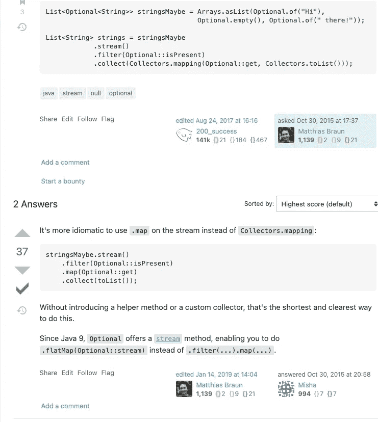

# 经验丰富的开发人员使用的 5 个建设性的 Java 代码评审注释

> 原文：<https://blog.devgenius.io/5-constructive-java-code-review-comments-that-seasoned-developers-use-f15f7f409f96?source=collection_archive---------1----------------------->

## Java 专家使用这些高质量的代码评审注释来给出有价值的反馈


照片由[马体·米罗什尼琴科](https://www.pexels.com/@tima-miroshnichenko?utm_content=attributionCopyText&utm_medium=referral&utm_source=pexels)从[佩克斯](https://www.pexels.com/photo/woman-in-black-blazer-holding-white-tablet-computer-7567605/?utm_content=attributionCopyText&utm_medium=referral&utm_source=pexels)拍摄

*即使你看到 Java 的问题，你也认可 PR。您不希望因为可选性而拖延代码审查过程。你知道更好的解决方案，而不是匿名类，但你没有说出来。*

大多数开发人员毫无异议地批准代码评审。即使他们有异议。由于他们不知道如何评论，他们批准了公关，然后继续前进。

这里有一些方法可以用于代码评审注释。使用这些来给出高质量的反馈，接受表扬，并改进你的代码。

# 你应该如何应对选择性误用？

你会看到很多误用。或者你现在能看到很多。

假设你看到了这样的东西:

```
// ...Optional.of(getDocument()).orElse(getFallbackDocument());//...
```

你现在知道`orElseGet`和`orElse`是什么意思了。你知道[](https://stackoverflow.com/questions/33170109/difference-between-optional-orelse-and-optional-orelseget)*`[*orElse*](https://stackoverflow.com/questions/33170109/difference-between-optional-orelse-and-optional-orelseget)`[*和*](https://stackoverflow.com/questions/33170109/difference-between-optional-orelse-and-optional-orelseget) `[*orElseGet*](https://stackoverflow.com/questions/33170109/difference-between-optional-orelse-and-optional-orelseget)` [*的区别。*](https://stackoverflow.com/questions/33170109/difference-between-optional-orelse-and-optional-orelseget)*

*这里的问题是如何评论这个问题。你可以这样写:*

```
*Please change orElse to orElseGet instead.*
```

*这个评论不会给出太多的价值。*为什么作者要把* `*orElseGet*` *？有什么好处？你没有展示好处，所以显得有点无礼。**

*那么你能写些什么来代替呢？*

```
*This will work but it could cause nasty bugs. The method within the orElse block will get executed even though the Optional is present. If there are side effects within the supplier or method in orElse, this could cause bugs.Let's see if there are other places where orElse+method exists so we can refactor.*
```

*也要提供证据。你可以把关于这个问题的讨论联系起来，比如。或者你可以用 [*JShell*](https://docs.oracle.com/javase/9/jshell/introduction-jshell.htm) 来证明你的观点。证明你的主张仍然成立，否则你会在两端浪费时间。*

# *你在公共关系上看到匿名的例子*

*假设您在代码中看到匿名类的实例。*

```
*AnonClass instanceAnon = new AnonClass() {
	@Override... 
}*
```

*这种方法有几个问题。首先，测试是不可能的，因为这个变化。此外，还有从相关代码中抛出的未处理的已检查异常。*

****你可以对这种变化视而不见。****

*因为有太多的评论，你可能会同意。“LGTM！”继续前进。*橡皮图章式的公关根本不会改善代码审查。**

*但这不是在这种情况下所期望的。*

*我也不会对此发表评论。如果可能的话，我会顺其自然。*

*这次谈话会导致与作者的多次交锋。此外，我们会在线程中损失大量时间。最后，我们会延长交货时间。*

****您可以创建新的跟进 PR。****

*你可以加上你认为缺少的一切。我做到了这一点，也在测试中发现了一些其他问题。最后，修复了主要问题，提高了测试覆盖率。*

# *你会看到一个更清洁的溪流解决方案*

*“如果我们像 Y 一样做 X 会不会更好？”*

*作者做了 X，你却觉得 Y 更适合。所以你去写评论。没有任何事先咨询，或探索的话题。*

*如果你很了解 X，那么这个评论没问题。你可以根据你的先验知识给出一个相关的解决方案。*

*即便如此，一些开发者还是喜欢把这些想法作为评论留下。这些假设大部分都不成立。要点是双方，作者和评论家会浪费时间。*

****这些评论有什么问题？****

*他们没什么建设性。他们会把想法留在空中。假设不是你所期望的。假设应该在代码评审之前进行讨论。*

****作者做 X 是有原因的。****

*开发者的 change X 将改进代码库。所以你的评论会破坏开发者的努力。由于您的 Y 方法更好，开发人员可以将此评论视为对其解决方案的冒犯。*

****先试 Y 出来。****

*首先尝试您的解决方案。虽然你的意图是好的，但你可能会提出一个糟糕的解决方案。即使是好意，你也会增加交货时间。*

*例如，你可以有一个`Optional`和`Streams`的解。不尝试解决方案，你就看不到正确的方法。另外，你会明白作者为什么选择 x。*

*探索完了，再回去确认你的说法为什么 X 更好。*

*你在这里不是更好的选择吗？我认为 Y 会是更好的选择，因为它更简洁。”*

*这里有一个很好的评论作为例子。*

**

*[来源](https://codereview.stackexchange.com/questions/109294/filtering-out-empty-optionals)*

# *作者不在乎你的评论*

*假设作者做了以下事情:*

*   *作者评论了你的建议*
*   *作者不在乎你的评论*
*   *寻求他人的认可来规避你的评论*

*如果没什么大不了的，就不会再听到你的建议了。如果这是一件大事，你会应用你的建议。*

*如果没有人愿意在这方面投入更多，我会说让它滑下去吧。稍后，如果问题出现，应用你的解决方案。或者把它包在另一张科技债卷里。*

*如果通过你的建议解决的问题再次出现，你可以指出你的解决方法。你会在团队中赢得更多尊重。*

# *该不该提问？*

*欢迎对 PRs 提出问题。*

*即便如此，您可能会认为“这是如何工作的”注释有点无效。如果作者进行了彻底的测试并对关键点进行了评论，那么就没有必要进行评论。*

****这些评论把公关变成了调查。****

****没有开发者喜欢调查。*** 具体可以参考任务描述。*

**你可以问什么来代替？**

*询问对准则的期望。查明变化的原因。*

*要了解某些东西是如何工作的，请运行测试。如果没有覆盖范围，那就指出来。此外，在检查代码之前，请参考任务定义。*

*你不知道代码是如何工作的——你没有投入足够的精力去学习这项任务。如果你这样做了，你会问一些非常具体的问题，并透露你的意图和期望。*

**提问的好例子是什么？**

*我们的 JPA 救世主 Alexey 在一个 PR 上问了一个好问题 [*。他问的是预期，而不是如何运作。*](http://mail.openjdk.java.net/pipermail/lambda-dev/2012-September/005851.html)*

**“呜呼！我们能期待新代码的二进制版本很快推出吗？”**

*作者或相关人士提出了许多解决方案。此外，他把评论包装成积极的，所以答案是意料之中的。*

*阿列克谢问了一个超级具体的问题。他知道手头的任务，并询问更多信息。这样总会得到很好的反响。*

*不要忽视高质量的代码评审。*

*作者会感谢你找到了那个 bug。您将进一步维护该代码(除非您退出)，因此尽早修复 bug 对您有利。*