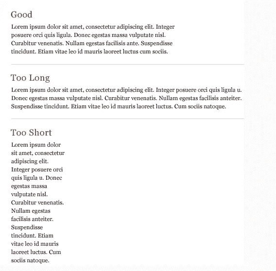
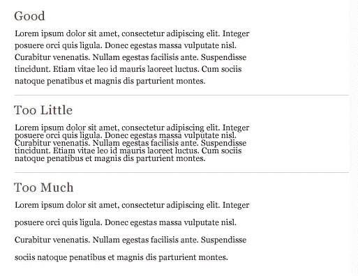

# UX 设计中的 5 个致命错误会扼杀你的项目

> 原文：<https://blog.devgenius.io/5-crucial-mistakes-in-your-ux-design-that-can-kill-your-project-bf359533a38f?source=collection_archive---------2----------------------->

一个 UX 设计师应该设计一个满足这些基本要求的应用程序或网站。换句话说，UX 设计师的最终目标是通过使软件产品更有用、更易访问、更令人满意来提高用户对软件产品的满意度。

UX 设计师应该遵循 5 个关键原则，即人性化、情境化、可发现性、简易性和简单性。

一个好的 UX 设计有助于提高保存率，有助于提高搜索引擎优化排名，并有助于吸引更多的客户和保留现有客户。

避免这些违反我们上面提到的原则的关键错误。

# 1.文本内容太多

包含太多的文字内容可能会吓跑你的访客。他们不喜欢读长段落。

*   减少你网站上的文字量。检查你所有的内容，只选择绝对必要的文本。
*   尽可能用视觉效果代替文字。

视觉效果良好的长度

# 2.字体和颜色的混杂

过多的颜色和字体会使网站难以理解。它们会分散目标受众的注意力，让他们忽略你希望他们采取的最重要的行动。

将你的配色方案限制在两到三种平衡的颜色。此外，在你的网站上始终使用不超过两种字体。

# 3.元素周围没有足够的空白

你的访问者会发现很难理解哪些元素是他们应该首先关注的，哪些是不太重要的。

你应该在元素周围留出足够的空白，这样目标受众就可以注意到其中最重要的部分，同时也避免弄乱你的页面。

空白很重要

# 4.长表格

用户需要填写的字段越多，他们就会越早想离开你的网站。这完全取决于你为什么需要客户填写表格。

使您的表单域有序且结构化。通过将它们分类或排列成有序的列表。通过使用自动完成功能，您还可以尽可能简化某些字段的处理。

# 5.难以察觉的 CTA 按钮

对于一个电子商务网站来说，没有比行动号召按钮更重要的元素了。毕竟，只有当你的客户点击它时，你的公司才能获得收入。

通过选择不同于周围页面元素的颜色、样式和文本，使您的 CTA 按钮引人注目。你把按钮放在哪里也很重要。