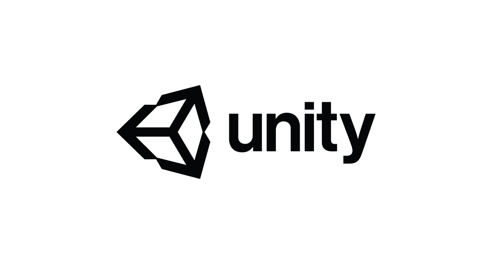
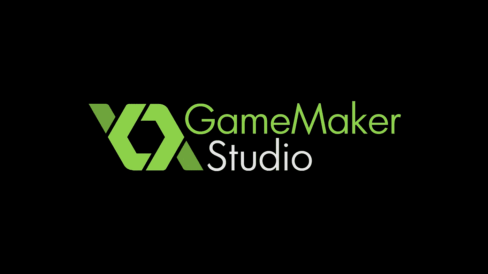
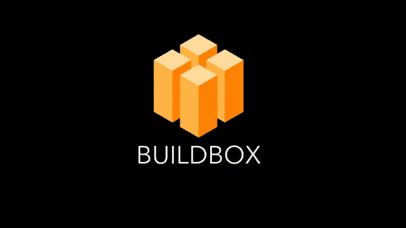
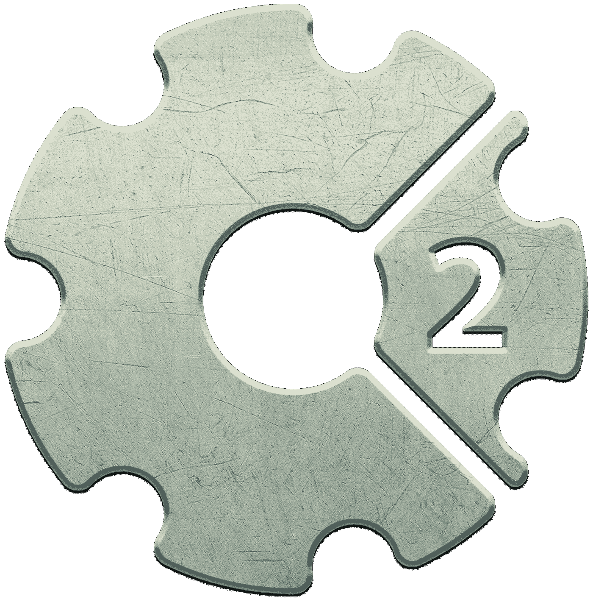
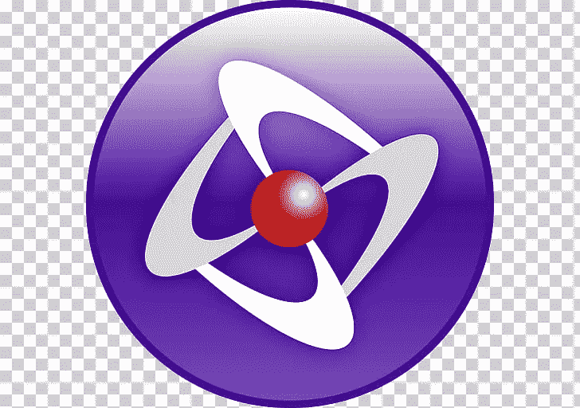

# 游戏设计和开发的 5 个重要工具

> 原文：<https://blog.devgenius.io/5-crucial-tools-for-game-design-and-development-c523f49cb25a?source=collection_archive---------17----------------------->

## 触手可及的强大游戏设计软件！

法比安·格罗斯的照片

游戏开发正在席卷全球。游戏只是像素人物用他们像素化的小剑与斑点怪物战斗的日子已经一去不复返了。游戏只是小孩子玩的日子也一去不复返了。那么游戏开发谋生需要什么工具呢？

**Unity
该引擎已扩展到支持超过 25 个平台，可用于创建三维、二维、虚拟现实和增强现实游戏，以及模拟和其他体验。
[https://unity.com/](https://unity.com/)**

图片来自 Unity.com

**GameMaker 工作室** GameMaker 是马克·奥维马斯于 1999 年创建的一系列跨平台游戏引擎。GameMaker 无疑是业内最受欢迎的游戏开发工具之一。这是因为它的拖放系统让你制作游戏的速度比你自己编码快很多倍。
您还可以选择升级到专业版或主收藏版，以访问更多工具。
[https://www.yoyogames.com/gamemaker](https://www.yoyogames.com/gamemaker)

图片来自 Androidauthority.com

有了 BuildBox，你可以在很短的时间内用很简单的方式制作自己的游戏。你不需要编码——选择图像，导入它们，给它们分配一个角色(角色，物体，装饰，启动等等),你的游戏就开始了。此外，您可以进行更改并实时检查。如果你不是技术专家，这个平台是为你准备的。
[https://www.buildbox.com/](https://www.buildbox.com/)

图片来自 Fiverr.com

**Construct 2** Construct 2 是另一个强大的 2D 游戏创作工具，可以让你发布到 HTML5。这是另一个对设计者友好的程序，不需要任何编程经验就能创造奇迹。有一个免费版本，你可以把它发布到网上。
https://www.construct.net/en/make-games/buy-construct?[action=c2retirement](https://www.construct.net/en/make-games/buy-construct?action=c2retirement)

图片来自 bahraingamejam.com

**click team Fusion 2.5** click team Fusion 2.5 是为高级游戏开发者设计的，但并不意味着在创建游戏时需要复杂的编码经验。用更少的代码创建游戏工具从未如此简单。该软件工具具有一个优秀的事件编辑器系统，它允许游戏开发者轻松快速地创建游戏。通过这种方式，开发者在创建游戏时需要的编码会更少。https://www.clickteam.com/clickteam-fusion-2-5

图片由 UIhere.com 拍摄

Giphy.com 的 GIF

我希望这些软件能帮助你们开始编程和游戏开发。努力工作，让我知道你的最新进展。

曼文德拉【2020 年 7 月