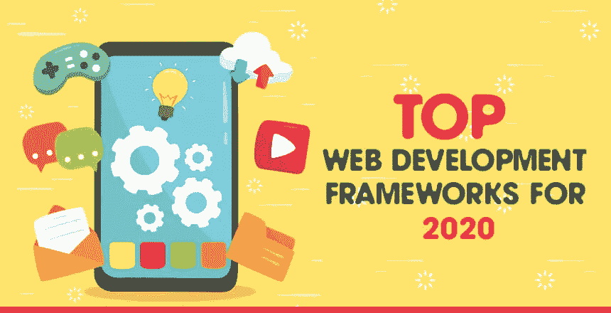

# 5 2020 年的 CSS 框架

> 原文：<https://blog.devgenius.io/5-css-framework-in-2020-f9bacb313d28?source=collection_archive---------43----------------------->

CSS 代表[级联样式表](http://entradasoft.com/blogs/5-css-framework-in-2020)。Web 开发由三个基本文件组成，即 HTML 文件、CSS 文件和 JavaScript 文件。而 [HTML 和 JavaScript 文件](http://entradasoft.com/blogs/5-css-framework-in-2020)分别负责模板和动态元素。CSS 只负责一件事，那就是 CSS 实际上如何很好地控制样式。它通过确定元素在某个网页上的外观来做到这一点，例如它们的颜色，字体，它也有助于元素的定位，它还做了一点动画。

换句话说，我们可以说它是一个框架库，通过它我们可以借助 CSS 语言开发标准的网页设计。

【http://entradasoft.com/blogs/5-css-framework-in-2020】全篇 : [全篇](http://entradasoft.com/blogs/5-css-framework-in-2020)

**2020 年的 5 个基本框架**

1.引导程序

2.基础

3.UIkit

4.语义用户界面

5.布尔玛

**Bootstrap:** 这个最初命名为 Twitter 的蓝图。它是最流行的 HTML、CSS 和 JavaScript 框架，用于开发一个反应灵敏的移动友好网站。它包括基于 HTML 和 CSS 的设计模板，用于排版、表单、按钮、表格、导航、模态、图像、传送带等等。

它有助于我们创造响应性设计。它兼容大多数浏览器，如 Chrome、Firefox、Internet Explorer、Safari 和 Opera 等。随着时间的推移，Bootstrap 发生了各种变化。Bootstrap 的各种版本有 *Bootstrap 2 和 3、Bootstrap 4、Bootstrap 5、Alpha。*

**自举的优势:**

Bootstrap 易于使用。

它有一致的设计。

它兼容所有浏览器。

它被大规模地应用在手机上。

因此，它被称为移动优先方法。

它适用于所有移动设备、平板电脑、台式机等。

**基础:**它是一个移动优先响应框架，由 Sass/SCSS 构建，为设计人员提供快速开发的最佳实践。该框架包括快速原型化响应站点所需的最常见模式。通过使用 Sass mixings，基础组件很容易进行样式化和简单的扩展。

从 2.0 版本开始，它还支持响应式设计。这意味着网页的图形设计会根据所用设备的特性进行动态调整。此外，从 4.0 版本开始，它采取了移动优先的方法，首先为移动设备设计和开发，并为更大的屏幕增强网页和应用程序。Foundation 是开源的，可以在 GitHub 上获得。

**基金会的优势:**

它拥有一个强大网格系统。

它支持项目的快速发展。

它提供了最好的定制能力。

它包含一套模板和现成的代码。

它为网站和电子邮件提供服务。

**UIKit 框架:**该框架提供了各种功能，如文档支持、绘图和打印支持、关于当前设备的信息、文本管理和显示、搜索支持、可访问性支持、应用程序扩展支持和资源管理。这个开源框架几乎可以在任何现代浏览器上工作，比如 Chrome、Mozilla Firefox、Oracle、Explorer 等等。它是广泛使用的框架。

**ul kit 的优势:**

这很容易学，因为代码非常容易。

它节省时间和金钱。

Ulkit 提供如此多的组件，可在所有设备上平稳快速地工作。

**语义框架:**这是一个现代化的前端开发框架，由 LESS 和 jQuery 提供支持。它拥有时尚、精致、扁平的设计外观，提供了轻量级的用户体验。根据 Semantic UI 网站的说法，该框架的目标是通过创建一种共享 UI 的语言来增强设计者和开发者的能力。

这是一个免费的开源项目。它已经在多个大规模生产环境中使用。

它在两个方面是独特的。首先是方式，框架是结构化的。它使用五个描述性类别来定义可重用的 UI 组件。UI 元素、UI 集合、UI 视图、UI 模块、UI 行为是五个描述性的类别。

**UI 元素:**是一个基本的构建块。它可以单独出现，也可以整齐划一地成群出现。例如，按钮可以是独立的，也可以放在按钮组中。

**UI 集合:**是一组相互依赖的不同种类的元素。例如，一个 web 表单可以有按钮、输入、复选框、图标等等。

**UI 视图:**表示一段普通的网站内容。例如，评论部分的提要。

**UI 模块:**是一个具有基于 JavaScript 的交互式功能的组件。示例包括手风琴、调光器、莫代尔等等。

**UI 行为:**是一个不能独立存在的组件，而是用来给其他组件注入功能的。*例如，*表单验证行为为表单组件提供验证功能。

**语义 UI 的优势:**

这个框架比其他框架有更高的学习曲线。

**布尔玛:**它是为移动优先而设计的。它 100%有反应。它针对垂直阅读进行了优化。在这种情况下，列是垂直堆叠的。我们可以通过添加移动修饰符来加强列和级别的水平布局。立柱由 Flexbox 驱动。这是构建响应式列的简单方法。

**布尔玛的优势:**

这个很好用。

基于 Flexbox 的响应式设计。

它的语法很简单。

它是高度可定制和模块化的。

现在我们知道，所有上述的[框架](http://entradasoft.com/blogs/5-css-framework-in-2020)都是各自的最佳选择。但是总的来说还是有一些缺点的。因此，为了克服一个框架的问题，开发了一个新的框架，它具有前一个框架的一些额外特性。

以下是所有提到的框架的关键特征。这使得它们彼此不同。

为了确保项目的轻量级增加，应该让布尔玛或 UIkit 试试。

如果你想要一个有很多支持的无障碍解决方案，请访问 Bootstrap。

Foundation framework 为您的组件提供了更多自由。

如果 web 应用程序使用大量的 JavaScript，应该选择语义框架。

更多阅读:[http://entradasoft.com/blogs/5-css-framework-in-2020](http://entradasoft.com/blogs/5-css-framework-in-2020)