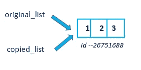
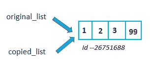
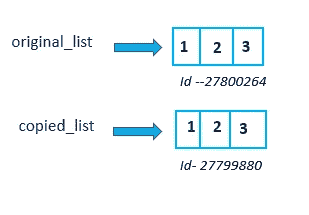
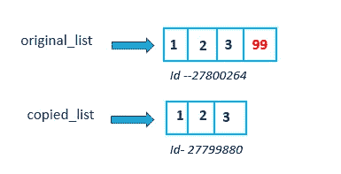

# 用 Python 复制列表的 5 种不同方法

> 原文：<https://blog.devgenius.io/5-different-ways-to-copy-list-in-python-9478bc6d8f02?source=collection_archive---------2----------------------->

## 复制 Python 列表


来自 [Pexels](https://www.pexels.com/photo/delicious-ripe-red-cherries-on-gray-background-7138918/?utm_content=attributionCopyText&utm_medium=referral&utm_source=pexels) 的 [Julia Filirovska](https://www.pexels.com/@filirovska?utm_content=attributionCopyText&utm_medium=referral&utm_source=pexels) 的照片

在本文中，我介绍了用 python 复制列表的不同方法。

# 1.赋值运算

我们可以使用赋值操作 **=** 来复制列表

```
**copied_list=original_list**
```

original_list 和 copied_list 将指向同一个列表对象。



在原始列表中进行的修改将反映在复制列表中，反之亦然。



# 2.使用 copy()函数

我们也可以使用 copy()函数复制 python 列表。original_list 和 copied_list 都指向内存中不同的列表对象。



在原始列表中进行的修改不会反映在复制的列表中，反之亦然。



但是如果我们修改嵌套列表中的元素，那么它会同时反映在 original_list 和 copied list 中。

# 3.使用 list()构造函数

我们可以使用 list()构造函数复制列表。原始列表和复制列表都指向不同的列表对象

```
**copied_list=list(original_list)**
```

修改原始列表中的元素不会反映在复制列表中，反之亦然。

# 4.索引

我们可以使用索引方法复制列表。

```
s[i:j:k] — slice of *s* from *i* to *j* with step *k*
```

i →开始索引，j →结束索引，k →步进

如果我们提到 original_list[:]，它会从步骤 1 开始到结束切片 original_list。

它返回列表的副本。

```
**copied_list=original_list[:]**
```

修改 orignial _ list 不会反映在 copied_list 中，反之亦然。

**如何使用索引逆序复制元素？**

`original_list[::-1]`

step=-1 表示从最后一个索引开始到 start_index。

**如何从列表中复制替代元素？**

# 5.列表理解

我们可以使用列表理解从列表中复制元素。

```
copied_list=[i for i in original_list]
```

修改原始列表不会反映在复制列表中，反之亦然。

我们还可以对列表中的每个元素应用任何函数，并使用 list comprehension 复制它。

**例:将列表中的元素平方并复制。**

```
copied_list=[i*i for i in original_list]
```

# 结论:

在本文中，我介绍了用 python 复制列表的不同方法。

1.  赋值操作→两个列表将指向同一个列表对象
2.  索引、列表()、列表理解、复制()→两个列表(原始列表和复制列表)将指向不同的列表对象。

# 进一步阅读:

[](/indexing-vs-slicing-in-python-de01cd99c499) [## Python 中的索引与切片

### 了解索引和切片

blog.devgenius.io](/indexing-vs-slicing-in-python-de01cd99c499) [](https://medium.com/analytics-vidhya/shallow-copy-vs-deep-copy-vs-assignment-in-python-921d7e413a3a) [## Python 中的浅拷贝 vs 深拷贝 vs 赋值

### python 中浅拷贝、深拷贝和赋值的快速概述。

medium.com](https://medium.com/analytics-vidhya/shallow-copy-vs-deep-copy-vs-assignment-in-python-921d7e413a3a) 

*如果你喜欢阅读我更多关于 Python 和数据科学的教程，
关注我的* [***中型***](https://medium.com/@IndhumathyChelliah) ***，***[***Twitter***](https://twitter.com/IndhuChelliah)

[https://indhumathychelliah.medium.com/membership](https://indhumathychelliah.medium.com/membership)