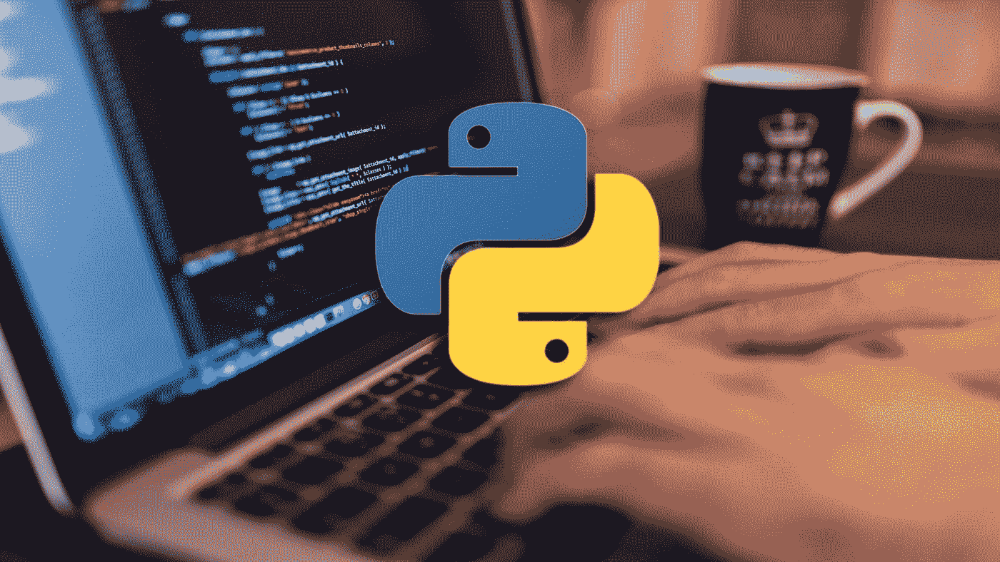

# Python 初学者的 5 个简单项目

> 原文：<https://blog.devgenius.io/5-easy-projects-for-python-beginners-499a6d2766e8?source=collection_archive---------3----------------------->

## 这些项目将帮助您学习 Python 的基础知识，并开始自己使用它

[图片](https://coursesity.com/course-detail/free-python-tutorial---python-for-beginners-learn-python-for-free-with-mike-dane)来自 Coursesity

这是为那些已经掌握了 Python 基础，但还没有达到能够创建自己的项目的程度的人准备的。这些教程将帮助您快速理解如何用 Python 构建简单的项目。

1.  [随机数生成器](https://pythonalgos.com/2021/11/24/super-simple-python-random-number-generator/):这个项目将向你介绍如何用 Python 中的`random`库生成随机数。我们使用`randint`函数选择一个随机数来生成，使用`input`从用户那里获得输入，使用`int`将输入从字符串转换为整数。
2.  [高低猜谜游戏](https://pythonalgos.com/2021/11/28/super-simple-python-high-low-guessing-game/):和随机数生成器一样，这个项目也是基于使用`random`库中的`randint`函数。这个项目将向你介绍如何使用一个`while`循环。它还将向您展示如何以实用的方式使用`if/elif/else`语句。
3.  [简单(四个函数)计算器](https://pythonalgos.com/2021/11/30/super-simple-python-simple-calculator/):与上两个函数不同，这个不使用`random`库。这个项目是对函数和字典的介绍。通过做这个项目，你会了解到如何制作简单的函数以及如何使用字典作为地图。我们还将通过字典传递函数来了解 Python 中的按名称传递是如何工作的。
4.  石头剪刀布:石头剪刀布结合了我们上面谈到的所有概念。这个游戏结合了使用`random`库、创建函数和使用字典。我们还使用一个扩展的`if/elif`语句，末尾没有`else`语句。
5.  生成一副卡片:这个项目是作为课程的介绍。我们在这个项目中使用的类用来表示一个`Card`对象。我们不必为这个对象使用一个类，因为它是一个简单的`tuple`对象，但是为了程序更加清晰，我们可以这样做。我们也再次使用字典并引入嵌套的`for`循环。

如果您觉得这很有帮助，请在 Twitter 或 LinkedIn 上与您的朋友分享！要无限制地访问媒体上的信息宝库，今天就注册成为[媒体会员](https://medium.com/@ytang07/membership)！更多 Python 技巧、自然语言处理教程和其他技术相关的帖子，记得关注我，[唐](https://www.medium.com/@ytang07)！

## 延伸阅读/项目

*   [探索 Matplotlib 的 animation.funcanimation](https://pythonalgos.com/create-animations-with-matplotlib-animation-funcanimation/)
*   [每一个蟒蛇都需要知道的五个分支](https://python.plainenglish.io/5-subreddits-every-pythonista-needs-to-know-a58117949856)
*   [GRU·RNN 在喀拉斯](https://pythonalgos.com/build-a-gru-rnn-in-keras/)
*   [我是如何在一个月内博客浏览量超过 5000 次的，你也可以](https://medium.com/@ytang07/how-i-got-over-5000-views-my-first-month-blogging-and-you-can-too-384e537f5eae)
*   [Python 中的嵌套列表](https://pythonalgos.com/nested-lists-in-python/)

*更多内容请看*[*blog . dev genius . io*](http://blog.devgenius.io)*。*