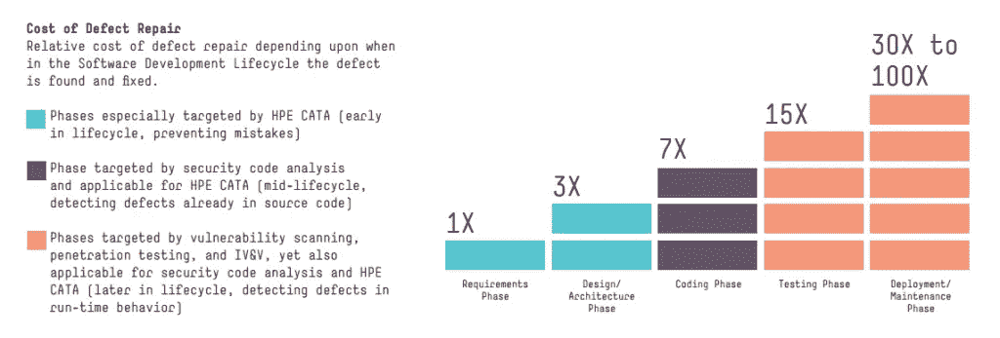

# 避免 bug 的 5 个简单方法

> 原文：<https://blog.devgenius.io/5-easy-ways-to-avoid-bugs-9ddbcc01f9ed?source=collection_archive---------6----------------------->

## 我已经搞砸了，所以你不必

照片由[埃里克·麦克莱恩](https://unsplash.com/@introspectivedsgn?utm_source=medium&utm_medium=referral)在 [Unsplash](https://unsplash.com?utm_source=medium&utm_medium=referral) 上拍摄

每个网络开发者都会犯错误。我至少做了几百个。已知的。有些经常发生，所以让我们把它们写下来。

及早发现漏洞有助于降低成本。问题越严重，修复成本就会成倍增加。查看图表，看看你的总体影响。

学分:[https://xbsoftware . com/blog/why-should-testing-start-early-software-project-development/](https://xbsoftware.com/blog/why-should-testing-start-early-software-project-development/)

修复重要的错误会让你成为一个有价值的团队成员。团队成员会对你的定位能力更有信心。请继续阅读，找出避免错误的简单方法。

## 表单验证

表单对每个 CRUD 应用程序都至关重要。注意表单变化，新字段，控制器变化。与表单相关的更改很可能会导致意外的行为。

假设您需要一个新的表单域。之后立即更正表单验证。检查所有可能的表单输入，检查新 HTTP 请求的有效性。共享表单也会导致严重的错误，一定要彻底检查使用表单的每个页面。

前端验证应该有点松散，但后端应该涵盖其余部分。确保您的验证涵盖所有特殊的无效字符，并且限制是正确的。

## 处理列表和地图

每个 web 应用程序都使用列表和地图，以适当的方式呈现数据。处理不当会导致严重的麻烦。

围绕列表的边缘案例有很多。列表可能出现的错误:

1.  空列表
2.  显示错误
3.  映射错误
4.  减少错误

为了防止列表处理中的错误，使用单元测试创建良好的覆盖率。边缘情况几乎总是列表的问题。创建错误的映射或减少可能会得到错误的输出值。

## 代码剩余

代码剩余经常发生。删除一些特性，或者创建一个新的特性都会产生这种代码。

测试应该剔除剩余的代码。检查可疑的、未使用的代码，以便发现错误。如果你从一个思维过程跳到另一个思维过程，可能会出现代码残留。

## 处理条件

命名条件经常会导致问题。命名变量`setPropertyToTrue`和`disableCaptcha`之间的差异可以帮上大忙。

不要对标志使用负数。比如`notYetUsedProduct`应该是`!usedProduct`。这样你就不会遇到讨厌的带标志的 bug，尤其是在有多个条件的情况下。

例如，在 JavaScript 中避免使用三元运算符，以使调试更容易。将所有标志提取到单独的函数和变量中。在不同的条件下工作更容易，并能立刻表现出意图。

## 测试边缘案例

遵循代码并测试它。最后但并非最不重要的提示。确保涵盖所有边缘案例。咨询其他开发人员，尝试找到另一种测试方法。

## 感谢阅读！