# 磨练您的安全编码技能的 5 个练习

> 原文：<https://blog.devgenius.io/5-exercises-to-hone-your-secure-coding-skills-7be9400dcf14?source=collection_archive---------2----------------------->

## 让我们通过逐步构建身份验证逻辑来学习


维多利亚·希斯在 [Unsplash](https://unsplash.com/?utm_source=unsplash&utm_medium=referral&utm_content=creditCopyText) 拍摄的照片

许多软件工程师主要关注于构建业务特性。但是，在增强应用逻辑的安全性上花了多少功夫呢？忽视保护您的应用程序的需要可能是毁灭性的，因为应用程序可能容易受到网络攻击。后果将是服务中断、数据丢失甚至经济损失。

事实是，许多安全漏洞是由于粗心的错误或没有适当保护的应用程序逻辑造成的。构建一个安全的应用程序并不困难。事实上，安全感知编程并不是一门火箭科学，如果你留心并更多地考虑代码逻辑中的安全控制，你可以获得这项技能并提升你的整体代码质量。

在本文中，您将使用 Java Spring Boot 完成一系列有趣的编码练习，这些练习有助于您熟悉程序逻辑中的一些安全保护概念。

一个示例应用程序提供了一个用户/密码验证逻辑。出于演示目的，逻辑内置于控制器中。通常情况下，应该使用 Spring 安全框架中的认证服务来实现。

下面的身份验证逻辑从用户详细信息服务中检索用户记录，并验证用户 id 和密码。如何更好地保护这种登录逻辑？至少可以做 5 项改进来更好地保护系统。

## GitHub 知识库中的练习

从这个 GitHub 存储库中获取源代码([https://GitHub . com/gavinklfong/authentic ation-code-exercises](https://github.com/gavinklfong/authentication-code-exercises))。**主**分支是整个练习的初始版本，您可以在每个分支中找到示例解决方案。总共 5 个练习有 5 个分支。比如分支**练习-1** 就是练习 1 的样本解。

## 关于示例应用程序

这是一个简单的 Spring Boot 应用程序，运行这个命令来启动应用程序。

```
mvn spring-boot:run
```

进入 [http://localhost:8080](http://localhost:8080) ，你会看到一个登陆页面。

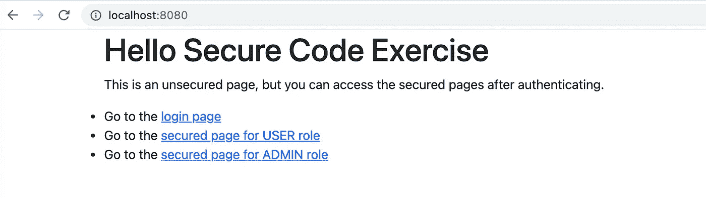

示例应用程序—登录页面

转到登录页面，使用页面上提供的任何一个用户登录。

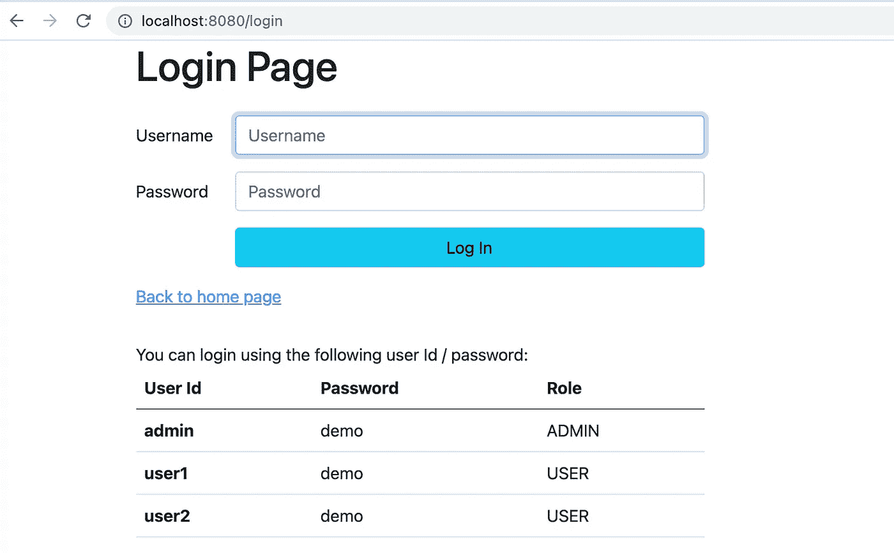

示例应用程序—登录页面

成功登录后，您将被重定向到一个安全页面。

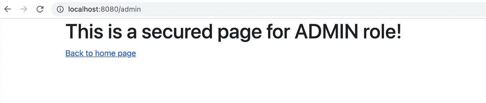

示例应用程序-安全页面

如果您尝试在身份验证之前访问受保护的页面，将会看到 403 错误消息。

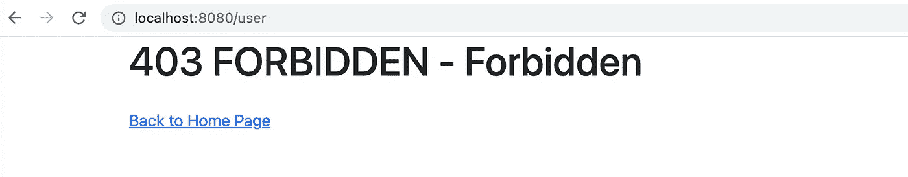

示例应用程序—禁止的错误

# 练习 1 —如何保护持久性存储中的密码记录？

身份验证逻辑从用户服务中查找用户记录，并使用字符串比较来比较密码。显然，存储在用户服务中的密码是纯文本格式的。以明文形式存储敏感数据可以被任何有权访问数据的人轻易看到，这严重暴露了敏感数据泄露的风险。

将密码转换为哈希值是存储密码的标准且安全的方法，因为哈希是单向函数，这意味着没有办法将哈希值转换回原始文本内容。当然，利用强大的计算设备从散列值中导出原始内容是可行的，但是，如果采用强大的加密散列算法，这将需要数年时间。

**Argon2** 是强烈推荐的哈希函数，它是 2025 年密码哈希大赛的冠军。要实现密码散列，只需在 Spring 中定义一个密码编码器 bean，然后它会自动注入到登录和用户注册等功能中。假设现有用户系统记录中的所有密码都已经迁移为哈希值，那么登录逻辑的增强就是使用编码器来验证用于身份验证的密码。

检查 git 分支**练习-1** 以获得使用密码编码器认证的示例实现。

下面是如何实现密码哈希的步骤:

1.  将用户记录中的所有现有密码迁移到哈希值

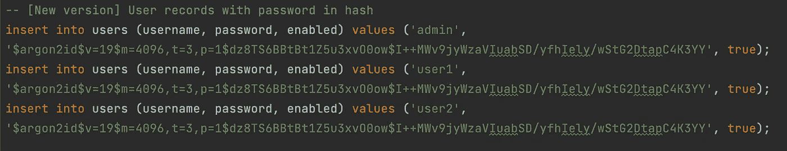

密码哈希值持久存储

2.定义密码编码器。源代码比较显示了原始版本和新版本。我们在右侧的配置类中定义了密码编码器。

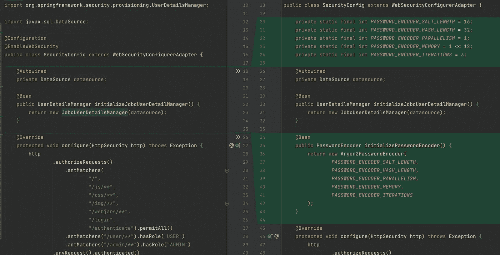

Argon2 密码编码器定义

3.添加对 maven 的依赖，因为 Argon2 密码编码器需要 bouncycastle 库。

```
<dependency>
   <groupId>org.bouncycastle</groupId>
   <artifactId>bcprov-jdk15on</artifactId>
   <version>1.69</version>
</dependency>
```

4.更新身份验证逻辑以使用编码器进行密码验证。右侧的更新版本使用编码器验证密码。

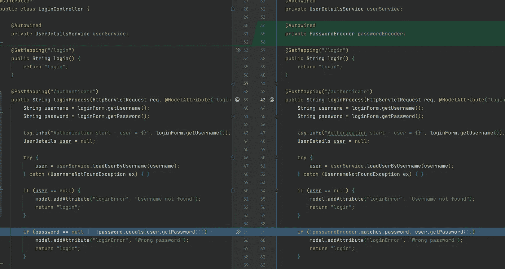

密码编码器在认证逻辑中的应用

# 练习 2 —如何防范用户 id 被发现？

## 用户枚举

恶意用户的第一步是找到进入系统的方法。用户枚举是获取凭证的常用技术之一，它利用暴力攻击来发现并获取用户 id 和密码。换句话说，黑客通过运行一个计算机程序来实现攻击的自动化，该程序使用一组字典单词、公共用户 id 和密码来尝试登录数十万次甚至数百万次。黑客首先在你的系统记录中找出一个现有用户 id 的列表，然后发现每个用户 id 的密码。

黑客能够根据您的身份验证功能的系统响应来推断您的系统记录中是否存在用户 id。因此，在为登录失败返回任何错误消息时要小心。

如果输入的用户 id 不存在，示例应用程序将显示错误消息“找不到用户名”,如果用户记录存在且密码不匹配，则返回消息“密码错误”。该消息为恶意用户提供了有用的提示，以便他们可以建立已知用户的列表。

错误消息—使用不存在的用户 id 登录

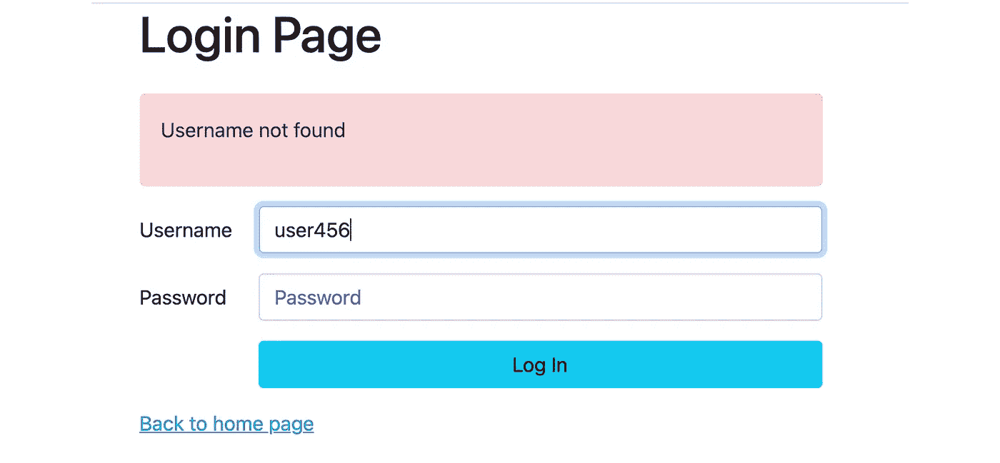

找不到用户错误

错误消息—密码错误

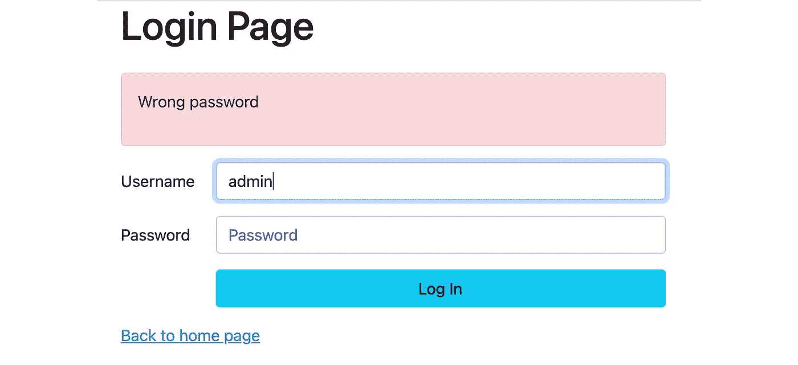

密码错误

因此，解决方案是使错误信息更加通用。对于未知的用户 id 或错误的密码，系统应返回相同的错误消息“不正确的用户/密码”。你可以在 git 分支**练习-2** 中找到解决方法。下面右边的源代码是修改后的版本，带有一般错误信息。

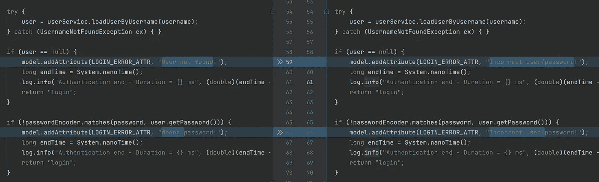

练习 2 的示例解决方案

现在，系统显示一条通用消息“不正确的用户/密码！”找不到用户或密码错误。

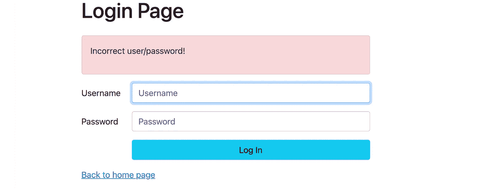

一般登录错误消息

# 练习 3 —黑客还能推断出用户是否存在于您的系统中吗？如果有，如何预防？

随着错误消息的更新，恶意用户不再知道用户记录是否存在。他们还能通过其他方式质疑用户是否存在于你的系统中吗？

系统处理时间可能会以某种方式泄露内部身份验证过程。下面我们来看一下用户密码认证的流程图。系统首先根据输入的用户 id 获取用户记录，然后验证密码，最后为成功的身份验证建立登录会话。

对于错误情况，比如找不到用户记录或密码错误，系统简单地跳过其余处理并返回一个错误响应。因此，错误案例的平均响应时间比成功登录的过程更快。以下是每种可能结果的平均响应时间:

*   登录失败(找不到用户):~ 1 毫秒
*   登录失败(密码不正确):~ 100 毫秒
*   登录成功:~ 120 毫秒

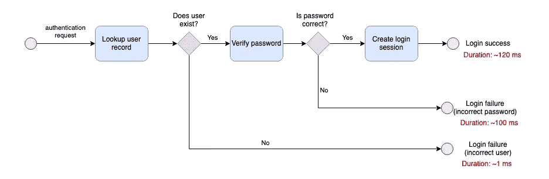

每个登录场景的平均处理时间

由于找不到用户而导致登录失败的响应时间比其他情况快得多。密码验证的哈希过程在很大程度上造成了响应时间的差异，因为它相对来说是一个 CPU 密集型过程。因此，只要观察响应时间，就不难确定用户 id 是否存在。

检查 git 分支**练习-3** ，你会发现示例解决方案。要解决这个问题，建议的解决方案是添加一个虚拟步骤，以便在输入的用户 id 不存在时运行散列过程。在发送错误响应之前，虚拟步骤对输入的密码进行哈希处理，并与虚拟密码哈希进行匹配。

更新版本显示在下面源代码比较屏幕的右侧:

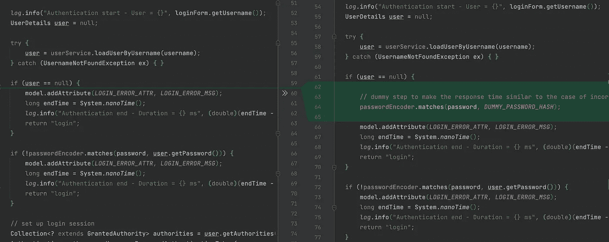

练习 3 的示例解决方案

有了虚拟散列过程，下面的过程流程图显示了用户未发现错误和密码不正确两种情况下的相似响应时间。

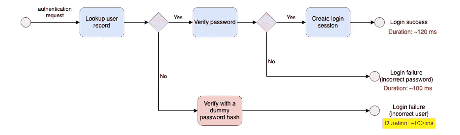

应用虚拟哈希过程后的平均响应时间

# 练习 4-如何检测和跟踪可疑的恶意活动？

没有系统日志，您如何对系统进行故障诊断？当涉及到日常系统支持时，系统日志是绝对重要的，但是，当他们构建系统逻辑时，没有多少开发人员注意日志记录。因此，由于缺乏信息，许多生产问题没有得到解决。

身份验证逻辑的足够日志记录使得跟踪所有登录提交成为可能。例如，Splunk 等企业数据平台支持的日志监控和警报触发。原则是通过为成功和失败案例编写系统日志来实现可追溯性，但是，请注意不要记录敏感数据，如个人信息或密码。

查看 git 分支**练习-4** ，您可以看到带有日志记录的认证逻辑。右侧的代码比较显示了代码变化。虽然这 3 行代码非常简单，但它为我们提供了有用的信息，大大加快了故障诊断过程。

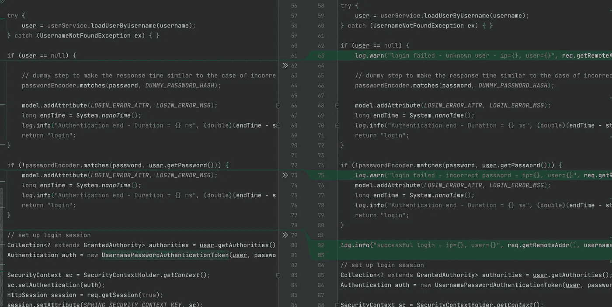

# 练习 5-如何防范自动攻击？

允许通过蛮力进行无限次数的登录尝试会增加安全漏洞的风险，因为攻击者迟早会在无数次试错之后获得有效的凭据。

虽然检测蛮力攻击并不难，但阻止这类攻击却很难。有效的方法是应用严格的密码策略并启用双因素身份验证，但是，实施和迁移所有现有凭据需要花费时间和精力。另一种方法是通过降低攻击速度来降低攻击效果，通常的做法是阻止可疑的 IP 地址或暂时锁定帐户。然而，黑客可以通过从不同 IP 范围的多台机器发起攻击，轻松绕过 IP 地址阻塞。此外，帐户锁定机制很容易被滥用，通过发起大规模攻击，导致锁定大量用户帐户，这将需要巨大的资源来审查和解锁帐户。

在本练习中，我将分享一种通过在登录流中引入验证码来对付机器人攻击的便捷方法。这是减轻机器人攻击的一种快速简单的方法。这个示例解决方案采用了谷歌的 reCAPTCHA 服务版本 2。

在验证码验证的登录流程中增加了一个额外的步骤。

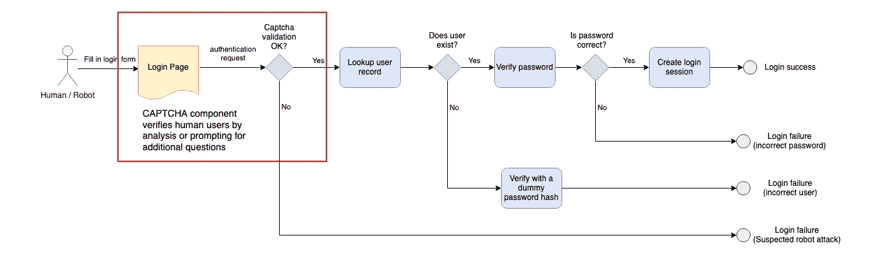

带有验证码验证的登录流程

登录屏幕上会添加一个复选框。用户需要单击登录提交的复选框。根据用户在屏幕上的活动，可能会提示用户一个带有图像列表的问题，用户需要通过选择正确的图像来完成该问题，以便在登录前通过验证码验证。在后台，小部件验证用户在屏幕上的活动，并从 CAPTCHA 服务获取令牌。提交请求后，身份验证逻辑将使用 Google 的 REST API 验证 CAPTCHA 令牌的真实性。

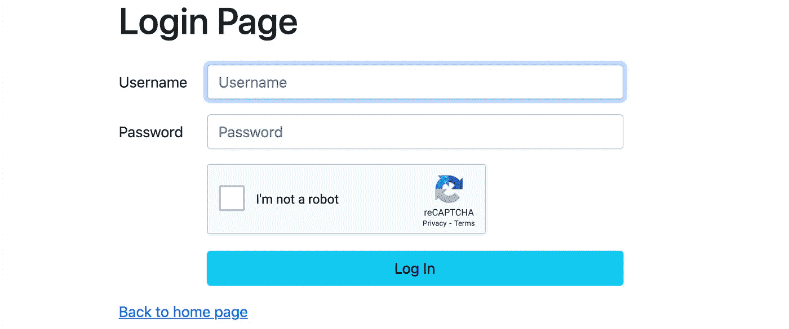

首先，你需要在谷歌网站([https://developers.google.com/recaptcha](https://developers.google.com/recaptcha))上注册免费的验证码服务，然后在注册结束时，你将获得一套密钥和站点密钥。设置验证码小工具和令牌验证需要这些密钥。

结帐 git 分支**练习-5** ，你会发现一个集成了谷歌 reCAPTCHA 服务的示例解决方案。修正案包括以下内容:

*   **登录屏幕**——包括 javascript 库和用于 Captcha 小部件的 HTML 标签
*   **认证逻辑** —使用 Google reCAPTCHA 服务的 REST API 来验证验证码令牌。

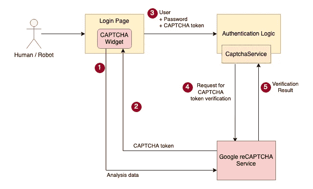

带验证码验证的验证逻辑

# 最后的想法

安全编码是所有开发人员的一项基本技能，不管他们在为什么类型的系统工作。你不需要学习全日制学位或获得专业证书来获取知识。相反，您可以通过以下方式更好地保护您的系统:保护持久性存储中的敏感数据，通过系统日志提高系统可追溯性，以及通过深思熟虑的设计增强您的系统对外部各方的响应。构建身份验证逻辑的练习有助于您完成思考过程，从而在应用程序开发中建立安全思维。