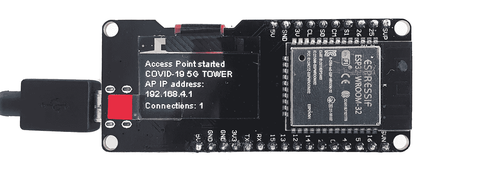
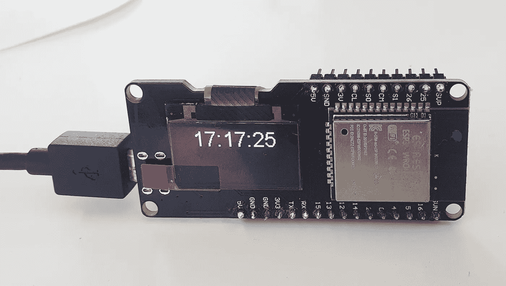
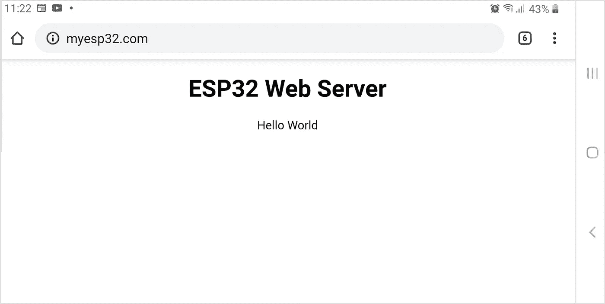
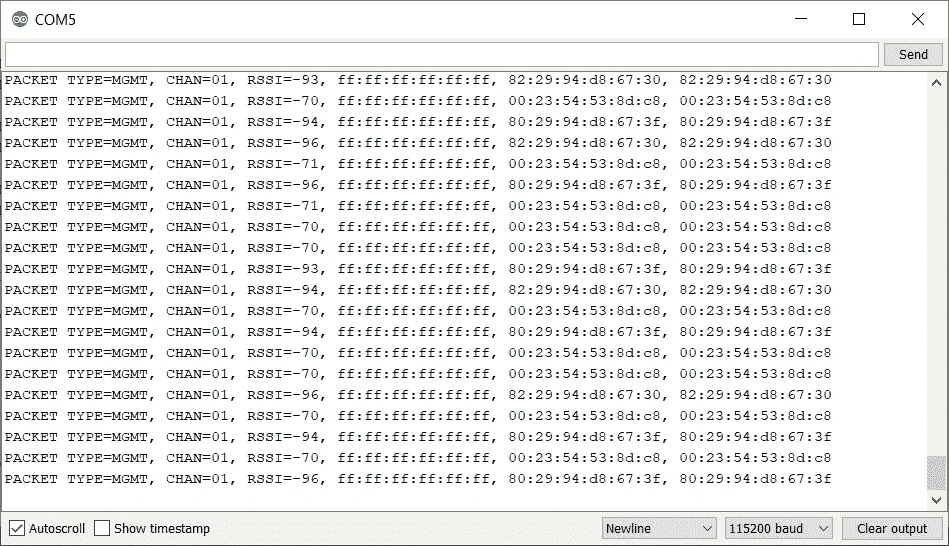
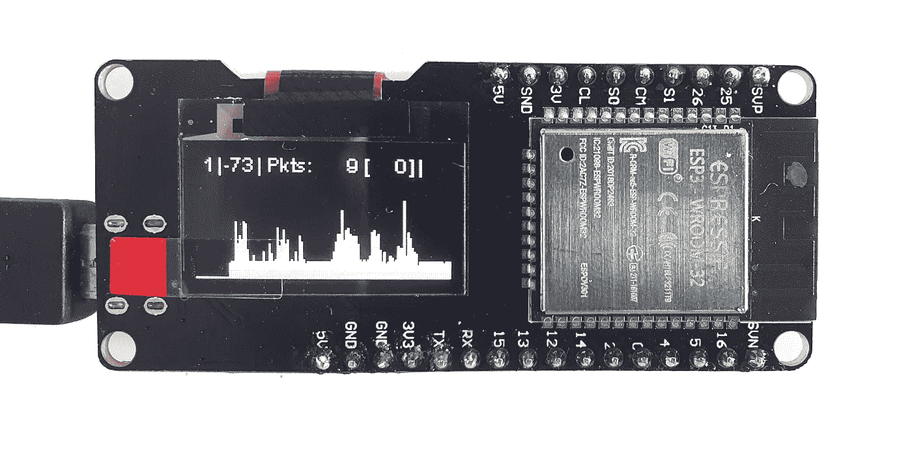
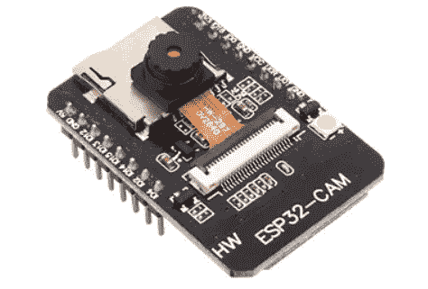

# 5 个使用 ESP32 的 WiFi 实验

> 原文：<https://blog.devgenius.io/5-experiments-with-wifi-using-esp32-8d40dddc538b?source=collection_archive---------2----------------------->

大家好。

ESP32 板之所以受欢迎，是因为其价格低廉、处理能力强(200 MHz CPU)、可同时用于 MicroPython 和 Arduino IDE 的多个 SDK、外设(GPIO、SPI、I2C)和无线(WiFi、蓝牙)连接支持。今天，我们将看看如何在这样一个董事会在价格只有约 12 美元。



我会考虑使用 WiFi 的不同选项，从简单的家庭网络连接到 WiFi 嗅探器。为了测试，我们将需要任何 ESP32 板(最好有一个有机发光二极管屏幕，如图)和 Arduino IDE。

我不会描述如何将 ESP32 连接到 Arduino IDE，任何人都可以在这里阅读。我只能指出，需要按住 Boot 按钮才能从 Arduino IDE 上载代码。除此之外，该板的用途与任何普通的 Arduino 相同。

本文中的所有代码示例都可以完全使用，您只需将它们复制并粘贴到 Arduino IDE 中。

让我们开始吧。

# 1.连接到 WiFi 并获取 NTP 时间

由于主板上有 WiFi，我们最简单的做法就是连接到现有的 WiFi 网络。这是很容易的，甚至在旧的 ESP8266 董事会的工作。然而，只是连接和什么都不做是无趣的，我将展示如何通过 NTP 获得时间。使用下面的代码，就可以很容易地将我们的 ESP 板变成一个桌面(或为 100lvl 极客——手腕:)手表。



代码相当简单，NTP 支持已经内置在标准库中，不需要安装任何东西。为了让有机发光二极管屏工作，我们需要安装 [SSD1306](https://github.com/ThingPulse/esp8266-oled-ssd1306) 库。

SSID 和密码字符串需要替换为真实接入点的参数，之后一切工作开箱即用。

```
#include <WiFi.h>
#include <SSD1306Wire.h>
#include <time.h>

const char* ssid     = "MYWIFI";     
const char* password = "12345678";const char* ntpServer = "pool.ntp.org";
const long  gmtOffset_sec = 3600;
const int   daylightOffset_sec = 3600;*// OLED Display 128x64*
SSD1306Wire  display(0x3c, 5, 4);

void setup() {
  Serial.begin(115200);         
  delay(10);
  Serial.println('\n'); *// Connect to the network*  
  WiFi.begin(ssid, password);             
  while (WiFi.status() != WL_CONNECTED) 
  { 
    *// Wait for the Wi-Fi to connect*
    delay(500);
    Serial.print('.');
  }
  Serial.println('\n');
  Serial.println("Connection established");  
  Serial.print("IP address:\t");
  Serial.println(WiFi.localIP()); *// Get the NTP time*
  configTime(gmtOffset_sec, daylightOffset_sec, ntpServer); *// OLED display init*
  display.init();
  display.clear();
  display.setTextAlignment(TEXT_ALIGN_LEFT);
  display.setFont(ArialMT_Plain_10);
  display.drawString(0, 0, "Access Point connected");
  display.drawString(0, 24, "AP IP address: ");
  display.drawString(0, 36, WiFi.localIP().toString());
  display.display();
  delay(1000);
}void draw_time(char *msg) {
  display.clear();
  display.setTextAlignment(TEXT_ALIGN_CENTER);
  display.setFont(ArialMT_Plain_24);
  display.drawString(display.getWidth()/2, 0, msg);
  display.display(); Serial.println(msg);
}

void loop() { 
  struct tm timeinfo;
  if (getLocalTime(&timeinfo)) {
      char time_str[16];
      strftime(time_str, 16, "%H:%M:%S", &timeinfo); draw_time(time_str);
  }  
  delay(500);
}
```

# 2.WiFi 接入点

当然，我们不仅可以连接到接入点，还可以创建自己的接入点。在这个例子中，我们将推出一个小型网络服务器，可以打开，例如，从智能手机。我想强调的是 SYSTEM _ EVENT _ AP _ STACONNECTED 事件的处理，它允许我们找出有多少客户端连接到我们的 AP。

本代码基于[本教程](https://www.arduino.cc/en/Tutorial/Wifi101SimpleWebServerWiFi)。

```
#include <WiFi.h>
#include <DNSServer.h>
#include <SSD1306Wire.h>*// Access Point credentials*
const char *ssid = "TEST-123";
const char *password = NULL; *// "12345678";*
int connections = 0;*// Onboard WiFi server*
WiFiServer server(80);
String responseHTML = "<!DOCTYPE html><html>"
                      "<head><meta name=\"viewport\" content=\"width=device-width, initial-scale=1\">"
                      "<style>html { font-family: Helvetica; display: inline-block; margin: 0px auto; text-align: center;}"
                      "</style></head>"
                      "<body><h1>ESP32 Web Server</h1>"
                      "<p>Hello World</p>"
                      "</body></html>";*// OLED Display 128x64*
SSD1306Wire  display(0x3c, 5, 4);void WiFiStationConnected(WiFiEvent_t event, WiFiEventInfo_t info) {
  connections += 1;
  showConnectionsCount();
}void showConnectionsCount() {
  char data[32];
  sprintf(data, "Connections: %d", connections);
  draw_message(data);
}void setup() {
  Serial.begin(115200);                   
  Serial.println();
  Serial.println("Configuring access point..."); *// Start access point* 
  WiFi.mode(WIFI_AP);                   
  WiFi.softAP(ssid, password);
  WiFi.onEvent(WiFiStationConnected, SYSTEM_EVENT_AP_STACONNECTED); *// IP Address of our access point* IPAddress ip_address = WiFi.softAPIP(); *// Start web server*
  server.begin();

  Serial.print("AP IP address: ");
  Serial.println(ip_address); *// Oled display* 
  display.init();
  *// Draw info*
  display.clear();
  display.setTextAlignment(TEXT_ALIGN_LEFT);
  display.setFont(ArialMT_Plain_10);
  display.drawString(0, 0, "Access Point started");
  display.drawString(0, 12, ssid);
  display.drawString(0, 24, "AP IP address: ");
  display.drawString(0, 36, ip_address.toString());
  display.display(); *// Total number of connections*
  showConnectionsCount();
}void draw_message(char *msg) {
  display.setColor(BLACK);
  display.fillRect(0, 50, display.getWidth(), 12);
  display.setColor(WHITE);
  display.drawString(0, 50, msg);
  display.display(); Serial.println(msg);
}void loop() {
  *// Listen for incoming clients* WiFiClient client = server.available();  
  if (client) { 
    *// A new client connects*
    draw_message("Client connected");

    String currentLine = "";   
    while (client.connected()) {  
      if (client.available()) {        
        char c = client.read(); *// read a byte, then*
        Serial.write(c);        *// print it out the serial monitor*
        if (c == '\n') {        *// the byte is a newline character*
          *// if the current line is blank, you got 
          // two newline characters in a row.*
          *// that's the end of the client HTTP request, 
          // so send a response:*
          if (currentLine.length() == 0) {
            *// Header*
            client.println("HTTP/1.1 200 OK");
            client.println("Content-type:text/html");
            client.println("Connection: close");
            client.println();

            *// Display the HTML web page*
            client.println(responseHTML);            
            *// The HTTP response ends with another blank line*
            client.println();
            break;
          } else { 
            *// if we got a newline, then clear currentLine*
            currentLine = "";
          }
        } else if (c != '\r') {  
          *// if we got anything else but a CR character,
          // add it to the end of the currentLine
*          currentLine += c;   
        }
      }
    }
    *// Close the connection*
    client.stop();
    showConnectionsCount();
  }
}
```

程序启动时，屏幕将显示接入点名称和 IP 地址。从智能手机连接到接入点后，我们可以在浏览器中键入 IP 并查看网页内容。

服务器也可以在没有有机发光二极管屏幕的情况下工作，在这种情况下，可以使用 Arduino IDE 中的 Serial Monitor 查看调试信息。

# 3.支持 DNS 的 WiFi 接入点

前面的例子可以通过使用板载 DNS 进行改进。在这种情况下，我们不必记住并输入 IP 地址，而是使用一个名称，例如，[www.myesp32.com。](http://www.myesp32.com.)



源代码使用了 [WebServer](https://github.com/espressif/arduino-esp32/tree/master/libraries/WebServer) 类，这使得代码变得更短。

```
#include <WiFi.h>
#include <DNSServer.h>
#include <WebServer.h>WebServer webServer(80);const char *ssid = "TEST-123";
const char *password = NULL; *// "12345678";*IPAddress apIP(192, 168, 1, 4);
DNSServer dnsServer;
*// Use "*" to all DNS requests* const char *server_name = "www.myesp32.com";String responseHTML = "<!DOCTYPE html><html>"
                      "<head><meta name=\"viewport\" content=\"width=device-width, initial-scale=1\">"
                      "<style>html { font-family: Helvetica; display: inline-block; margin: 0px auto; text-align: center;}"
                      "</style></head>"
                      "<body><h1>ESP32 Web Server</h1>"
                      "<p>Hello World</p>"
                      "</body></html>";void setup() {
  WiFi.mode(WIFI_AP);
  WiFi.softAP(ssid, password);
  delay(100);

  WiFi.softAPConfig(apIP, apIP, IPAddress(255, 255, 255, 0)); const byte DNS_PORT = 53;
  dnsServer.start(DNS_PORT, server_name, apIP); webServer.onNotFound([]() {
    webServer.send(200, "text/html", responseHTML);
  });
  webServer.begin();
}void loop() {
  dnsServer.processNextRequest();
  webServer.handleClient();
}
```

# 4.WiFI 嗅探器

另一个使用 WiFi 的有趣例子是在 https://github.com/ESP-EOS/ESP32-WiFi-Sniffer 的。ESP32 上的 WiFi 芯片可以切换到所谓的“混杂模式”，允许在不连接网络本身的情况下监控 WiFi 数据包。特别是，我们可以看到附近设备的 MAC 地址:



这可能是有用的，例如，智能家居可以发现主人何时回家。一些公司使用设备的 MAC 地址来监控访问者，然后向他们显示有针对性的广告(我不确定这是否 100%合法)。

源代码可以从[https://github.com/ESP-EOS/ESP32-WiFi-Sniffer](https://github.com/ESP-EOS/ESP32-WiFi-Sniffer)页面下载。

# 5.WiFi 数据包监视器

使用混杂模式的另一个例子是通道活动的图形化监控。和前面的情况一样，不需要连接到网络本身。



源代码是在这里[取的](https://github.com/spacehuhn/PacketMonitor32)，我去掉了 SD 卡支持(这块板上没有卡)，用图形库修复了一个 bug。可以通过按下按钮(也不在板上:)或通过 Arduino IDE 中的串行监视器发送相应的数字来切换 WiFi 频道。

```
#include <esp_wifi.h>
#include <esp_wifi_types.h>
#include <esp_system.h>
#include <esp_event.h>
#include <esp_event_loop.h>
#include <nvs_flash.h>
#include <stdio.h>
#include <string>
#include <cstddef>
#include <Wire.h>
#include <Preferences.h>
using namespace std;#define MAX_CH 14       // 1 - 14
#define SNAP_LEN 2324   // max len of each recieved packet#define BUTTON_PIN 5    // button to change the channel#define USE_DISPLAY     // comment out if you don't want to use OLED
//#define FLIP_DISPLAY  // comment out if you don't like to flip it
#define MAX_X 128
#define MAX_Y 64#if CONFIG_FREERTOS_UNICORE
#define RUNNING_CORE 0
#else
#define RUNNING_CORE 1
#endif#ifdef USE_DISPLAY
#include <SSD1306Wire.h>
#endifesp_err_t event_handler(void* ctx, system_event_t* event) {
  return ESP_OK;
}// OLED Display 128x64
#ifdef USE_DISPLAY
SSD1306Wire  display(0x3c, 5, 4);
#endifPreferences preferences;bool useSD = false;
bool buttonPressed = false;
bool buttonEnabled = true;
uint32_t lastDrawTime;
uint32_t lastButtonTime;
uint32_t tmpPacketCounter;
uint32_t pkts[MAX_X];   // here the packets per second will be saved
uint32_t deauths = 0;   // deauth frames per second
unsigned int ch = 1;    // current 802.11 channel
int rssiSum;double getMultiplicator() {
  uint32_t maxVal = 1;
  for (int i = 0; i < MAX_X; i++) {
    if (pkts[i] > maxVal) maxVal = pkts[i];
  }
  if (maxVal > MAX_Y) return (double)MAX_Y / (double)maxVal;
  else return 1;
}void setChannel(int newChannel) {
  ch = newChannel;
  if (ch > MAX_CH || ch < 1) ch = 1; preferences.begin("packetmonitor32", false);
  preferences.putUInt("channel", ch);
  preferences.end(); esp_wifi_set_promiscuous(false);
  esp_wifi_set_channel(ch, WIFI_SECOND_CHAN_NONE);
  esp_wifi_set_promiscuous_rx_cb(&wifi_promiscuous);
  esp_wifi_set_promiscuous(true);
}void wifi_promiscuous(void* buf, wifi_promiscuous_pkt_type_t type) {
  wifi_promiscuous_pkt_t* pkt = (wifi_promiscuous_pkt_t*)buf;
  wifi_pkt_rx_ctrl_t ctrl = (wifi_pkt_rx_ctrl_t)pkt->rx_ctrl; if (type == WIFI_PKT_MGMT && 
      (pkt->payload[0] == 0xA0 || pkt->payload[0] == 0xC0 )) 
    deauths++; if (type == WIFI_PKT_MISC) return;         // wrong packet type
  if (ctrl.sig_len > SNAP_LEN) return;       // packet too long uint32_t packetLength = ctrl.sig_len;
  if (type == WIFI_PKT_MGMT) 
    packetLength -= 4;  // fix for known bug in the IDF [https://github.com/espressif/esp-idf/issues/886](https://github.com/espressif/esp-idf/issues/886) // Serial.print(".");
  tmpPacketCounter++;
  rssiSum += ctrl.rssi;
}void draw() {
#ifdef USE_DISPLAY
  double multiplicator = getMultiplicator();
  int len;
  int rssi; if (pkts[MAX_X - 1] > 0) 
    rssi = rssiSum / (int)pkts[MAX_X - 1];
  else 
    rssi = rssiSum; display.clear(); display.setTextAlignment(TEXT_ALIGN_RIGHT);
  display.drawString( 10, 0, (String)ch);
  display.drawString( 14, 0, ("|"));
  display.drawString( 30, 0, (String)rssi);
  display.drawString( 34, 0, ("|"));
  display.drawString( 82, 0, (String)tmpPacketCounter);
  display.drawString( 87, 0, ("["));
  display.drawString(106, 0, (String)deauths);
  display.drawString(110, 0, ("]"));
  display.drawString(114, 0, ("|"));
  display.drawString(128, 0, (useSD ? "SD" : ""));
  display.setTextAlignment(TEXT_ALIGN_LEFT);
  display.drawString( 36,  0, ("Pkts:")); display.drawLine(0, 63 - MAX_Y, MAX_X, 63 - MAX_Y);
  for (int i = 0; i < MAX_X; i++) {
    len = pkts[i] * multiplicator;
    display.drawLine(i, 63, i, 63 - (len > MAX_Y ? MAX_Y : len));
    if (i < MAX_X - 1) pkts[i] = pkts[i + 1];
  }
  display.display();
#endif
}void setup() {
  // Serial
  Serial.begin(115200); // Settings
  preferences.begin("packetmonitor32", false);
  ch = preferences.getUInt("channel", 1);
  preferences.end(); // System & WiFi
  nvs_flash_init();
  tcpip_adapter_init();
  wifi_init_config_t cfg = WIFI_INIT_CONFIG_DEFAULT();
  ESP_ERROR_CHECK(esp_event_loop_init(event_handler, NULL));
  ESP_ERROR_CHECK(esp_wifi_init(&cfg));
  //ESP_ERROR_CHECK(esp_wifi_set_country(WIFI_COUNTRY_EU));
  ESP_ERROR_CHECK(esp_wifi_set_storage(WIFI_STORAGE_RAM));
  ESP_ERROR_CHECK(esp_wifi_set_mode(WIFI_MODE_NULL));
  ESP_ERROR_CHECK(esp_wifi_start()); esp_wifi_set_channel(ch, WIFI_SECOND_CHAN_NONE); // I/O
  pinMode(BUTTON_PIN, INPUT_PULLUP); // display
#ifdef USE_DISPLAY
  display.init();
#ifdef FLIP_DISPLAY
  display.flipScreenVertically();
#endif // show start screen
  display.clear();
  display.setFont(ArialMT_Plain_16);
  display.drawString(6, 6, "PacketMonitor32");
  display.setFont(ArialMT_Plain_10);
  display.drawString(24, 34, "Made with <3 by");
  display.drawString(29, 44, "[@Spacehuhn](http://twitter.com/Spacehuhn)");
  display.display(); delay(1000);
#endif // second core
  xTaskCreatePinnedToCore(
    coreTask,               /* Function to implement the task */
    "coreTask",             /* Name of the task */
    2500,                   /* Stack size in words */
    NULL,                   /* Task input parameter */
    0,                      /* Priority of the task */
    NULL,                   /* Task handle. */
    RUNNING_CORE);          /* Core where the task should run */ // start Wifi sniffer
  esp_wifi_set_promiscuous_rx_cb(&wifi_promiscuous);
  esp_wifi_set_promiscuous(true);
}void loop() {
  vTaskDelay(portMAX_DELAY);
}void coreTask( void * p ) {
  uint32_t currentTime;while(true) {
    currentTime = millis(); // check button
    if (digitalRead(BUTTON_PIN) == LOW) {
      if (buttonEnabled) {
        if (!buttonPressed) {
          buttonPressed = true;
          lastButtonTime = currentTime;
        } else if (currentTime - lastButtonTime >= 2000) {
          draw();
          buttonPressed = false;
          buttonEnabled = false;
        }
      }
    } else {
      if (buttonPressed) {
        setChannel(ch + 1);
        draw();
      }
      buttonPressed = false;
      buttonEnabled = true;
    } // draw Display
    if ( currentTime - lastDrawTime > 1000 ) {
      lastDrawTime = currentTime;
      pkts[MAX_X - 1] = tmpPacketCounter; draw(); Serial.println((String)pkts[MAX_X - 1]); tmpPacketCounter = 0;
      deauths = 0;
      rssiSum = 0;
    } // Serial input
    if (Serial.available()) {
        ch = Serial.readString().toInt();
        if (ch < 1 || ch > 14) ch = 1;
        setChannel(ch);
    }
  }
}
```

一个 ESP32 板只能监控一个通道，但这些板足够便宜，可以做到这一点:


*图片来源:*[*github.com/spacehuhn/WiFiSatellite*](https://github.com/spacehuhn/WiFiSatellite)

# 结论

正如我们所见，就功能和价格比而言，ESP32 相当有趣，而且无论如何，比 Arduino 功能性强得多。用 WiFi 做实验也挺好玩的。在板上，我们不仅可以保留一个功能完整的 web 服务器(即使有 WebSockets 支持)，还可以更详细地研究 WiFi 和 MAC 功能。

一般来说，当 Arduino 功能不够时，ESP32 模块是有趣的，但在 Linux 上使用 Raspberry Pi 仍然是多余的。顺便说一下，ESP32 的计算能力甚至允许使用摄像头模块，因此该板可以用作无线视频门铃或家庭视频监控系统的原型。下一次，我将更详细地描述我在这块板上的实验:



我祝愿所有的读者成功地进行 ESP 实验。