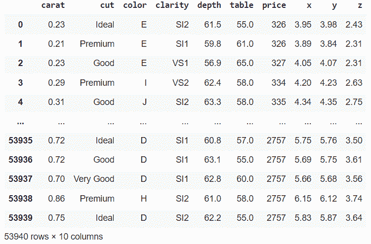
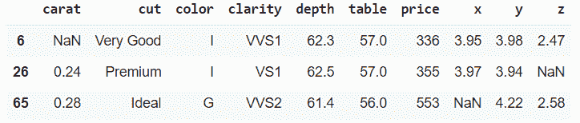
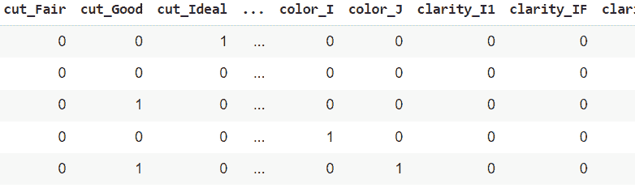
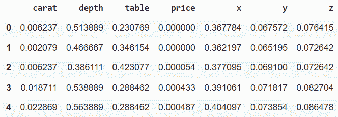
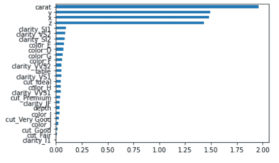

# 在应用机器学习算法之前，你应该考虑的 5 种重要的预处理方法

> 原文：<https://blog.devgenius.io/5-important-preprocessing-methods-you-should-consider-before-applying-machine-learning-algorithms-2d43b2a1d98f?source=collection_archive---------9----------------------->

## 数据科学之旅

## 数据将成为世界上最有价值的资产。


由中途的人工智能创建的图像

# 概观

由于新的技术进步，发布的数据量有了巨大的增长。我们有很多数据，从健康到经济，从环境到空间。而且都在等待被理解。从这些数据中找出意义，有可能成为许多问题的解决方案，这些问题至今仍有待回答。然而，不断增长的数据量也带来了复杂性。统计等传统方法不足以解决这种复杂性和噪声数据。今天，机器学习方法已经被频繁地用于各个领域来克服这些困难。对于现实生活中几乎每一种不同类型的问题，我们都有一系列健壮的算法。尽管如此，除了算法的能力之外，提交给该算法的数据也应该是适当的。虽然在机器学习步骤中通常没有给出必要的重要性，但是预处理是有助于问题解决的主要步骤，并且在提高成功性能方面起着重要作用。因此，在使用机器学习算法之前，我们必须精确地分析数据并应用必要的预处理步骤。

从日常生活中收集的每一种数据都是独一无二的。因此，可能需要许多不同的预处理方法来调整算法并提高成功率。然而，有这样的预处理方法，在几乎每种数据类型中使用它是必要的。在本帖中，我们想分享其中最关键的五个，你可以用在自己的数据上。如果你愿意，我们就来看看这些方法，不要再浪费时间了。我们将使用 Python 3 进行编码，并分析来自 kaggle 的名为 diamonds prices 的数据。要获取数据，请点击以下链接:[https://www . ka ggle . com/datasets/nancyalaswad 90/diamonds-prices](https://www.kaggle.com/datasets/nancyalaswad90/diamonds-prices)

# 1.处理缺失值

每次开始分析数据时，我们都必须确定是否有任何缺失值？有几种方法可以处理这种情况。其中一个就是干脆退学。但是我们不想丢失数据，我们可能没有足够的数据。如果样本中的某个属性缺失，我们可以在不破坏数据整体统计的情况下填充缺失的属性，而不是完全丢弃样本。你可以在文献中看到这些名为数据插补的方法。让我们检查我们的数据，看看我们能做些什么。

```
import pandas as pd
data = pd.read_csv("DiamondsPrices.csv")
data.head()
```



我们有 53940 个数据样本，每个样本有 10 个特征。让我们深入调查一下。

```
data.info()

"""
<class 'pandas.core.frame.DataFrame'>
RangeIndex: 53940 entries, 0 to 53939
Data columns (total 10 columns):
 #   Column   Non-Null Count  Dtype  
---  ------   --------------  -----  
 0   carat    53939 non-null  float64
 1   cut      53940 non-null  object 
 2   color    53940 non-null  object 
 3   clarity  53940 non-null  object 
 4   depth    53940 non-null  float64
 5   table    53940 non-null  float64
 6   price    53940 non-null  int64  
 7   x        53939 non-null  float64
 8   y        53940 non-null  float64
 9   z        53939 non-null  float64
dtypes: float64(6), int64(1), object(3)
memory usage: 4.1+ MB
"""

data.loc[(data["carat"].isnull())|(data["x"].isnull())|(data["z"].isnull())]
```

正如你所看到的，一些特征(克拉、x 和 z)的值小于 53940。



我们将使用“sk learn”(sci-kit-1 . 1 . 3)中的一个库来估算缺失值。库中的方法计算每一列的平均值，并将平均值放入缺失点。当然，我们也可以使用其他策略来填充值，如中值、常数等..

[https://gist . github . com/drmehmetbilen/a1c 169809 f 80 CB 3d 024 e 555401645986](https://gist.github.com/drmehmetbilen/a1c169809f80cb3d024e555401645986)

# 2.编码

编码部分由几个步骤组成。其中之一是口头数据。正如你在数据中看到的，切割、颜色和清晰度包括文字。我们可以给每个不同的文本一个数字，但是因为这些数字不代表数字大小，它们可能误导我们的算法。虚拟编码是解决这个问题的一个很好的方法。我们将为每个不同的特征文本创建一个新列。如果样本有这个特征，我们就在那一栏上写 1，如果没有，就写 0。熊猫有一个简单的方法来实现这一点。

```
cToDummy = ["cut","color","clarity"]
data = pd.get_dummies(data, columns  = cToDummy)
data.head()
print(data.columns)
```



我们现在总共有 27 个功能，其中 17 个是新的。此时，我们的整个数据集只包含数字数据。看来现在可以用我们的算法了。是的，这在技术上是正确的，但我们仍然需要改进。

# 3.正常化

不同范围的特征是算法最大的敌人。一个小的数值增加或减少对一个特性来说可能没有意义，但对另一个特性来说却是至关重要的。根据算法的不同，它可能无法理解这种情况，所以我们应该提供一点帮助。借助缩放将每个特征移动到另一维度将是有用的。在文献中，您可以看到有一些选项可以做到这一点，如线性缩放(最小-最大)、剪辑、对数缩放、Z 分数等..最小最大缩放是最常见的方法。并且转化方法简单。

x′=(x 最大)/(最大最小值)

我们也可以使用“sklearn”库的帮助。它有一个 MinMaxScaler 方法。

```
from sklearn.preprocessing import MinMaxScaler
cToNormalize = ["carat","depth","table","price","x","y","z"]
for i in cToNormalize:
  mms = MinMaxScaler()
  data[i] = mms.fit_transform(data[i].values.reshape(-1,1))
```

转换后，我们的新数据集如下所示。现在，每个要素的值都在 0 和 1 之间。



# 4.特征选择

数据集中的每个要素可能都不能充分满足要求，因此这些要素是多余的。我们将开发的模型的成功和运行时间都直接受到数据集的不必要值所产生的复杂性的影响。我们应该摆脱它们，但是我们如何决定哪一个是必要的或不必要的呢？启发式方法尽管启发式方法在这方面表现良好，但是统计方法如“Fisher，Information Gain，Chi Square”也由于其简单和快速的结构而被广泛使用。我们将通过相互获取信息来分析我们的数据。一如既往,“sklearn”对此有一个很好的方法。

```
from sklearn.feature_selection import mutual_info_regression
y = data.pop("price")
x = data
importances = mutual_info_regression(x,y)
iColumns = pd.Series(importances,data.columns)
iColumns.sort_values().plot(kind="barh")

x = data[["carat","y","z","x","clarity_SI1","color_E"]].values
```

在这一点上，作为一个模型开发人员，我们应该通过查看特性的重要性来做出决定。我们要选择多少特征？对此没有明确的决策方法。我们需要通过查看要素的重要性来尝试获得表示最少数量的要素和最具代表性的新数据集。



# 5.验证

想象一下，在一次考试前，你知道所有的问题和答案。那就太好了，不是吗？在测试之前就知道所有这些的模型怎么样？如果我们在训练过程中给出所有的样本，我们就不能依赖模型的性能。它可以取得 100%的成功，但我们不确定它是否经过训练或过度训练。我们可以在文献中看到一些克服这种情况的方法。数据分割是广泛使用的防止过拟合的方法之一。方法遵循以下步骤:

1.  随机分割数据(80%用于训练，20%用于测试)
2.  仅使用训练数据训练您的模型
3.  仅用测试数据测试模型性能

遵循这 3 个步骤足以对模型性能做出更准确的解释。然而，重复这些步骤几次，平均结果，然后评估这个平均值的成功将提供一个更好的愿景。

第一步，我们可以再次使用 sklearn 的帮助。train_test_split 方法用于以给定的训练/测试速率分离和混合数据。

```
from sklearn.model_selection import train_test_split
trainData,testData = train_test_split(data,test_size=0.20,shuffle=True)
```

# 摘要

预处理步骤对机器学习算法的性能和运行时间的影响是不争的事实。在这篇文章中，我们试图解释 5 种不同的方法，它们对你管理这个过程是最需要的，也是最重要的。根据数据集的特征，您将需要许多不同的途径和方法。这里解释的内容将为高级预处理方法提供基础和起点。