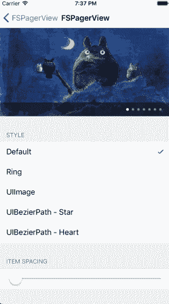
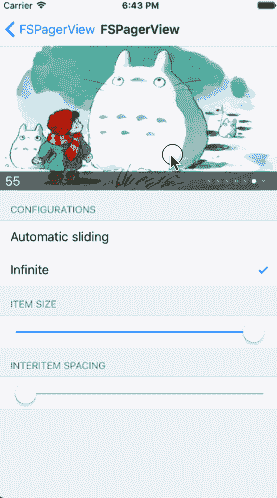
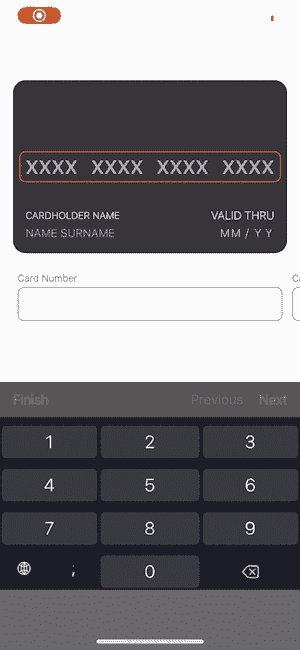
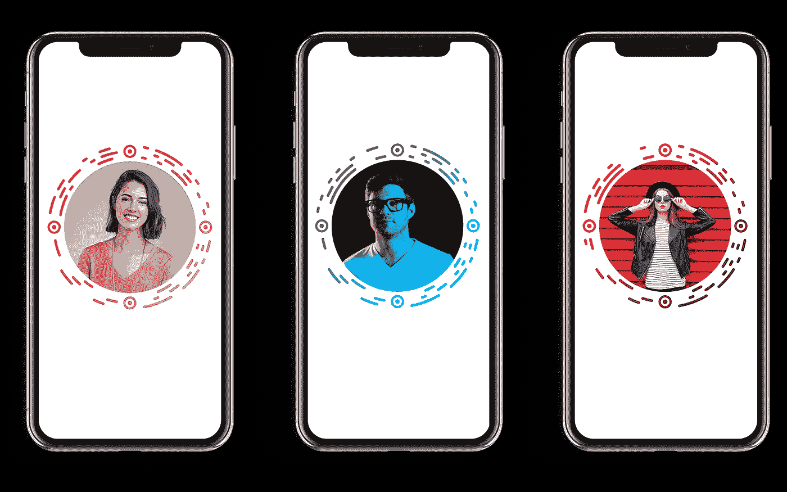
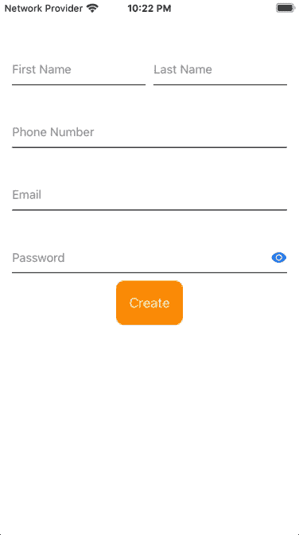

# 5 个 iOS 库，让你的应用更时尚

> 原文：<https://blog.devgenius.io/5-ios-libraries-to-make-your-app-more-stylish-db18a79b63c4?source=collection_archive---------13----------------------->

## 图像滑块、动画信用卡输入、圆形二维码等等

卡斯帕·卡米尔·鲁宾在 [Unsplash](https://unsplash.com?utm_source=medium&utm_medium=referral) 上的照片

# 1. [FSPagerView](https://github.com/WenchaoD/FSPagerView)

经过几个月的休息，我们开始使用 [*FSPagerView*](https://github.com/WenchaoD/FSPagerView) ，一个令人惊叹的库来创建一个**可滑动照片库**。你可以用这个库来制作**横幅**、**图片**、**入职**屏幕等等，只需要一点点努力和漂亮的效果。

目前实现的主要特性有:**无限**滚动、**自动**滑动(带定时器)、**水平** / **垂直**滚动、可定制项目**尺寸**和**间距**，可定制页面控制器**指示器**、 **3D** 变换(更多信息和示例在库的 Github 页面上)

# 2.[动画卡输入](https://github.com/netguru/AnimatedCardInput)

[*AnimatedCardInput*](https://github.com/netguru/AnimatedCardInput)，由 [netguru](https://github.com/netguru) 开发，是一个用于**信用卡明细输入**的 iOS 库，用 Swift 5.0 编写，支持 iOS 11+。它提供了一个**动画视图**，允许用户轻松设置**卡号**、**持卡人姓名**和**有效期**。

该视图还可以定制启用 CVV 掩蔽，日期验证，彩色文本，字体，日期分隔符，占位符等等。

# 3.[圆形代码](https://github.com/aslanyanhaik/RoundCode)

[*round code*](https://github.com/aslanyanhaik/RoundCode)*是为定制**圆形二维码**创作而制作的 iOS 库。与 Facebook Messenger 个人资料二维码类似， [*RoundCode*](https://github.com/aslanyanhaik/RoundCode) 允许您创建和读取圆形码。*

*您可以设置中央**图像**、**大小**、**渐变**类型和**线条**颜色。唯一不足的是只支持 iOS 13.0+版本*

# *4.[FloatingLabelTextFieldSwiftUI](https://github.com/kishanraja/FloatingLabelTextFieldSwiftUI)*

**

*对于您的完整 SwiftUI 项目来说，一个非常有用的库是[*FloatingLabelTextFieldSwiftUI*](https://github.com/kishanraja/FloatingLabelTextFieldSwiftUI)。例如，当用户必须设置标签的详细信息时，它可以在标签上方创建一个浮动标签。*

*使用一个**漂亮的动画**，这个轻量级的库将在你的视图中添加更多的动态内容，以便为最终用户创建一个更好的界面。*

# *5.[卡片堆栈视图](https://github.com/dadalar/SwiftUI-CardStackView)*

**

*最后一个库是[*CardStackView*](https://github.com/dadalar/SwiftUI-CardStackView)*，*易于使用并且完全在 **SwiftUI** 中制作，允许你在 **iOS** ， **macOS** 和 **watchOS** 上创建类似 Tinder 的视图。*

*目前支持的方向有:`LeftRight`、`FourDirections`、`EightDirections`。*

**

# *阅读更多*

*不要错过之前的版本！*

*   *[在你的下一个应用中使用的 5 个 iOS 库](/better-programming/5-ios-libraries-to-use-on-your-next-app-5510659afcdb)*
*   *[5 个 iOS 库让你的 App 界面更好](/better-programming/5-ios-libraries-to-make-your-app-interface-better-fcbb2292e0e8)*
*   *[改善项目用户体验的 5 个 iOS 库](https://medium.com/better-programming/5-ios-libraries-to-improve-your-projects-user-experience-c079fb81416f)*