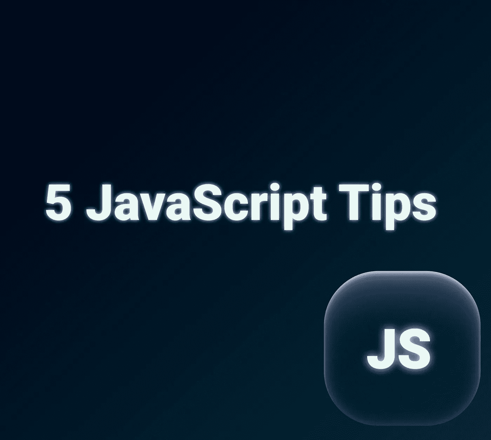

# 5 个值得了解的 JavaScript 技巧

> 原文：<https://blog.devgenius.io/5-javascript-tips-that-are-good-to-know-eb548b4b64a5?source=collection_archive---------0----------------------->

1.  **使用模板字符串**

字符串连接很容易也很简单，但是有时它会导致挫折和错误。

模板文字允许嵌入表达式。要使用这种方法，您需要知道字符串必须用反斜杠(``)括起来的唯一语法。

模板字符串可以包含动态值的占位符。这些由美元符号和花括号标记。

2.**解构**

如你所知，析构是分解数组元素和对象属性的技术。让我们用几个例子来看。

这里我们有一系列表情符号:

为了析构，我们将使用如下语法。

这与 do，`let smile= emojis[0];`相同，但是更加灵活。你有没有注意到，我刚刚忽略了使用中间空白的**烟火**表情符号？那么输出会是什么呢…

我还想让你看看其余的`…` 操作员。如果您想要析构一个数组，您想要将一个或多个项赋给变量，并将其余的项放入另一个数组，您可以使用如下所示的`…` rest 来实现。

像数组一样，我们也可以析构对象。

析构使得，我们得到名字，边在一对变量中，其余的在另一个对象中。

如果你想知道更多，请在评论中写下。

**3。isInteger**

怎么知道一个数是不是整数？

这是非常有用的，最好是知道。

JavaScript 的 Number API 提供了一个名为 isInteger()的方法来实现这个目的。

**4。速记用 AND**

让我们考虑这样一种情况，我们有一个布尔值和一个函数。

如果您想检查布尔条件并调用函数，您可以更改这段代码

一个更短的

因此，我们使用了运算符 AND( `&&`)。我们也完全避免使用`if` 语句。很酷，对吧？

**5。默认值用或**

如果需要设置变量的默认值，可以使用 OR( `||`)操作符轻松完成。

但是如果值应该是 0 就有问题了。如果这个人的年龄是 0(可能是刚出生的婴儿)呢？年龄将被计算为 20 ( `0 || 20 = 20`)。这是意外的行为。

进入`nullish operator (??)`。它是一个逻辑运算符，当其左侧操作数为`null`或`undefined`时，返回其右侧操作数，否则返回其左侧操作数。

快乐编码:)

# 学到了新东西？

如果你喜欢这篇文章，可以 [**给我买杯咖啡**](https://www.buymeacoffee.com/stasoz) 我写下一篇文章的时候再喝:)

*更多内容尽在*[*blog . dev genius . io*](http://blog.devgenius.io)*。*