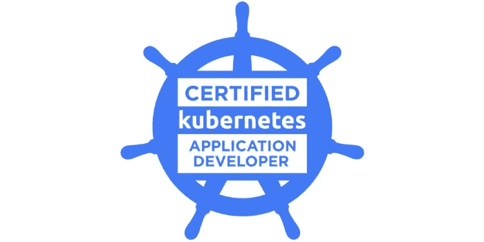

# 破解 CKAD 认证的 5 个关键技巧

> 原文：<https://blog.devgenius.io/5-key-tips-to-crack-ckad-certification-d2dd4dbad971?source=collection_archive---------3----------------------->

最近，我成功通过了[认证 Kubernetes 应用开发人员(CKAD)](https://www.cncf.io/certification/ckad/) 认证，我想分享我的经验、学习技巧和诀窍以及帮助我获得 CKAD 徽章的资源。



**#技巧一:知己知彼【考试大纲】**

为了准备考试，第一步应该是熟悉教学大纲。我将列出有助于您准备认证的关键章节，在 CNCF [页面](https://www.cncf.io/certification/ckad/)上还有一份简要的教学大纲。

*   **核心概念** : *Pod、副本集、部署、名称空间*
*   **配置** : *命令参数、环境变量、配置映射、秘密、安全上下文、节点关联、污点和容差、服务帐户*
*   **多容器箱** : *边车、大使、适配器*
*   **可观察性** : *活性探测、就绪探测、记录、监控*
*   **Pod 设计** : *标签、选择器、作业、Cron 作业、部署策略*
*   **服务&联网** : *网络策略、服务、入口*
*   **状态持久性** : *持久性卷、持久性卷声明、卷安装、存储类、状态集*

你也可以通过 Udemy 上提供的下面的实践培训课程，我个人认为非常有用。

[](https://www.udemy.com/share/1013BQAEAeeVpXTHwA/) [## Kubernetes 认证应用程序开发人员(CKAD)培训

### Kubernetes 认证可以让你的职业生涯达到一个全新的水平。在 Kubernetes 上学习、实践并获得认证…

www.udemy.com](https://www.udemy.com/share/1013BQAEAeeVpXTHwA/) 

**#提示 2:准备好你的武器库【练习时使用命令式指令】**

kubernetes 中的每个资源都可以通过使用 yaml 文件来创建。比如，如果你想用 yaml 创建一个 pod。您可以使用声明性命令来创建它。

在 kubernetes 中创建 pod 的声明性示例

但是有时候从头开始创建 yaml 文件会很麻烦，因为你会遇到很多问题，比如缩进和使用错误的键。这类问题会耗费大量时间，而且很难调试。因此，与其从头开始创建 yamls，不如尝试使用命令性的[命令](https://kubernetes.io/docs/tasks/manage-kubernetes-objects/imperative-command/)，这将节省大量时间并帮助您加快速度。

对于创建包含图像的窗格的示例，您可以使用:

```
kubectl run <pod_name> --image=<image_name>
```

这可以帮助你创建 pod 而不用创建 pod.yaml，如果你想在 yaml 中添加更多的东西，你可以使用`dry-run`命令让 yaml 退出这个命令式命令。例子

```
kubectl run <pod_name> --image=<image_name> -o yaml --dry-run=client
```

这个命令可以给你 pod yaml，你可以很明显地编辑它并在考试中节省一些宝贵的时间。

我发现了一个很好的资源来练习 kubectl 中的命令性命令。这个 git 存储库有很多 kubectl 命令性命令的例子。

[](https://github.com/dgkanatsios/CKAD-exercises) [## dgkanatsios/CKAD-演习

### 一组练习帮助我准备认证 Kubernetes 应用程序开发人员考试，由云提供…

github.com](https://github.com/dgkanatsios/CKAD-exercises) 

**#技巧三:患难之交【遇到困难时使用 kubenetes.io】**

在考试期间，你只能访问这些链接[https://kubernetes.io/docs/](https://kubernetes.io/docs/)、[https://github.com/kubernetes/](https://github.com/kubernetes/)、[https://kubernetes.io/blog/](https://kubernetes.io/blog/)及其子域名。有关考试的更多说明和提示可以在此[链接](https://docs.linuxfoundation.org/tc-docs/certification/tips-cka-and-ckad)中找到。

kubernetes 中有些对象不能用命令式命令创建，显然必须为其创建 yaml 文件。如你所知，编写 yaml 是一项令人生畏的任务，因为它消耗了你大部分的时间。所以最好的建议是熟悉 kubernetes。我会找到所有你遇到困难时不得不去的地方。不要使用谷歌搜索，使用 kubernetes [文档](https://kubernetes.io/docs/)并复制 yaml 内容来创建不同的 kubernetes 对象。除非你是这方面的专家，否则不要试图独自纠正 yaml。

在编写 yaml 文件时，还有一件事可以帮到你，那就是`kubectl explain`命令。如果你想知道某一级的键是什么，它包含什么值，你可以使用`kubectl explain`命令来找到它。例如，如果您想知道`containers`在`pod.yaml`中可以有哪些键，您可以使用以下命令轻松找到。

```
kubectl explain pod.spec.containers
```

对于许多 kubernetes 对象来说，这个命令就像一个文档命令，它甚至解释了这个键可以包含什么值以及值的类型。

**#Tip4:要么全有，要么全无【尽可能多地尝试提问】**

在 CKAD 考试中，一些问题太容易，而另一些问题可能需要一些时间来解决。所有的问题都是随机排列的，所以请确保你阅读了所有的问题，不要在单个问题上浪费时间。

我遵循的方法是，如果在试了两次后问题仍未通过，我会标记它们并向前移动，以便我可以尝试其他问题。试着尝试考试中的所有问题，不要在一个问题上花太多时间，你可以标记它们，然后进入下一个问题。也许对你来说，接下来的问题会更容易解决。

还有一件事你应该始终牢记在心，那就是始终仔细阅读问题，并按照问题中的要求在正确的地方进行修改。不要忘记阅读问题的信息部分，它可能会提供一些提示。

**#Tip5 : Hustle【好好练】**

这些建议可以帮助你很好地分配你的努力和时间，但最终实践是关键。确保你尽可能多的练习。对于刚接触 kubernetes 的人来说，花一个月的时间完成整个教学大纲。您也可以在 Google Kubernetes Engine(GKE)、 [katacoda](https://www.katacoda.com/) 或任何首选的 Kubernetes 云提供商上免费设置一个集群进行练习。对于已经有一些使用 kubernetes 的经验的人来说，试着掌握可能成为交易破坏者的命令。最后，你应该能够在 kubernetes 中创建、删除和调试资源，从而通过考试。

一定要熟悉编辑器(vim 或 nano ),无论哪种你觉得舒服，在考试练习时尽量不要使用任何文本编辑器或任何 IDE。

这个考试确实很有意义，有助于你作为一名熟练的应用程序开发人员脱颖而出。所以准备好，开始准备考试吧。

万事如意！！


拍拍下面把这篇文章推荐给别人👏👏