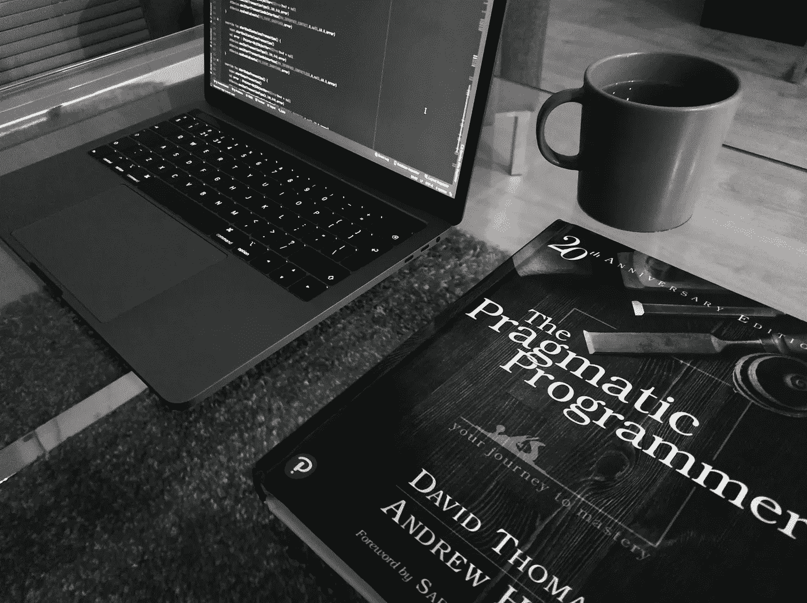

# 《务实的程序员》一书中的 5 条经验

> 原文：<https://blog.devgenius.io/5-lessons-from-the-book-the-pragmatic-programmer-b4549408880f?source=collection_archive---------3----------------------->

戴维·托马斯和安德鲁·亨特所著的《实用程序员》一书是开发人员的“必读”之一。合著者 Andrew Hunt 早在 2001 年就参与了敏捷宣言的创建。这本书可以给你很多关于如何编写灵活、动态、适应性强的软件的实用建议。我发现这本书非常有趣，所以我想告诉你这本书给我的许多教训中的 5 条。我希望能激起你的好奇心，既然这样，[这里有](https://www.pragmaticprogrammer.com/titles/tpp20/the-pragmatic-programmer-20th-anniversary-edition/)你可以买到这本书的链接。让我们从第一课开始:

## 1.解决问题，而不是责备:

有可能在调试过程中，你发现别人写的一段代码有问题，一些开发人员只是说“这段代码不是我写的，所以我不会修复它”。

务实的程序员修复代码，而不是责备，不管 bug 是你的错还是别人的错。还是你的问题。记得和你的团队沟通，这样你就可以创造一个共同的健康文化。作者强烈鼓励对代码进行热烈的讨论，这是分享知识和想法的重要方式。

[车头](https://unsplash.com/@headwayio?utm_source=unsplash&utm_medium=referral&utm_content=creditCopyText)在[档](https://unsplash.com/s/photos/meeting?utm_source=unsplash&utm_medium=referral&utm_content=creditCopyText)拍照

## 2.你不可能写出完美的软件:

让我直截了当地说:完美的软件是不存在的，所以接受它作为一个事实，不要浪费你的时间去追逐一个不可能的目标。但是务实的程序员可以从这件事情中得到好处:代码处于防御模式，不要相信任何人包括(尤其是)你自己的代码。不断寻找代码中需要改进的地方。

作者介绍了帮助我们不断修正现有代码的常用技术。编写有效的代码，并通过编写测试来证明它，然后确保它们经常自动执行。

使用版本控制软件记录你的代码库的每一个变化，共享目录中的代码作为版本控制系统是不可接受的。这种系统可以让你回到以前的代码版本，所以如果你弄得一团糟，你可以回到以前的版本重新开始。此外，您可以随时知道谁对特定代码行进行了修改，或者在特定版本中修改了哪些文件。这些信息对于 bug 跟踪、性能和质量来说是非常宝贵的。

## 3.不要依赖什么可以改变:

为了真正使你的代码具有适应性和灵活性，你应该把那些当你的软件在不同的环境中运行或者为不同的客户运行时会改变的值保留在你的应用程序之外。

您可能希望具体化的常见内容是凭证、许可证密钥、格式细节、验证参数等等。您可以选择将这些值放在一个文件、数据库表中，或者放在一个 API 后面，但是将这种数据保存在外部。记住，不适应的人会落后。

## 4.迈出小步:

未来是不确定的，尤其是当我们谈论软件的时候。客户不知道他们到底想要什么，这是开发者可以帮助的地方。我们的工作是帮助人们了解他们真正想要的是什么。有些人认为“需求收集”是项目的早期阶段，但事实并非如此。

> 需求是在反馈循环中学习的。

这就是为什么务实的程序员喜欢在短迭代中工作的主要原因，以便在一个循环中获得来自客户的反馈。因此，为了减少浪费精力的风险，设计和编写更适合当前需求的可维护代码是很重要的。

采取小步骤，编写易于更改的代码，收集客户的反馈，并调整需求，这是务实的程序员所做的事情。这种建议类似于敏捷开发所说的，我写了一篇关于这个话题的文章，你可以在[这里](https://medium.com/dev-genius/why-agile-can-make-you-a-better-developer-b6e8ad9f63a4)找到它。

## 5.构建您的知识组合:

照片由[马修·费尼](https://unsplash.com/@matt__feeney?utm_source=unsplash&utm_medium=referral&utm_content=creditCopyText)在 [Unsplash](https://unsplash.com/s/photos/knowledge?utm_source=unsplash&utm_medium=referral&utm_content=creditCopyText) 拍摄

与金融投资组合类似，为了正确管理你的知识投资组合，你应该:定期投资，分散投资，并经常审查和重新平衡其内容。

养成一个健康的习惯，定期投资你的投资组合，计划每天花一定的时间在你的知识上。知识是一种即将到期的资产。

尝试每年至少学习一门新语言，此外，尝试尽可能的多样化。例如，如果你是一名移动开发者，那么试着学习一门后端语言/技术，反之亦然。你知道的不同的东西越多，你就越有价值。试着读一本非技术性的书，因为我们是为人们编写软件的。作者给出的另一个建议是对你正在阅读的东西持批评态度，你必须确保你正在阅读的信息是准确的。记住，你能做的最好的投资是在你自己身上。

这些只是你可以从这本书中学到的许多教训中的五个。这并不是一本最值得开发者推荐的书，这里是完整的[列表](https://dev.to/awwsmm/20-most-recommended-books-for-software-developers-5578)。这绝对物有所值。

**在这里** **你可以找到我在 Medium 上的其他作品的链接并关注我** [**。感谢阅读！**](https://medium.com/@danilo.raspa)

 [## 为什么敏捷可以让你成为更好的开发人员

### 让我们从开发者的角度来分析敏捷软件开发

medium.com](https://medium.com/dev-genius/why-agile-can-make-you-a-better-developer-b6e8ad9f63a4)  [## 每个开发人员都应该阅读马丁·福勒的《重构》的 3 个理由

### 欢迎任何反馈😊

medium.com](https://medium.com/@danilo.raspa/3-reasons-why-every-developer-should-read-refactoring-by-martin-fowler-8051dc39d9f3)