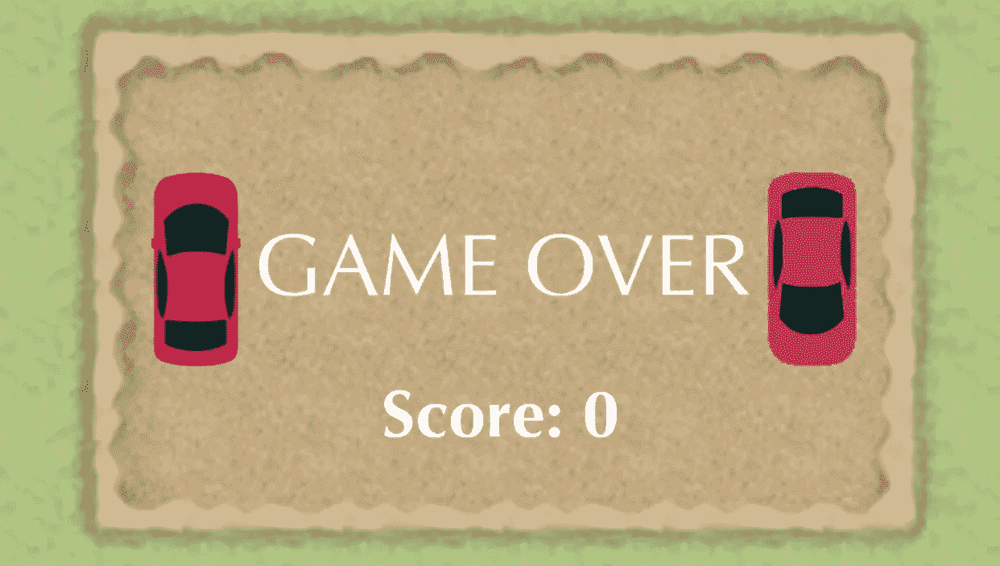
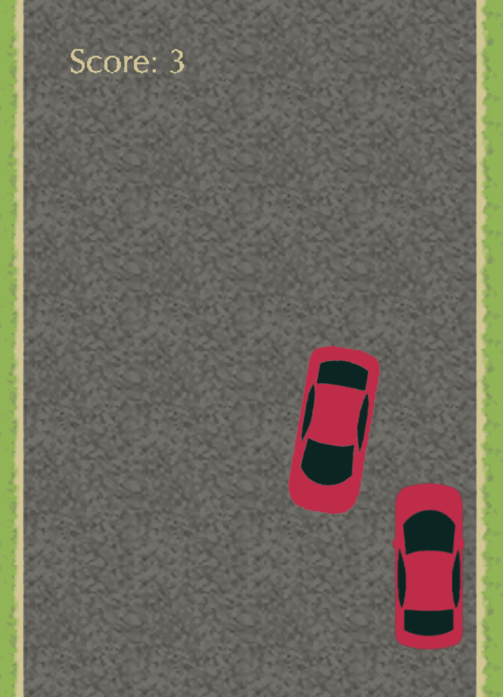
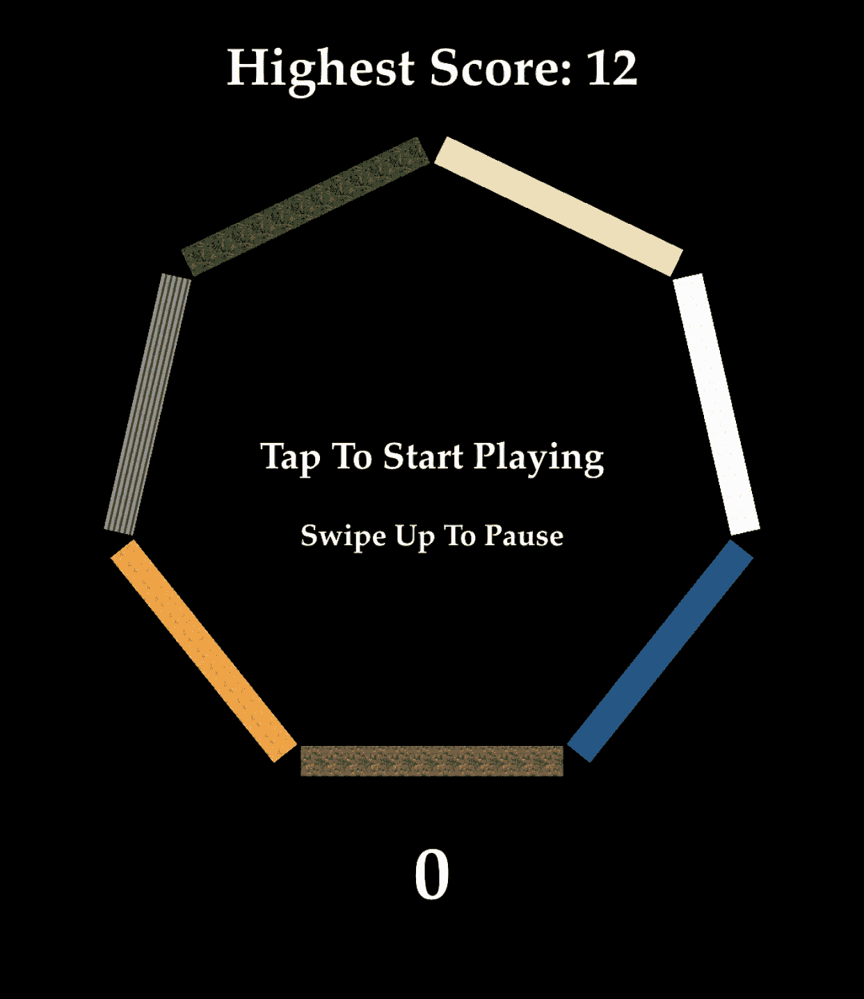

# 我从失败的移动应用创业中学到的 5 个教训

> 原文：<https://blog.devgenius.io/5-lessons-that-i-learned-from-my-failed-venture-in-mobile-apps-742b72403586?source=collection_archive---------4----------------------->

我认为这是我致富和辞掉常规工作的一种方式，它为我重新评估我的信仰和价值观铺平了道路。

正是在 Flappy Bird 流行期间，激发我进入移动应用程序的世界。我的无意识大脑认为，我可以轻松地每天赚 50K 美元，只要创造一个超级硬的游戏，并在手机上发布。我从没犯过这么大的错误。

# 这一切是如何开始的

我决定学习，然后创建自己的移动应用程序是在 2017 年。在一家科技公司做 IT 分析师，拿到奖金后，我买了我的第一台 macbook，这样我就可以开始在 Xcode 上编码，并在 app store 上发布我的作品。大约在那个时候，我感受到了一股短暂的动力，让我能够在短短一个月内研究、开发并发布我的第一个应用程序。3 个月后，我发布了第二个应用，同年又发布了两个应用。但在这段时间里，现实开始缓慢但肯定地发生作用。

# 残酷的现实袭来

我最初的几个应用是通过 admobs 赚钱的超级游戏。当我收到谷歌的一封电子邮件，说他们要禁用我的 admobs 账户，他们的决定是最终决定时，让我坚持下去的动力很短暂。可能我犯了一个小错误，我不确定是什么，因为 admobs 不会告诉你确切的原因。他们的游戏场，他们的规则。我搜索了一个替代品，找到了 chartboost(直到今天我还在用)。我想这是我唯一需要担心的事情，其他的会自己解决的。那我就等着最终梦寐以求的被动现金流吧。但这从未发生过。我的应用程序没有得到足够的下载，我的用户停留时间太短，我很少赚到一分钱。

那么更大的问题来了，我从来没学过…

# 我太妄想了，看不清现实

如果我早点意识到这一点，也许我就能早点解决我的问题，而不是浪费更多的时间重复做同样的事情，同时期待不同的结果。我被误导的动机让我像疯子一样继续工作，但也蒙蔽了我的判断，阻止我看清现实，重新评估我应该如何做事。

我花了几个已发布和失败的应用程序才最终学到这些宝贵的经验:

## **第一课:首先制作一个原型来测试市场**

在写这篇文章的时候，我已经发布了 13 个应用程序。在这些数字中，只有 5 个产生了利润。更不用说那些产生利润的应用中有 2 个是付费应用而不是游戏。

如果我先创建一个工作原型，然后让可以提供合理反馈的可信人员对其进行测试，我应该可以节省自己几个月的辛苦工作。这样，在投入更多时间完成和发布之前，它会给我足够的信息来了解应用程序的好坏。

## **第二课:倾听你的用户**

受超硬超复杂游戏成功的启发，我以这种方式设计了我的前几个应用程序，这导致了我的失败。我已经从我的普通用户那里收到了很多反馈，说我的游戏非常难，他们要求增加一个简单的难度。但是我从来不听我的老用户的。相反，我继续发布超硬超卡萨斯游戏，试图取悦一个甚至不知道我的应用程序存在的利基市场。然后后果就来了，我失去了已经支持和使用我的应用的群体。

## 第三课:分析从不说谎

事实证明，并不是所有的超硬超卡萨斯游戏都是有用的，在社交媒体上发布你的应用程序是不够的。

让一个应用程序成功的因素有很多。获得更多事实的唯一可靠方法是查看分析。这样，你就能对如何前进做出更好的决定。

## 第四课:不断推出新内容

我以前也有这个坏习惯在那之前有一次我发布了 app，就这样。这就是为什么我的应用程序有短期保留应用程序。

app store 或 play store 中最赚钱的应用会定期更新新内容。因为与我们的祖先相比，现在的人注意力持续时间较短。

发布应用程序并不是结束，它只是旅程的开始。

## **第五课:承诺是最重要的**

我忘记了成功最重要的公式。承诺。

承诺是当你定期提升你的技能，研究市场，思考新的内容。牺牲大量本该用于娱乐的空闲时间，为创造更好的应用铺平道路。

回想我的旅程，我意识到我只是相信而不是承诺。我以为我已经够努力了，但事实上我只是在等待好运降临。这是我失败的主要原因。

这不是一个成功的故事，而是我想分享的一次学习经历。听着，我不是来摧毁你的梦想或者阻止你追求你的激情。我的观点是，时不时地做一次现实检查。相信自己是不够的。更重要的是做好你的功课，研究市场，计划你的方法，从错误中学习，努力工作，最重要的是如果你真的想实现你的梦想，坚持不懈。

就我个人而言，这取决于我是否会犯同样的错误，或者是否仍然顽固地重复同样的错误。

-电弧

> 这篇文章包含以下链接到我的应用程序商店简介。谢谢你。

 [## App Store 上的 Alvin Sosangyo 应用

### 下载 Alvin Sosangyo 的应用程序，包括 inhibit The Balls 2、ML Lingo、Equalme 等。

apps.apple.com](https://apps.apple.com/ph/developer/alvin-sosangyo/id1212525993) 

*更多内容尽在*[*blog . dev genius . io*](http://blog.devgenius.io)*。*