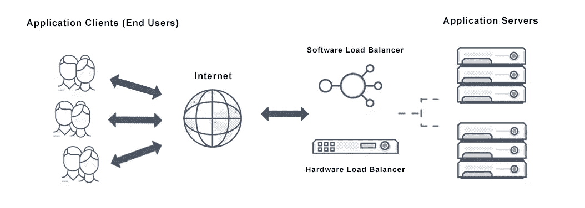

# 5 分钟学习 Python 和创建自己的负载平衡器:包括一步一步的教程！

> 原文：<https://blog.devgenius.io/5-minutes-to-learn-python-and-create-your-own-load-balancer-step-by-step-tutorial-included-f3109b5f7961?source=collection_archive---------4----------------------->



负载平衡器是一种系统，它将传入的网络流量分布在一组服务器上，以确保没有一台服务器不堪重负。这有助于提高服务器及其承载的应用程序的性能和可用性。

在本教程中，我们将学习如何使用`sockets`模块在 Python 中创建一个简单的负载平衡器。

# 先决条件

为了跟随本教程，您需要对 Python 编程和`sockets`模块有一个基本的了解。您还需要运行一些服务器，以便在它们之间实现负载平衡。

# 步骤 1:将负载平衡器绑定到端口

创建负载平衡器的第一步是将其绑定到网络上的一个端口。我们可以使用`socket`对象的`bind()`方法来做到这一点。

```
import socket

# Create a socket object
sock = socket.socket(socket.AF_INET, socket.SOCK_STREAM)

# Bind the socket to a port
sock.bind(("localhost", 8080))
```

在这个例子中，我们将套接字绑定到`localhost`地址和端口 8080。您可以选择系统中尚未使用的任何端口。

# 步骤 2:侦听传入的连接

接下来，我们需要告诉套接字监听传入的连接。我们可以使用`listen()`方法做到这一点。

```
# Listen for incoming connections
sock.listen(5)
```

该方法采用一个整数参数来指定排队连接的最大数量。在本例中，我们允许最多 5 个连接排队。

# 步骤 3:接受传入连接

现在套接字正在监听传入的连接，我们可以开始使用`accept()`方法接受它们。

```
while True:
    # Accept an incoming connection
    client_sock, client_addr = sock.accept()
    print("Received connection from", client_addr)
```

`accept()`方法一直阻塞，直到接收到新的连接，这时它返回一个连接到客户机和客户机地址的新套接字对象。

# 步骤 4:将连接转发到服务器

既然我们已经收到了一个来自客户端的连接，我们需要将它转发到我们正在进行负载平衡的服务器之一。我们可以使用`socket`对象的`connect()`和`sendall()`方法来做到这一点。

```
# Choose a server to forward the connection to
server_sock = socket.socket(socket.AF_INET, socket.SOCK_STREAM)
server_sock.connect(("localhost", 8000))

# Forward the connection
server_sock.sendall(client_sock.recv(1024))
```

在本例中，我们将连接转发到运行在`localhost`地址和端口 8000 上的服务器。您可以选择任何您想要负载平衡的服务器。

# 步骤 5:关闭连接

一旦连接被转发到服务器，我们就可以关闭客户端和服务器的连接。

```
# Close the connections
client_sock.close()
server_sock.close()
```

# 完整示例

以下是负载平衡器的完整代码:

```
import socket

# Create a socket object
sock = socket.socket(socket.AF_INET, socket.SOCK_STREAM)

# Bind the socket to a port
sock.bind(("localhost", 8080))

# Listen for incoming connections
sock.listen(5)

while True:
    # Accept an incoming connection
    client_sock, client_addr = sock.accept()
    print("Received connection from", client_addr)

    # Choose a server to forward the connection to
    server_sock = socket.socket(socket.AF_INET, socket.SOCK_STREAM)
    server_sock.connect(("localhost", 8000))

    # Forward the connection
    server_sock.sendall(client_sock.recv(1024))

    # Close the connections
    client_sock.close()
    server_sock.close()
```

此代码创建了一个负载平衡器，它侦听端口 8080 上的传入连接，并将它们转发到在端口 8000 上运行的服务器。它将无限期地继续这样做，直到负载平衡器停止。

# 负载平衡算法

有许多不同的算法可用于选择将连接转发到哪个服务器。一些常见的算法包括:

*   循环:依次将连接转发到每个服务器。
*   最少连接数:将连接转发到当前连接数最少的服务器。
*   最短响应时间:将连接转发到平均响应时间最短的服务器。

您可以通过跟踪每个服务器的连接数和响应时间并相应地选择服务器来实现这些算法。

# 结论

在本教程中，我们学习了如何使用`sockets`模块在 Python 中创建一个简单的负载平衡器。我们将负载平衡器绑定到一个端口，监听传入的连接，接受这些连接，将它们转发到服务器，并关闭连接。我们还讨论了不同的负载平衡算法，这些算法可用于选择将连接转发到哪个服务器。