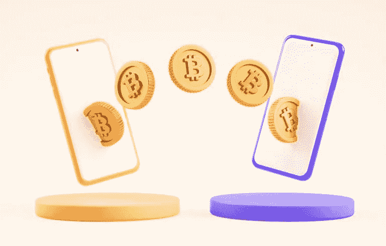

# 2022 年你应该注意的 5 个移动应用趋势

> 原文：<https://blog.devgenius.io/5-mobile-app-trends-you-should-watch-out-for-in-2022-4e59b7bb3020?source=collection_archive---------13----------------------->

去年，我们看到了移动商务(移动商务)、可折叠显示设备的应用开发以及移动钱包的普及。现在，仅仅几个月后，我们已经可以看到 2022 年一些最大的移动应用趋势正在形成。

作为一名企业主，了解应用程序世界的流行趋势可以帮助你决定将哪些功能纳入你自己的应用程序(如果你有一个的话)，或者让你的移动应用程序开发者开发什么样的应用程序。

在这篇博文中，我们将讨论 2022 年你应该警惕的五大移动应用趋势——继续阅读。

# 1.增强现实和虚拟现实

第一个趋势是向更加个性化的应用程序发展。消费者的要求越来越高，他们希望品牌能为他们提供量身定制的体验。这意味着企业需要投资增强现实(AR)和虚拟现实(VR)，以便为客户创造更多身临其境和个性化的体验。

这些技术将允许企业创造独特的客户体验，不仅引人入胜，而且令人难忘。在合适的移动应用程序开发人员的帮助下，商业、艺术和医疗领域的公司现在可以轻松地创建这些体验，并将它们直接带到客户的手机上。

# 你如何利用这一趋势？

一种方法是为潜在客户创建一个虚拟的业务场所或产品之旅。你也可以向他们展示一个产品是如何工作的，或者如何使用一个特殊的功能。

# 2.超级应用

你可以用一些应用程序来购物。你可以用一些应用程序来预订出租车。但是，如果有一个应用程序可以做到这两个呢？这就是超级应用的用武之地。

超级应用是一体化平台，在一个应用中提供多种服务。我们已经看到这种趋势随着微信等在亚洲的兴起，超级应用在世界其他地区流行只是时间问题。

# 你如何利用这一趋势？

这种趋势对于提供多种服务或产品的企业尤其重要。通过将您的所有产品整合到一个应用程序中，您可以让客户更容易找到他们想要的东西并进行购买。

# 3.P2P(点对点)支付

这是两个人可以不通过银行或其他金融机构相互转账的地方。

Apple Pay、Google Pay 和 Venmo 等移动钱包的激增使这一趋势成为可能。随着越来越多的人使用移动钱包进行日常购物，PTP 支付成为常态只是时间问题。

# 你如何利用这一趋势？

如果你是企业主，你可以开始接受客户的 PTP 付款。如果你是客户，你可以使用 PTP 支付快捷方便地向朋友和家人汇款。

# 4.跨平台应用开发

我们看到的另一个大趋势是跨平台应用开发的兴起。这是一家移动应用程序开发公司创建一个可以在 Android 和 iOS 设备上使用的应用程序的地方。

这样做的好处是，它允许企业通过他们的应用程序接触到更广泛的受众。由于跨平台应用程序是使用单一代码库开发的，从长远来看，它们的维护也更容易、更便宜。

# 你如何利用这一趋势？

在一个好的应用开发者的帮助下，你可以拥有一个在 Android 和 iOS 设备上都可以运行的应用。从长远来看，这将使你的应用达到更广泛的受众，并节省维护成本。

# 保持竞争力&引领这些移动应用趋势

这些只是我们在移动应用领域看到的众多趋势中的一部分。在优秀开发者的帮助下，你可以轻松地将这些趋势融入到你自己的应用中。

Zluck Solutions 是一家值得您信赖的 web 和移动应用程序开发外包公司！我们始终确保我们给你的人才拥有关于移动应用程序开发的最新知识。更多地了解我们如何处理[网络和移动应用开发](https://www.zluck.com/services/)项目，以及我们如何通过[联系我们](https://www.zluck.com/contact-us/)让您跟上最新潮流。