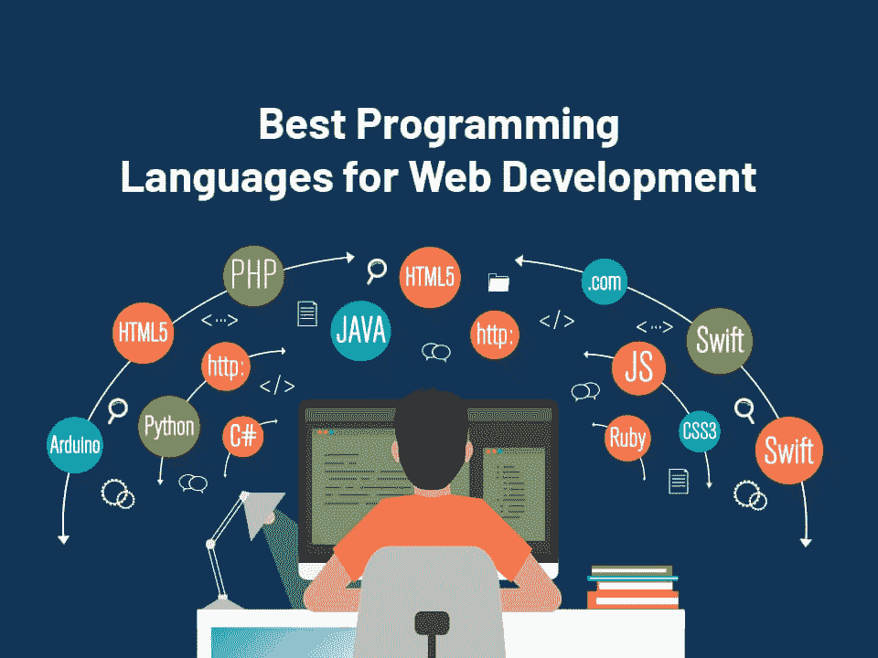
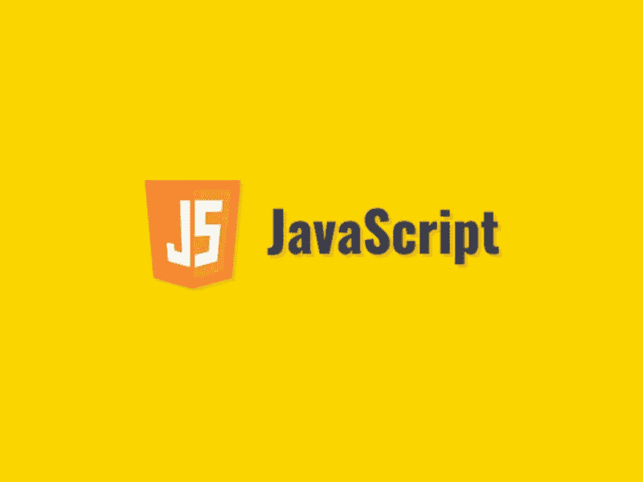
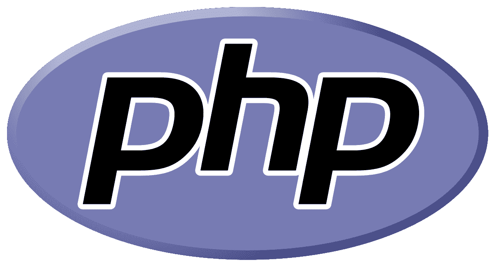
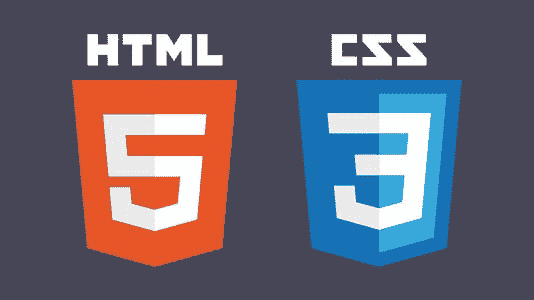
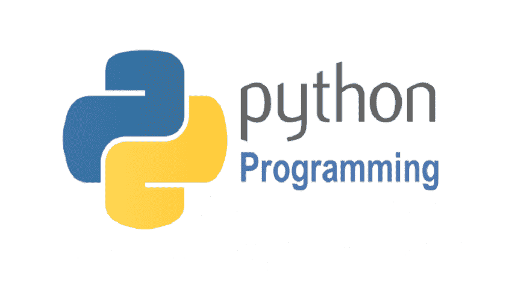
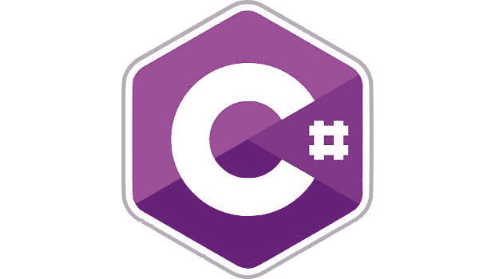

# Web 应用程序开发中最流行的 5 种编程语言

> 原文：<https://blog.devgenius.io/5-most-popular-programming-languages-for-web-app-development-fa5912e2a23b?source=collection_archive---------0----------------------->

图片来源:环球媒体观察

每种语言都有其独特的优点和缺点，所以在编写代码之前，您需要确保选择了正确的语言。

如果你正在寻找应用程序 web 开发的最佳编程语言，这里有你应该尝试的前 5 种。此外，为了在 web 应用开发中充分利用编程语言，**聘请了来自一流的**网站应用开发公司**的 web 应用开发人员**。

*   **JavaScript**

图片来源:Pragim Tech

JavaScript 是一种编程语言，是一套用于在网站上构建交互式事物的技术。这是一个具有多重含义的特殊技术术语，但是大多数非技术人员在提到 JavaScript 时通常会提到一个或另一个版本。

无论如何，JavaScript 是一种面向对象的脚本语言，是网页交互性的一部分。它主要用于网络浏览器，但也可以用于手机和平板电脑等其他设备。

此外，JavaScript 广泛用于 web 和移动应用程序开发，这也是它被认为是 web 应用程序开发的最佳编程语言的原因。

它也是可以在前端(客户端)和后端(服务器端)开发中使用的少数语言之一。

## 在 web 开发中使用 Java 的优势

-这是一种现代语言，因此有一个大型开发人员社区来帮助您。

-如果你有一些基本的编程经验，这相对容易理解。

-它可以在所有主流浏览器和平台上运行。

AngularJS、React、Vue 等 JavaScript 框架让 web 开发更高效。

## 在 web 开发中使用 Java 的缺点

-由于其松散的语法，调试起来很有挑战性。

-一些开发人员发现用 JavaScript 读写代码很困难。

-它不像其他语言那样适合大型项目。

你是否正在建立一个新的业务并专注于**网站应用开发**？与技术娴熟的 [**web app 开发者联系印度**](https://www.valuecoders.com/hire-developers/hire-web-app-developers?utm_source=GuestPost&utm_medium=Anu_B11&utm_id=web+app+development) 。通过这样做，您将获得符合您业务需求的创新解决方案。

*   **PHP**

图片来源:维基百科

PHP 是支持大多数网站的两种通用服务器端脚本语言之一。它已经成为历史上最著名的语言之一，它的易用性意味着许多编程新手都可以使用它。

PHP 代码通常也很快(主要是因为它通常运行在共享服务器上)，并且不需要您的客户进行太多的前期投资(因为它只需要一个互联网连接)。所有这些因素使得 PHP 对于刚开始编程的人来说是一个极好的选择。

除了是编程的理想入门之外，如果您正在构建一个需要经常更新的站点，PHP 也是一个很好的选择。因为 PHP 代码是在服务器上运行的，所以不需要每次更新时都上传。

即使你的客户不懂技术，他们仍然可以上传新内容或编辑现有内容，而不需要你的帮助。例如，WordPress 网站几乎总是内置 PHP，允许用户在没有编码知识的情况下轻松添加或编辑内容。

## 在 web 开发中使用 PHP 的优势

-它不需要您的客户进行太多的前期投资(因为它只需要一个互联网连接)。

-如果您正在构建一个需要经常更新的网站，这是一个很好的选择。

-这是一个很好的编程入门。

## 在 web 开发中使用 PHP 的缺点

-由于其松散的语法，调试起来很有挑战性。

-一些开发人员发现用 PHP 读写代码很困难。

-它不像其他语言那样适合大型项目。

*   **HTML/CSS**

图片来源:Lamda Test

认为 HTML 和 CSS 是网站蓝图的最好方式——没有它们，你的网站只是一堆随机的文本。这些语言也可以作为简单的网页单独使用。

您不需要任何额外的 web 应用程序开发编程语言来构建主要网页，甚至开始 web 开发。

分成多个部分(或标签)的单个 HTML 文件就可以了！一旦你建立了自己的网站，想要增加交互性或复杂的功能，你就需要像 JavaScript 这样的东西。一旦你想开始创建更高级的图形，你将需要像 GIMP 或 Photoshop 这样的东西。

诀窍在于知道什么时候应该超越一种语言，开始使用另一种语言。

此外，HTML 和 CSS 与其他语言结合使用来创建更复杂的网站。您会经常看到它们与 JavaScript(用于交互性)和 PHP 或 Ruby 之类的服务器端语言(用于后端功能)结合在一起。

## 在 web 开发中使用 HTML 和 CSS 的优势

-它们非常适合构建简单的网站。

-它们可以与其他语言结合使用，创建更复杂的网站。

## 在 web 开发中使用 HTML 和 CSS 的缺点

-它们不太适合大型项目。

-它们不提供很多交互性或功能性

为了给你的商业领域建立一个有影响力的网站，选择正确的技术，这可以在印度最好的**网络应用开发公司**的专家的帮助下快速完成。

*   **巨蟒**

图片来源:TechGig

Python 是一种通用编程语言，简单易学，语法清晰，使用英文关键字而不是符号。Python 支持多种编程范式，如命令式、面向对象、函数式编程或过程式。

它也是吉多·范·罗苏姆在 1991 年创造的一种开源语言。Python 越来越受开发人员的欢迎，因为它是 web 应用程序开发的通用和最佳编程语言。它用于简单的脚本或大型 web 应用程序——您可以自己使用它，也可以与其他技术一起使用。

例如，您可以将它作为后端的一部分(像 Rails 一样)来创建使用 Ruby on Rails 的网站，使网站编程变得容易。

此外，它是一种优秀的第一语言，因为它易于读写，并且比其他语言(如 C 或 C++)有更少的缺陷。Python 还可以创建桌面应用程序、游戏，甚至硬件。

## 在 web 开发中使用 Python 的优势

-它功能多样，可用于小型脚本或大型 web 应用程序。

-它可以与其他技术很好地集成。

## 在 web 开发中使用 Python 的缺点

-对于某些类型的应用程序，速度可能会很慢。

-它不像其他一些语言那样被广泛使用，所以可用的支持也较少。

从最好的**网站应用程序开发公司**获得**网站应用程序开发服务**可能是为您的企业设计和开发领先网络应用程序的更好选择。你还可以为 web 应用程序开发选择最佳的编程语言。

*   **C#**

图片来源:中

C#是最流行的 web 应用程序开发编程语言

一直沿用至今。这是一种面向对象的语言，旨在简单、现代和强大。如果您正在构建 Windows 或 Microsoft 平台应用程序，这是一个很好的选择。

作为一种. NET 语言，它可以访问所有。NET 的库和框架，如果您正在构建将在 Windows 服务器上运行的 web 应用程序或其他软件，这是一个不错的选择。如果你想使用 Xamarin 开发移动应用，C#也是一个不错的选择，因为它支持在 iOS 和 Android 设备上的原生开发。

此外，如果你想开发跨平台的应用程序，C#是一个很好的选择。它旨在与其他语言很好地配合，因此很容易创建其他开发人员可以使用的库和模块。它还支持函数式编程，这使得它很容易在并行处理的情况下使用。

## 在 web 开发中使用 C#的优势

-这是一种通用且强大的语言。

-它有一个完善的库和框架支持。

-在并行处理情况下易于使用。

## 在 web 开发中使用 C#的缺点

-它不像其他一些语言那样被广泛使用。

-如果您不熟悉面向对象编程，理解起来可能会很困难。

# 结尾词

总的来说，web app 开发没有最好的编程语言。这要看你的需求和喜好了。

然而，这三种语言(HTML/CSS、Python 和 C#)是可用的最流行和最广泛使用的选项。因此，如果你刚刚开始 web 开发，这些都是一个很好的起点。

你有喜欢的 web 开发编程语言吗？请在下面的评论中告诉我们！如果你正在寻找更多的资源来为你的企业开发领先的网络应用程序，**从一家可靠的 [**网站应用程序开发公司**](https://www.valuecoders.com/web-application-development?utm_source=GuestPost&utm_medium=Anu_B11&utm_id=web+app+development) 雇佣网络应用程序开发人员**。

编码快乐！