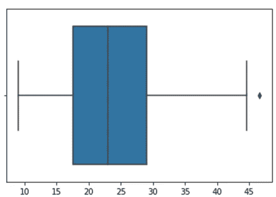
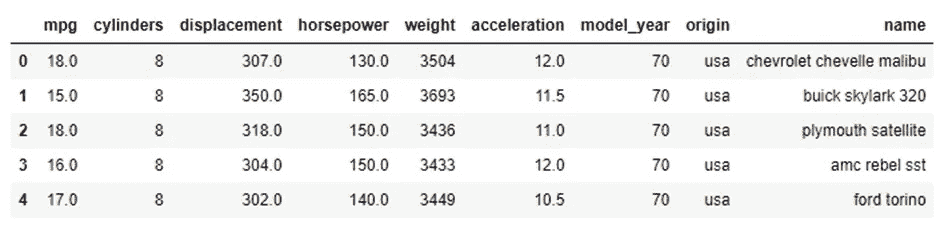
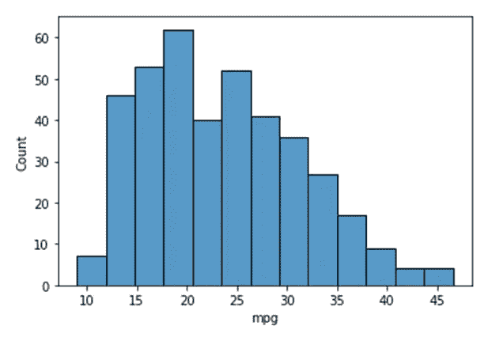
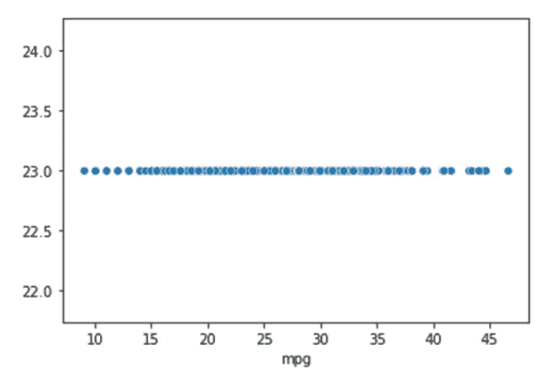
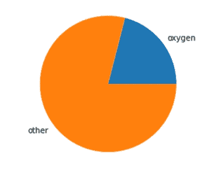
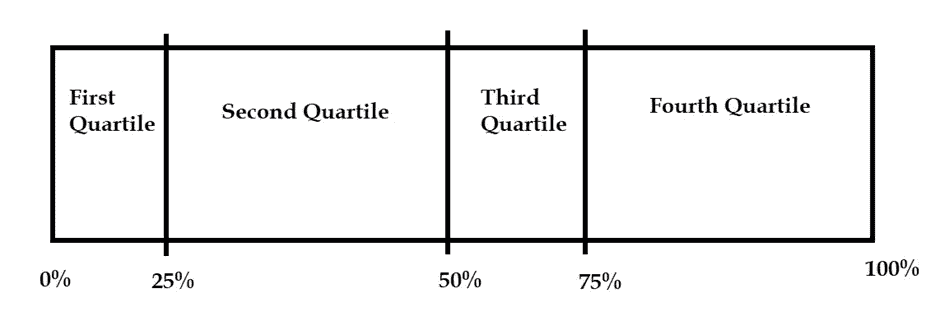
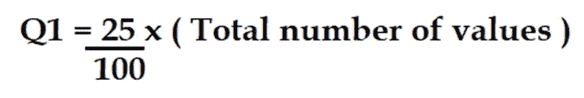
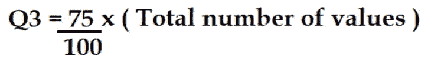
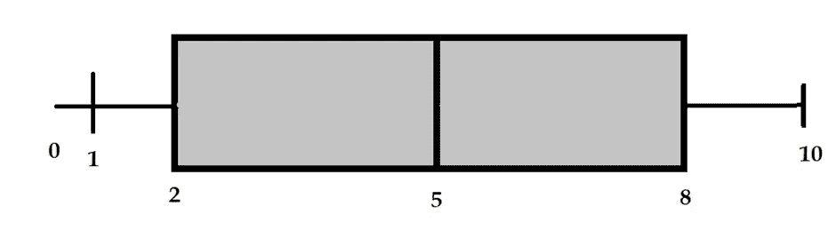
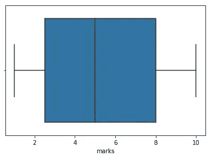

# 5 数字摘要—了解箱形图，就像你发明了它们一样

> 原文：<https://blog.devgenius.io/5-number-summary-get-to-know-about-box-plots-as-if-you-invented-them-edc003e3746a?source=collection_archive---------16----------------------->

所以你看到了一些盒状图，但不知道它们代表什么，有什么用，不要担心，读完这篇文章后，你会很有信心阅读盒状图，你自己也能制作它们。



方框图，作者提供的图像

让我们试着理解为什么一开始就需要方块图。

考虑一个数据集“mpg ”,它在数据科学学生和从业者中很流行。

```
import pandas as pd
import numpy as np
import seaborn as sns
import matplotlib.pyplot as pltdata = sns.load_dataset(‘mpg’)data.head()
```



来自 seaborn 图书馆的 mpg 数据集，图片由作者提供

现在让我们试着画一个 mpg 的直方图

`sns.barplot(data.mpg)`



seaborn 的“mpg”条形图，图片由作者提供

现在，问问你自己，当你看这个图表的时候，你能做出什么样的推论。

除了“有许多汽车的发动机行驶里程数为 12-20 英里”之外，你无法从图表中推断出更多的统计结果。

现在，让我们试着画出中间值，

`sns.scatterplot(data[‘mpg’],data[‘mpg’].median())`



seaborn 的 mpg 中值散点图，图片由作者提供

是的，这种绘制中位数的方法是荒谬的，但是可视化的东西比仅仅写结果要好得多。但是正如你所看到的，为了可视化各种统计结果，我们必须制作不止一个图表，或者至少编写更多行代码。

盒状图不仅仅是为了让分析师更容易地可视化数据，也是为了让分析的读者在更短的时间内获得数据的要点。

所以，现在你知道了盒状图的重要性，现在是时候从一个裸露的底部创建它们了。

首先，我们将学习百分位数和四分位数。

# 百分位数

如果我问你，“空气中氧气的百分比是多少？”，那么你知道答案就可能回答 21%，不知道就可能回答其他任何数字。但是你说空气中有 21%的氧气是什么意思，这是你在初中或初中时代就知道的非常简单的逻辑，如果我们继续在饼状图上绘制它，它会看起来像这样:



空气中氧气和其他气体的饼状图，图片由作者提供

现在，如你所见，这个百分比只不过是 100 分中的数学值，

另一方面，如果我问你在 JEE(工程师的国家级入学考试)中的分数是多少，那么如果你是一个绝对勤奋的人，你可能会说 98%。

现在，你回答我说“我在 JEE 大学的考试中得了 98 分”，但是这是什么意思呢？

这只是意味着你在 JEE 大学考试中超过了 98%的人，

让我们借助一个例子来找出答案，

假设有 27 名学生在总分 10 分的情况下进行了测试，他们的分数是:

```
marks_students_test = [1,4,3,4,8,1,6,2,8,9,5,2,2,7,9,10,5,2,3,9,7,4,7,8,9,6,1]
```

让我们找出 10 分中有 5 分的学生的百分比:

```
below_marks=0
for i in marks_students_test:
if i < 5:
below_marks += 1
print(below_marks/len(marks_students_test))
```

> *0.4444444444444*

所以分数超过 5 分的学生的百分比是 0.444

让我们继续讨论四分位数，因为你已经对百分位数有了足够的直觉。

# 四分位数

四分位数不过是数据在 25%中的划分，就像中位数把数据分成 50%的两部分一样，四分位数把数据分成 25%的组块 x 4。



四分位数，作者图像

请注意，四分位数不是以“等间距”划分的，四分位数是根据特定区域中相同数量的值划分的。

现在我们准备学习 5 个数摘要。

# 5 号总结

5 个数字汇总是一个框架，通过它我们可以绘制一个方框图，5 个数字汇总的元素有:

1.  最小值
2.  第一个四分位数(Q1) 25%
3.  中位数
4.  第三个四分位数(第三季度)75%
5.  最大值

因此，让我们对之前使用的相同数据集应用 5 数字汇总，首先我们将对数据集中的值进行排序。

[1, 1, 1, 2, 2, 2, 2, 3, 3, 4, 4, 4, 5, 5, 6, 6, 7, 7, 7, 8, 8, 8, 9, 9, 9, 9, 10]

现在，让我们应用 5 号总结:

1.最小值:1

2.第一个四分位数:

Q1 = 0.25 * 27 = 6.75，这 6.005 不是一个分数，它是一个指数，所以 Q1 值将是 6.75 值或 7 值:2



第一个四分位数(Q1)，作者形象

3.中位数:5

4.第三个四分位数:



第三个四分位数(Q3)，作者图像

Q3 = 0.75 * 27 = 20.25，同样这不是一个分数而是一个指数，所以 20.25 的值或 20 的值:8

5.最大值:10

所以，我们有:

*   最小值= 1
*   Q1 值= 2
*   中位数= 5
*   Q3 值= 8
*   最大值= 10

现在，让我们一起做一个方框图。

1.  创建最小值为 0、最大值为 10 的数字线
2.  绘图最小值
3.  绘制 Q1 值
4.  绘图中值
5.  绘制 Q3 值
6.  绘图最大值
7.  通过制作一个矩形来连接 Q1 和 Q3 值
8.  将最小值和最大值之间的线加粗一点



按照上述步骤手动制作方框图，图片由作者提供

恭喜你，你刚刚详细了解了盒图并制作了一个！

让我们通过在 python 中创建一个方框图来确认这个方框图是否正确:

```
import pandas as pd
import seaborn as sns 
data2 = pd.DataFrame({
    "marks":[1,4,3,4,8,1,6,2,8,9,5,2,2,7,9,10,5,2,3,9,7,4,7,8,9,6,1]
})
sns.boxplot(data2.marks)
```



用 python 创建的方框图，图片由作者提供

耶！！！没错！！！😊🎉🎉🎉

如果你喜欢我的解释，请尽可能多地分享这篇文章，不要忘记给这篇文章鼓掌👏！

> *如果你有知识，让别人为你点燃他们的蜡烛。*
> 
> ~玛格丽特·富勒