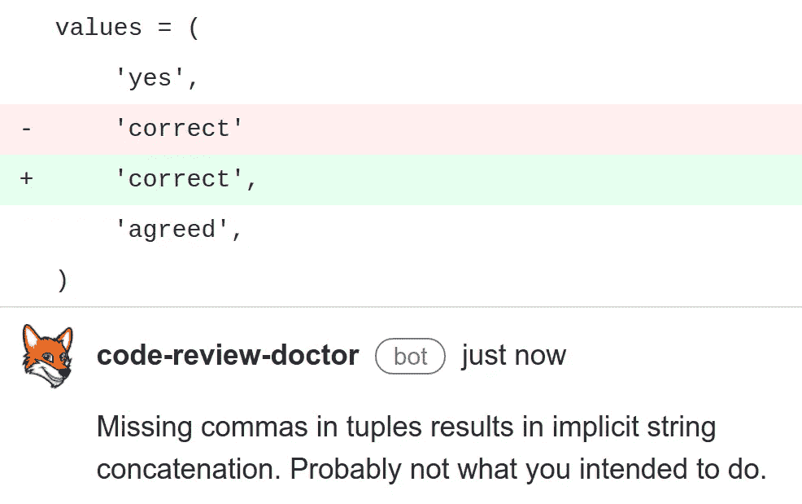
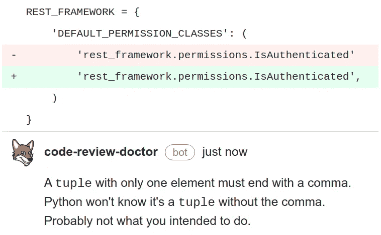
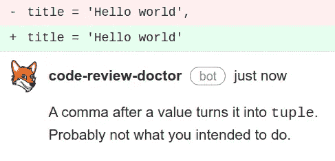
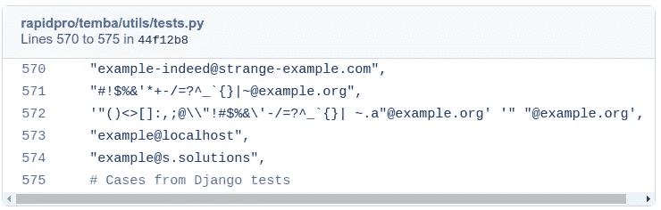
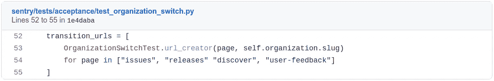
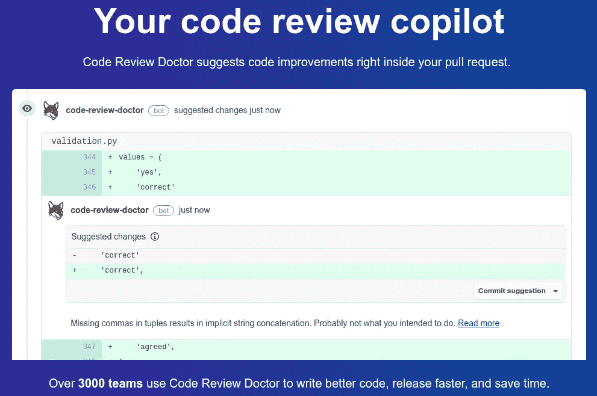

# 666 个 Python repos 中有 5%有逗号错别字(包括 Tensorflow、PyTorch、Sentry 和 V8)

> 原文：<https://blog.devgenius.io/5-of-666-python-repos-had-comma-typos-including-tensorflow-and-pytorch-sentry-and-v8-7bc3ad9a1bb7?source=collection_archive---------1----------------------->


我们发现，在我们检查的 666 个 Python 开源 GitHub 库中，有 5%存在以下三个由错别字引起的逗号相关的错误:

**逗号太少**
[列表/元组/集合](https://codereview.doctor/features/python/best-practice/avoid-missing-comma)中的字符串意外遗漏逗号，导致不需要的字符串串联。



由输入错误导致的隐式字符串连接会改变应用程序的行为。举个例子:

```
def is_positive(word):
    words = (
        'yes',
        'correct',
        'affirmative'
        'agreed',
     )
 return word in wordsis_positive('agreed') is True # evaluates to False
```

is_positive('agreed ')的计算结果为 False，因为打字错误导致肯定的结尾缺少逗号，从而导致“肯定”和“同意”隐式连接到“肯定同意”。

[意外遗漏了 1 个元素元组](https://codereview.doctor/features/python/best-practice/tuple-missing-trailing-comma)中的逗号，使其成为一个 str 而不是元组。



由于缺少逗号，当代码稍后试图对评估为`str`的变量执行元组操作时，预计会得到一个`TypeError`。

**逗号太多** 错别字[不小心在值](https://codereview.doctor/features/python/best-practice/tuple-accidental-trailing-comma)的末尾加了一个逗号，把它变成了一个元组



就 Python 解析器而言，括号对于非空元组是可选的。根据文档:实际上是逗号组成了元组，而不是括号。括号是可选的，除了空元组的情况。

**检测 bug**

我们没有一行一行地检查存储库。相反，我们通过我们在 AWS Lambda 上运行的[静态分析检查套件](http://codereview.doctor)来运行存储库，总共花费了 90 秒。

主要的困难是减少假阳性。从语法上来说，列表中缺少逗号和有意进行的隐式字符串连接没有区别。事实上，当我们第一次编写“可能缺少一个逗号”检查器时，我们发现 95%的问题实际上都是误报:开发人员进行跨多行的隐式字符串连接的原因非常简单:

*   像 SQL 或 HTML 这样的代码
*   用户代理字符串
*   类似路径的值，如文件路径和 URL
*   编码文本，如 JSON 和 CSV 文件内容
*   非常长的消息
*   Sha 哈希

在检查了 666 个代码库之后，我们理解了误报的关键驱动因素，并为这些类型的数据增加了隐式字符串连接的余量。在我们考虑了这些进行隐式字符串连接的有效原因后，假阳性率下降到可以忽略的非恼人水平。在这一点上，我们留下了一个 24 个存储库的列表，这些存储库在代码审查过程中出现了真正的错误。

有多普遍？

总的来说，我们在 666 个存储库中的 24 个中检测到了这些错误——其中许多是大型开源项目。我们提出了这些问题，并在一天繁忙的票证和 pr 管理过程中帮助解决了这些问题。以下是最有趣的几个:

*   [张量流](https://github.com/tensorflow/tensorflow/issues/53636)
*   [哨兵](https://github.com/getsentry/sentry/issues/30911)
*   [张量流](https://github.com/tensorflow/tensorflow/issues/53636)
*   [Pydata 的 xarray](https://github.com/pydata/xarray/issues/6136)
*   [谷歌的 V8](https://bugs.chromium.org/p/v8/issues/detail?id=12521)
*   [PyTorch](https://github.com/pytorch/pytorch/issues/70609)
*   [再次 py torch](https://github.com/pytorch/pytorch/issues/70607)
*   [Pytorch 第三部](https://github.com/pytorch/pytorch/issues/70611)
*   [rapidpro](https://github.com/rapidpro/rapidpro/issues/1599)
*   姜戈-colorfield
*   [django-服务台](https://github.com/django-helpdesk/django-helpdesk/issues/988)

5%的存储库有这三个错误中的一个，并且它们中的大多数是“大的”众所周知的和被广泛使用的项目，有许多贡献者和非常健壮的代码审查过程。这突出表明，对于像代码审查这样的手动过程来说，要在 100%的时间内检测到 100%的 bug，那么在代码审查期间，100%的人必须在 100%的时间内执行得 100%完美。看到认知失调了吗？我们进行代码评审是因为我们在编写代码时预期会出现人为错误，但是在评审代码时预期不会出现人为错误。有些事情人类可以做得很好，有些事情机器人可以做得更好。注意到逗号在错误的地方是其中之一。例如:



你能看出问题吗？[第 572 行](https://github.com/rapidpro/rapidpro/issues/1599)有隐式字符串串联！

它少了一个逗号，所以应该是

```
'”()<>[]:,;@\\”!#$%&\’-/=?^_{}| ~.a”[@example](http://twitter.com/example).org', '“ “[@example](http://twitter.com/example).org',
```

我一点也不惊讶被人类错过了！

**影响**
有些缺失的逗号影响很小甚至没有影响，但有些却非常有影响。以[哨兵](https://github.com/getsentry/sentry/issues/30911)一号为例:

请注意列表中缺少的逗号:



“releases”和“discover”之间缺少一个逗号，导致两者隐式连接在一起形成“releasesdiscover”。

影响是测试请求了不存在的“/releasesdiscover”，因此测试的不是“/releases”和“/discover”，而是 404 页面。就我们所知，这意味着/releases 和/discover 上的组织切换器可能会被破坏。有一些可怜的虔诚的人维持着依赖于这个测试的组织转换，并把它作为一个质量关口，给他们信心，他们没有破坏产品，但测试并没有真正起作用。就是这种事能害一晚上的睡眠！*让你陷入麻烦的不是你不知道的事。你确定的事情并不是这样的。*

**保护您的代码库**

你可以在 GitHub 中添加[代码审查医生](https://github.com/marketplace/django-doctor)，这样就可以在你的 PR 中建议对这些问题的修复。

