# 5 个用于成像超分辨率的开源深度学习工具

> 原文：<https://blog.devgenius.io/5-open-source-deep-learning-tools-for-imaging-super-resolution-f42ddb396678?source=collection_archive---------1----------------------->

几乎每个人都有 10-20 年前拍摄的照片或视频。这些图片是在 1600x1200 甚至 640x480 图像分辨率被认为“高”的时代拍摄的。我们今天能改善这样的照片吗？让我们弄清楚。

图像超分辨率(SR)是提高图像分辨率的过程，从低分辨率源获得高分辨率图像。标准的调整大小方法在这项任务中无法提供太多帮助，因为图片的原始信息已经丢失，但深度学习算法可以尝试基于低分辨率源生成新的像素。真的管用吗？我将测试 5 个免费的开源 Python 项目，每个人都可以在 PC 上运行，无需任何支付或云服务。我将使用 3 张图片:第一张是 20 年前使用“高端”(当时)0.3 MPx 640x480 分辨率相机拍摄的:

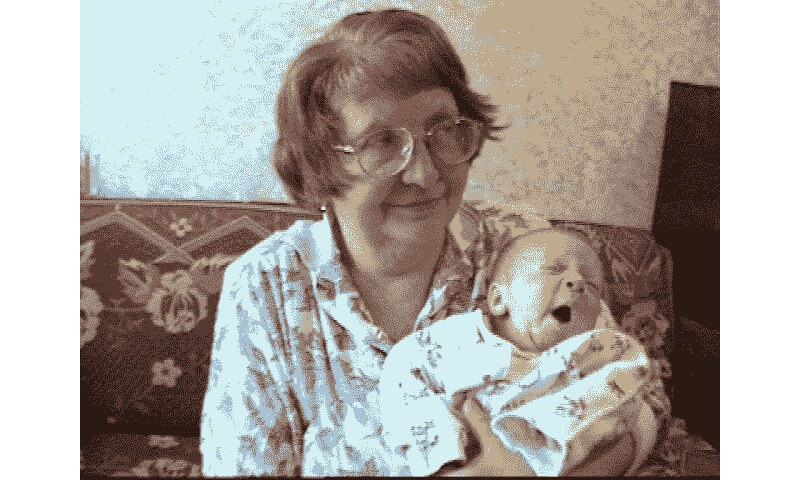

一张来自 640x480 相机的照片，由作者在 2001 年制作

第二张照片是现代版的，我手动将其调整为同样的 640x80 大小:

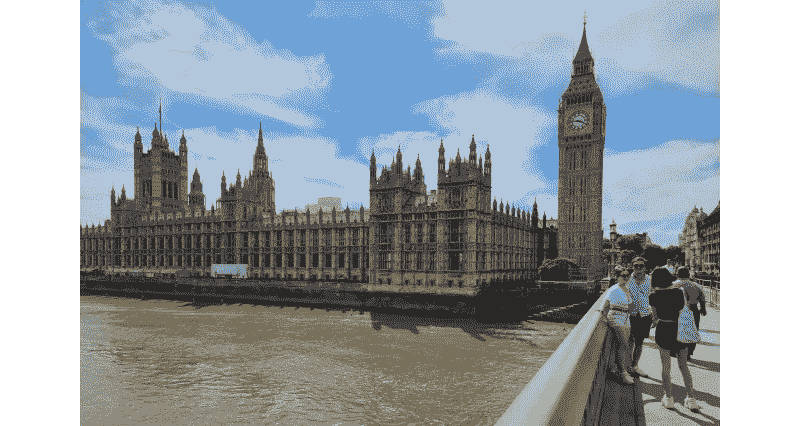

伦敦威斯敏斯特宫图片作者

它将允许我们看到不同算法可以添加到图像中的伪像，以及输出的准确性如何。

最后一张照片更“抽象”，有一些不规则的小细节，如草和树叶:

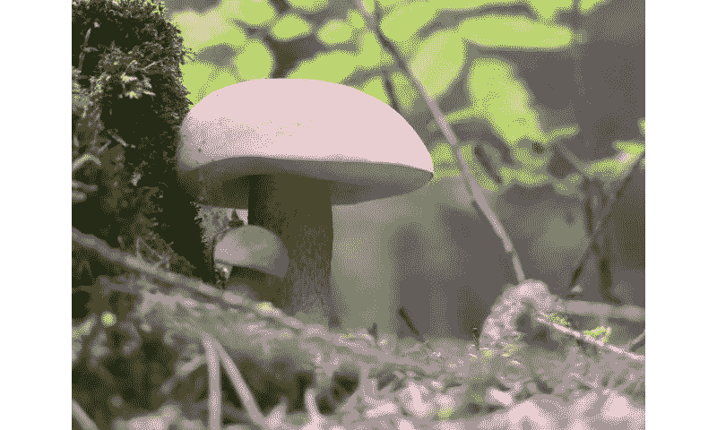

作者的蘑菇图片

让我们开始吧。使用所有这些项目不需要任何专门的 Python 知识，但是最好对如何运行 Python 代码、Jupyter notebook 或如何安装缺失的库有基本的了解。

# 1.神经增强

[神经增强](https://github.com/alexjc/neural-enhance)项目是大约 6 年前做的，现在被作者存档，不再改进。但这个项目仍然有 1400 个“分叉”，并在 GitHub 上被添加到“收藏夹”11.6K 次，所以测试它很有趣。唉，在库和框架每周更新一次的时代，运行一个 6 年前的项目本身就是一种挑战。2017 年的 NumPy、SciPy 和 Tensorflow 包不再与现代版本兼容，运行代码的最简单方法是使用 Docker 的虚拟系统:

```
docker run -it -v $(pwd):/home/ --name test1 --platform linux/amd64 ubuntu:focal
```

该命令将在当前文件夹中运行一个名为“test1”的 Docker 实例(完成测试后，我们可以在需要时使用 *docker rm test1* 命令删除它)。当 Docker 运行时，我们可以安装所有需要的组件:

```
apt update 
apt install python3 git python3-pip wget -y
apt install gfortran libopenblas-dev liblapack-dev -y
pip3 install Pillow scipy==1.00.1 theano imageio numpy==1.20.3
pip3 install https://github.com/Lasagne/Lasagne/archive/master.zipcd /home/
git clone https://github.com/alexjc/neural-enhance
cd neural-enhance
```

一个“神经增强器”正在使用大约 5 年前流行的[千层面](https://github.com/Lasagne/Lasagne)机器学习库。千层面正在使用 [Theano](https://github.com/Theano/Theano) ，看起来这个框架也不再改进了，但至少，GitHub 链接仍然是活跃的(我已经安装了一个“开发”版本的千层面，因为最后的更改仍然没有推送到最新版本)。

神经增强算法基于使用卷积神经网络(CNN)。神经网络模型包含几个层，每个卷积层可用于提高分辨率，如图所示。这里，原始(蓝色)3×3 像素块使用 2×2 步长卷积为 5×5 块:

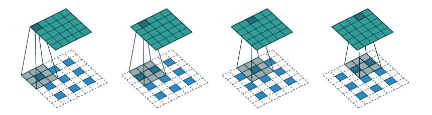

来源 https://arxiv.org/pdf/1603.07285.pdf

在神经增强中实现的另一个有趣的想法是使用预训练的 VGG-16 网络层作为损失函数:

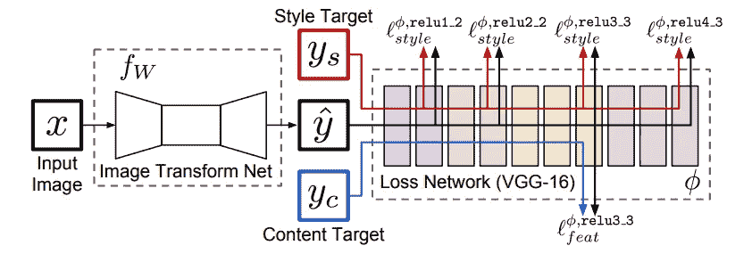

来源[https://arxiv.org/pdf/1603.08155.pdf](https://arxiv.org/pdf/1603.08155.pdf)

关于使用 CNN 进行超分辨率的更多细节可以在[研究论文](https://arxiv.org/pdf/1603.08155.pdf)和 [towardsdatascience](https://towardsdatascience.com/deep-learning-based-super-resolution-without-using-a-gan-11c9bb5b6cd5) 文章中找到。

总体思路很简单——在大量低分辨率和高分辨率图像对上训练神经网络，神经网络最终将能够基于低分辨率图像生成高分辨率图像。神经网络的训练可能需要很长时间，并且需要一个包含大量照片的数据集，但幸运的是，作者提供了一个预训练模型，它可以轻松下载并放入项目中:

```
 wget https://github.com/alexjc/neural-enhance/releases/download/v0.3/ne4x-photo-default-0.3.pkl.bz2
```

一切准备就绪后，可以使用命令行转换照片:

```
python3 enhance.py --type=photo --zoom=4 photo01.jpg
```

现在，让我们检查结果。

老式相机的第一张图像确实得到了改善，但可惜的是，CMOS 传感器的数字噪声也被“放大”了。很容易理解为什么——神经网络本身是在没有这种噪音的缩小图像上训练的。

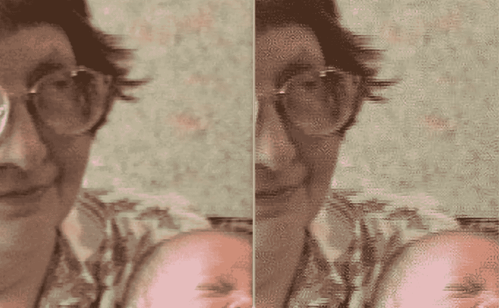

左图为原始图像，右图为作者的“增强”图像

来自伦敦的图像看起来更好，算法确实能够提高质量:

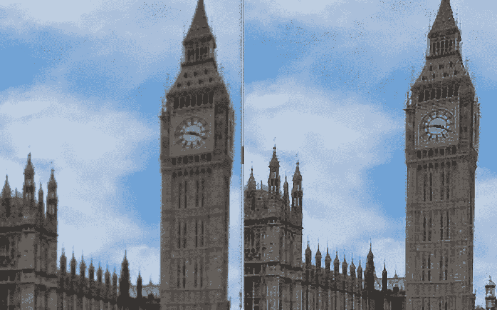

左图为原始图像，右图为作者的“增强”图像

在草或树叶等“抽象”图像上，输出图像质量也很好:

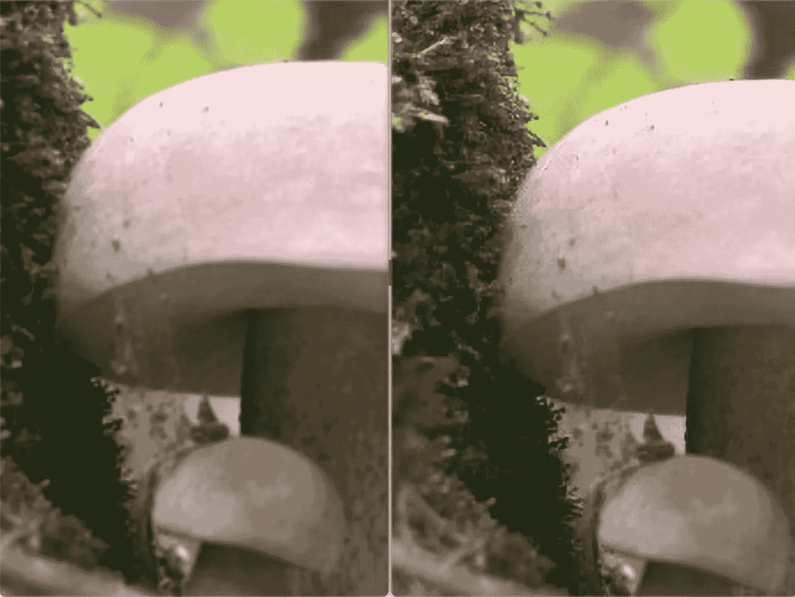

左图为原始图像，右图为作者的“增强”图像

希望了解更多细节的读者可以查看 GitHub 页面，在那里可以找到研究论文的链接和更多命令行示例。

# **2。超分辨率**

[超分辨率项目](https://github.com/krasserm/super-resolution)实现了 3 种不同的神经网络模型:

*   EDSR(增强型深度残差网络)， [NTIRE 2017](http://www.vision.ee.ethz.ch/ntire17/) 超分辨率挑战赛冠军
*   WDSR(宽激活深度剩余网络) [NTIRE 2018](http://www.vision.ee.ethz.ch/ntire18/) 超分辨率挑战赛冠军，
*   SRGAN ( [超分辨率生成对抗网络](https://arxiv.org/pdf/1609.04802.pdf))。

EDSR 和 WDSR 都是基于卷积神经网络，SRGAN 顾名思义，就是利用 GAN(生成对抗网络)来生成图像。作者还发表了一篇关于模型架构的漂亮而详细的[解释](https://krasserm.github.io/2019/09/04/super-resolution/)。

运行这个项目很简单，幸运的是，不需要使用 Docker 或虚拟机来安装过时的包。与前一个项目一样，应下载预训练的模型权重并将其放入项目文件夹中。运行代码的最小 Jupyter 笔记本显示在屏幕截图中:

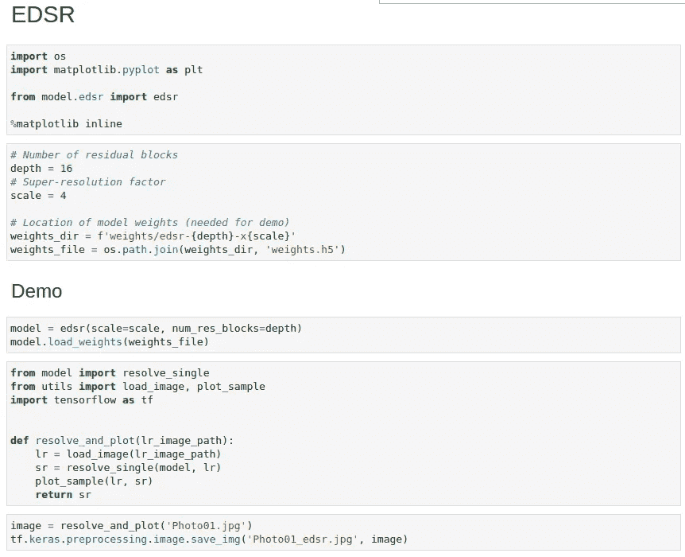

其他笔记本也可以类似的方式使用，示例包含在项目文件夹中。

现在让我们看看结果。

对于有噪声的摄像机图像，没有一个网络产生好的结果，它们放大了图像，但也放大了噪声:

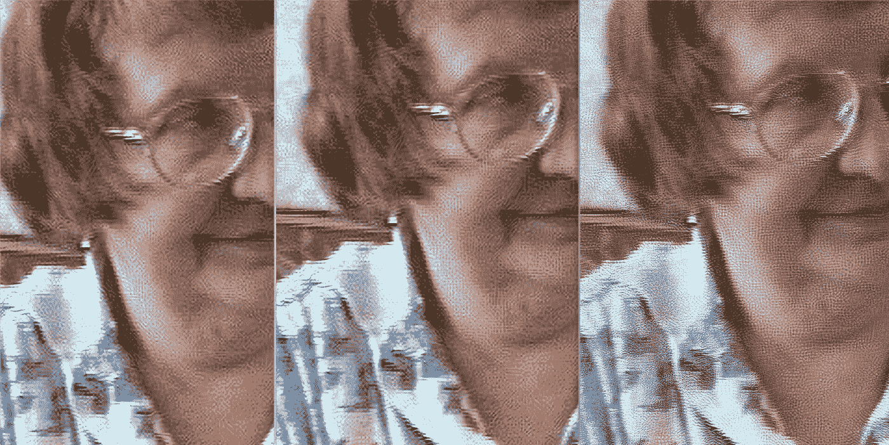

从左至右:作者的 EDSR、WDSR 和 SRGAN 输出图像

与神经增强相比，照片级逼真图像看起来更好，输出更清晰，对比度更高。但是伪像的数量也更高:

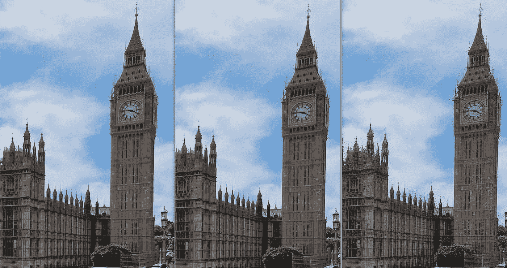

从左至右:作者的 EDSR、WDSR 和 SRGAN 输出图像

“抽象”图像看起来最好，可能只是因为一些不规则性在这里看不到:

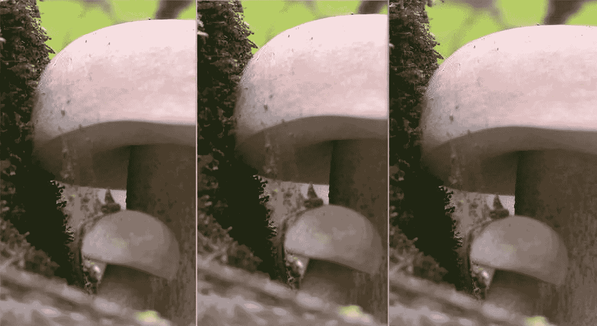

从左至右:作者的 EDSR、WDSR 和 SRGAN 输出图像

# 3.图像超分辨率(ISR)

[ISR 项目](https://github.com/idealo/image-super-resolution)包含几个 Keras 实现，包括[剩余密集网络](https://arxiv.org/pdf/1802.08797.pdf)和[生成对抗网络](https://arxiv.org/pdf/1609.04802.pdf)。ISR 项目甚至包含在 [pip 库](https://pypi.org/project/ISR/)中，因此可以使用 Python“pip”命令轻松安装。

从实用的角度来看，结果还可以，模型只提供 2 倍的高档，但工件的数量也很少:

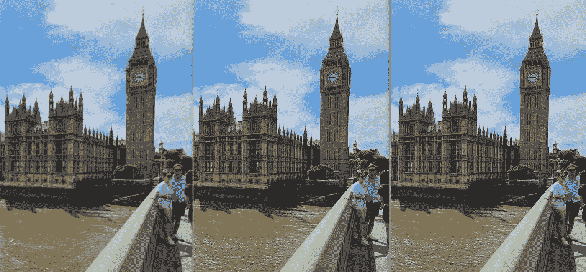

从左到右:作者的原始图像、RDN 和 GAN 输出图像

GitHub 页面是 3 年前更新的，我不期望将来会有任何改进。但是这个项目有一个很好的描述，对于学生或者自我教育的目的仍然是有用的。

# 4.增强型 SRGAN (ESRGAN)

[增强型 SRGAN](https://github.com/xinntao/ESRGAN) 项目是对[基础 cSR](https://github.com/XPixelGroup/BasicSR) 的改进，后者是一个用于图像和视频恢复的开源工具。作者添加了一个具有剩余连接的更深模型，GAN 训练中使用的鉴别器也得到改进，更多详细信息可在 [GitHub 页面](https://github.com/xinntao/ESRGAN)上找到。

使用这个项目很简单。代码可以从 GitHub 下载，预先训练好的模型链接也可以在那里找到。然后只需将图像放在“*LR”*文件夹中，运行 *python3 test.py* ，输出图像将保存在“*结果*文件夹中。

至于结果本身，则是爆笑。首先，ESRGAN 大大增加了数码相机的噪音:

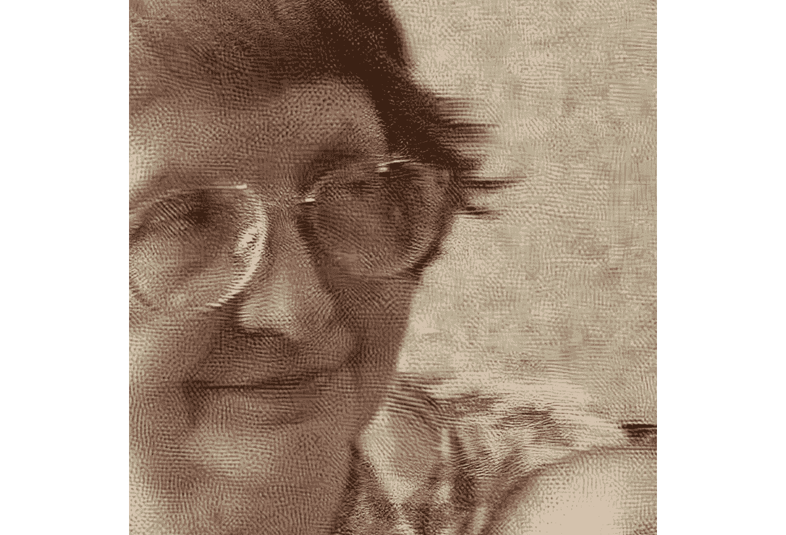

作者提供的 ESRGAN 100%作物图像

ESRGAN 能够制作一个高对比度的塔的图像，但它是以一种外星人或大理风格的方式完成的。这些外星人入侵痕迹是在伦敦市中心吗？:)

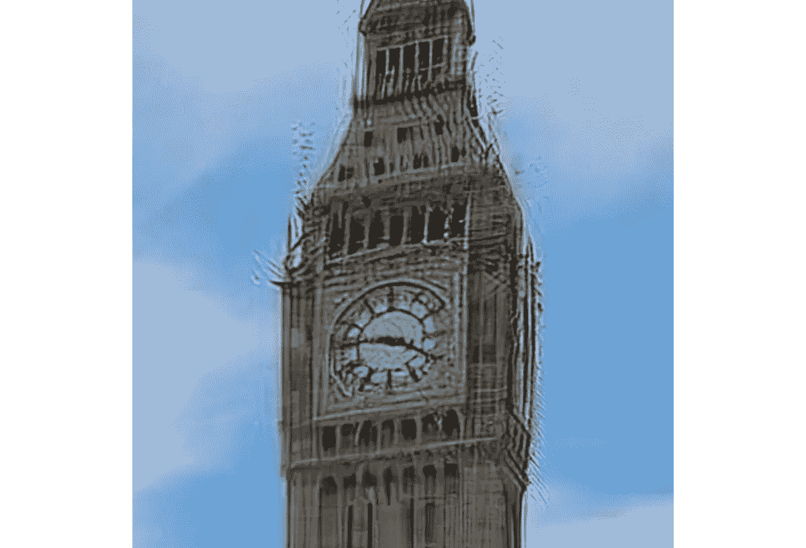

作者提供的 ESRGAN 100%作物图像

还是这些？

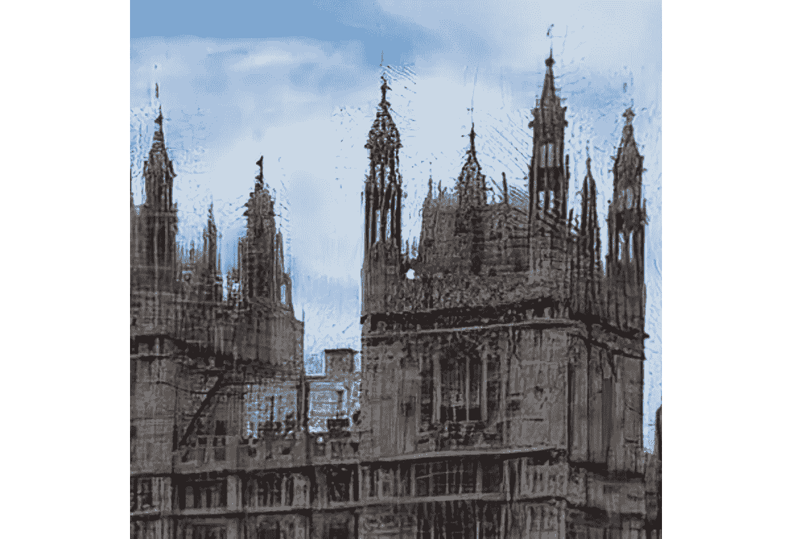

作者提供的 ESRGAN 100%作物图像

事实上，我可以很容易地想象原因——神经网络是在干净的图像上训练的，没有任何伪像地平滑缩小。所以，所有 JPEG 压缩伪像都被视为真实的细节，因为神经网络之前只是“没有看到它们”，没有学会忽略它们。

# **5。Real-ESRGAN**

前一个项目的问题非常明显，作者创建了另一个开源项目，名为 [Real-ESRGAN](https://github.com/xinntao/Real-ESRGAN) 。正如页面上所写的，“图像/视频恢复的实用算法”已经实现，这可能涉及使用 JPEG 压缩的噪声图像来训练网络，等等。

源代码可以从 [GitHub 页面](https://github.com/xinntao/Real-ESRGAN)中获取，预训练的模型应该在项目使用前下载。可以使用以下命令进行图像转换:

```
python3 inference_realesrgan.py -n RealESRGAN_x4plus -i Photo01.jpg -o Photo01-out.jpg --fp32
```

在这个例子中，我使用的是“RealESRGAN_x4plus”模型，不同的模型可以从[发布](https://github.com/xinntao/Real-ESRGAN/releases) GitHub 页面下载。作者还提供了单独的动漫和视频文件还原模型，我自己没有测试过。还提供了 Windows、Linux 和 OSX 的可执行文件，这对没有编程背景的人很有帮助。

至于结果，最后，我可以说他们好多了。在 100%的裁剪上有一些可见的伪像，但是对于“正常”视图，输出相当好:

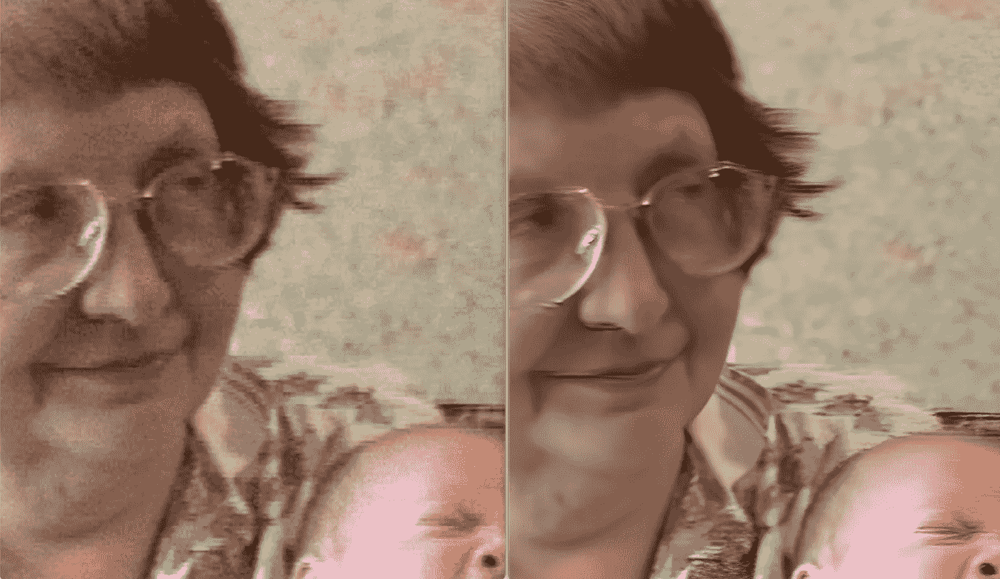

作者提供的原始图像和真实的 ESRGAN 作物图像

建筑细节看起来也更好:

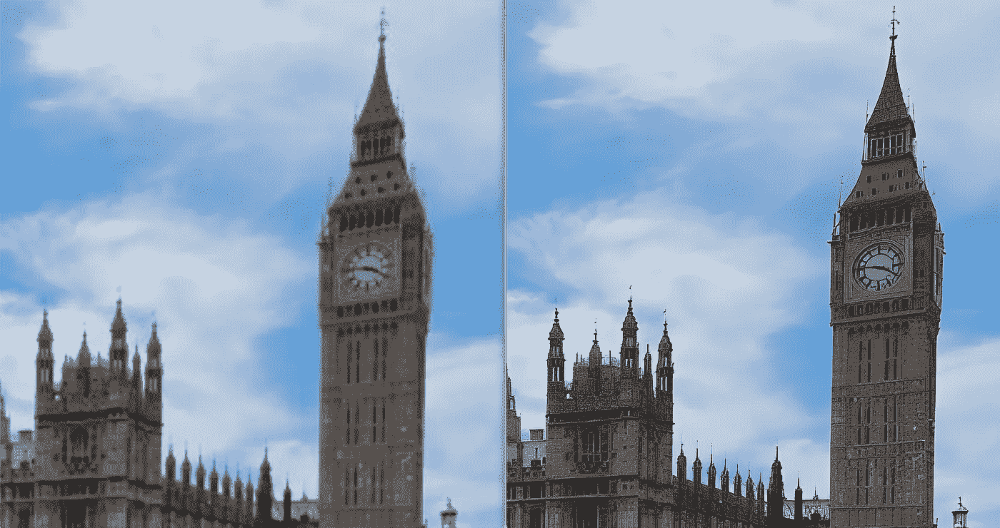

作者提供的原始图像和真实的 ESRGAN 作物图像

嗯，图像上有人工制品，其中一些可能看起来有点奇怪:

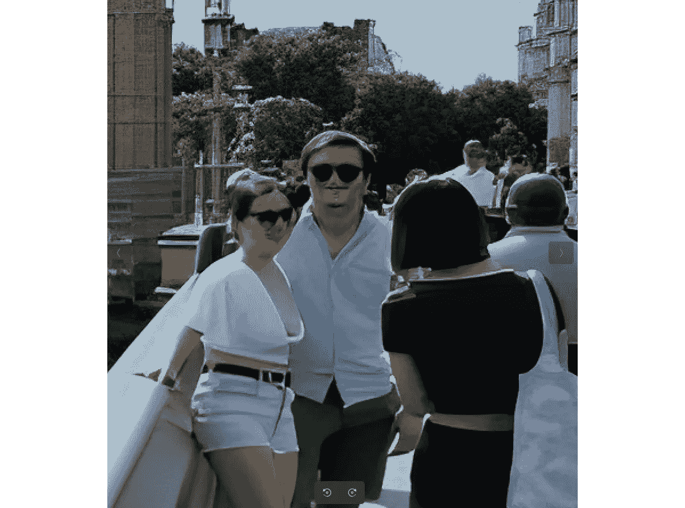

真实的 ESRGAN 结果，200%作物图像由作者提供

我必须承认，考虑到最初的 640x480 分辨率，结果是迷人的，但仍有巨大的改进空间。实际上，这些工具的目的并不是使用 200%缩放来偷窥像素。与低分辨率的原始照片相比，在 PC 或智能手机屏幕上观看高分辨率照片的总体印象会更好。

# 结论

成像超分辨率是一个有趣的领域，它最终从研究论文来到了现实世界。现在，甚至像 Adobe Photoshop Lightroom 这样的商业产品也提供这些工具。但是很多超分辨率算法都是开源的，只需要很少的 Python 知识就可以免费使用。

从实践的角度来看，仍然存在一些挑战，人们应该意识到:

*   输出图像上可能有许多伪像，结果仍然远非完美。我 100%确定几年后新的算法会提供更好的结果。
*   因此，一条重要的建议是，永远要备份原始文件。稍后可能会以更好的质量再次处理它，但是如果原始文件将会丢失，那么移除工件将会困难得多。
*   “增强的”结果可能看起来不错，但它们在历史上并不准确。图像中的原始高分辨率信息并不存在，神经网络只是基于它之前训练的成千上万张图像来*生成*似是而非的输出。这就像一个画家正在以小图为基础画一幅大图——所有的小细节他/她都可以根据他/她的经验来想象，但它们不会在科学上准确。对于家庭照片恢复来说，这可能已经足够好了，但显然，在这个过程中没有保证准确性。例如，这是一个原始的高分辨率图像，从低分辨率恢复的图像:

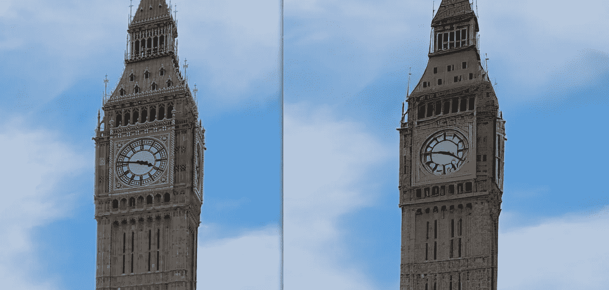

左边是原始的高分辨率图像，右边是作者的“增强”图像

另一方面，正如我之前所写的，这些算法不是为了使用 400%缩放的“像素偷窥”。从实用的角度来看，超分辨率工具可以使复古图像或电影更具吸引力，这显然是一个不错的改进。

感谢阅读。如果你喜欢这个故事，请随意在 Medium.com 的[订阅](https://medium.com/@dmitryelj/membership?source=publishing_settings-------------------------------------)，当我的新文章发表时，你会收到通知，并且可以完全访问其他作者的数千篇故事。那些对更多细节感兴趣的人也欢迎阅读另一个关于[图像着色开源工具](/5-open-source-python-tools-for-retro-images-colorization-c558e1d9cc08)的故事。