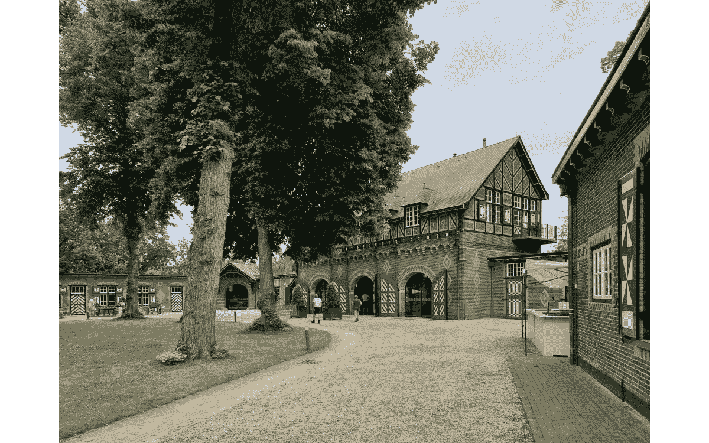

# 5 个用于复古图像着色的开源 Python 工具

> 原文：<https://blog.devgenius.io/5-open-source-python-tools-for-retro-images-colorization-c558e1d9cc08?source=collection_archive---------2----------------------->

在没有彩色图像的时代，成千上万的老式照片和电影被制作出来。如今，在深度学习的帮助下，我们可以让这些图片变得丰富多彩，更接近它们原来的样子。我将测试 5 个开源工具，它们将允许读者在他们自己的 PC 上免费给图像着色。

作为测试，我将使用两幅图像。第一次是在 1912 年:


芭蕾舞演员安娜·帕洛娃，来源[https://en.wikipedia.org/wiki/Anna_Pavlova](https://en.wikipedia.org/wiki/Anna_Pavlova)

第二个是我自己做的:


荷兰的哈尔城堡图片作者

这两张图片将有助于我们检查肤色，以及景观和建筑颜色的准确性。

我将测试开源工具，这些工具是免费的，可以从 GitHub 下载。使用这些工具不需要很深的 Python 知识，但是建议您对如何使用“pip”安装缺失的包或者如何在您的 PC 上运行 Jupiter 笔记本有一个基本的了解。

让我们开始吧。

# 去模糊化

[DeOldify](https://github.com/jantic/DeOldify) 是一个有趣的项目，它不仅提供了良好的结果，而且还被贡献者积极更新(在撰写本文时，最后一次更新才 10 天前)。DeOldify 基于 SA-GAN(自我注意生成对抗网络)。一般来说，GAN 由两个独立的神经网络组成——T4 发生器和鉴别器*。两个网络都由大量的图像训练，在训练过程中，生成器学习制作可信的图像，鉴别器学习区分生成的图像和真实的图像。在数小时的训练中，两个网络都变得越来越好，实际上是在相互竞争。代码中还使用了许多其他技巧，例如，可以在处理之前将图像转换到 L*a*b 或 YUV 颜色空间，以保持原始分辨率并仅更改颜色分量，等等。对更多细节感兴趣的人可以查看项目描述和源代码。*

*要在本地运行 DeOldify，我们需要从 GitHub 获取项目，并将预训练的神经网络权重下载到“模型”文件夹(链接取自[项目页面](https://github.com/jantic/DeOldify)，将来可能会被作者更改):*

```
*git clone [https://github.com/jantic/DeOldify](https://github.com/jantic/DeOldify)
cd DeOldify
mkdir models
cd models
wget [https://data.deepai.org/deoldify/ColorizeArtistic_gen.pth](https://data.deepai.org/deoldify/ColorizeArtistic_gen.pth)
wget [https://www.dropbox.com/s/usf7uifrctqw9rl/ColorizeStable_gen.pth?dl=](https://www.dropbox.com/s/usf7uifrctqw9rl/ColorizeStable_gen.pth?dl=0)1 -O [ColorizeStable_gen.pth](https://www.dropbox.com/s/usf7uifrctqw9rl/ColorizeStable_gen.pth?dl=0)
cd ..*
```

*之后，我们可以通过输入 *jupyter-lab* 命令并在浏览器中打开 *ImageColorizer.ipynb* 文件来运行一个 Jupiter 笔记本。笔记本中的工作代码如下图截图所示:*

**

*作者的 DeOldify Jupyter 笔记本图片*

*在这里，我将“设备”设置为 CPU——如果没有顶级显卡，很可能会出现“内存不足”的错误(CPU 的处理时间约为 3–5s，GPU 为 0.5s，因此 CPU 的计算也很好)。如果您更喜欢运行独立的 Python 代码而不是使用笔记本，可以使用以下代码:*

```
*from deoldify import device
from deoldify.device_id import DeviceId
from deoldify.visualize import *
torch.backends.cudnn.benchmark=Truedevice.set(device=DeviceId.CPU)colorizer = get_image_colorizer(artistic=True)
img_out = colorizer.get_transformed_image(path="anna_bw.jpg", 
                                          render_factor=15,
                                          watermarked=True)
img_out.save("anna_color.jpg")*
```

*至于结果，它们相当不错:*

****

*读者还可以尝试更改模型(有两种模型，颜色更鲜艳的“艺术”和“稳定”可用)和影响输出颜色的“render_factor”变量。顺便提一下，如果有人对左下角的一个标志感到厌烦，可以将“水印”参数设置为 False。*

# *彩色图像彩色化*

*[这个项目](https://github.com/richzhang/colorization)是利用卷积神经网络(CNN)生成彩色图像。从架构上来说，它比 DeOldify 简单得多，但正因为如此，读者理解它的工作方式可能会更方便。它也可以用于教育目的，作者在 GitHub 页面上提供了更多详细信息的研究论文链接。*

*唉，最后一次项目更新是在 2020 年，但代码仍然有效，可以很容易地在本地运行(尽管我有点担心 S3 亚马逊内部到预训练模型的链接会活跃多久)。*

*有两种模式可用，此代码可用于以两种方式转换文件:*

```
*import colorizers as c
import torch
import matplotlib.image as plt img = c.load_img("image_bw.jpg")
tens_l_orig, tens_l_rs = c.preprocess_img(img, HW=(256, 256))
img_bw = c.postprocess_tens(tens_l_orig, 
                torch.cat((0*tens_l_orig, 0*tens_l_orig), dim=1))# eccv16
colorizer_eccv16 = c.eccv16(pretrained=True).eval()
out_img_eccv16 = c.postprocess_tens(tens_l_orig,
                                colorizer_eccv16(tens_l_rs).cpu())
plt.imsave('image_eccv16.jpg', out_img_eccv16)# siggraph17
colorizer_siggraph17 = c.siggraph17(pretrained=True).eval()
out_img_siggraph17 = c.postprocess_tens(tens_l_orig,
                             colorizer_siggraph17(tens_l_rs).cpu())
plt.imsave('image_siggraph17.jpg', out_img_siggraph17)*
```

*结果如下所示。*

***Eccv16***

****

***信号图 17***

****

# *ChromaGAN*

*顾名思义， [ChromaGAN](https://github.com/pvitoria/ChromaGAN) 的作者也在使用生成对抗网络来给图像着色。更多细节和网络架构可在[研究论文](https://openaccess.thecvf.com/content_WACV_2020/papers/Vitoria_ChromaGAN_Adversarial_Picture_Colorization_with_Semantic_Class_Distribution_WACV_2020_paper.pdf)中找到。*

*唉，这个项目可能只是作为研究的一个演示，它并不是“用户友好”的。反正跑起来也不算太难。在使用一个项目之前，应该下载“my_model_colorization.h5”文件(链接在[GitHub 页面](https://github.com/pvitoria/ChromaGAN)上提供)并放入“model”文件夹中。源图像和输出图像应分别放在“chromagan_images”和“chromagan_results”文件夹中，然后可以在作者提供的笔记本中运行批处理。要在本地 PC 上运行代码，应该从笔记本中删除“*from Google . colab . patches import cv2 _ imshow”*和*“cv2 _ imshow(…)”*行。该项目正在使用 Keras，我也可以建议在文件的开头添加`os.environ["CUDA_VISIBLE_DEVICES"] = "-1"`行，以防出现“内存不足”的错误。*

*输出图像上有一些可见的伪像，GitHub 对这个项目的最后一次承诺是在 2020 年，所以我不指望它会再得到改善。但是出于教育目的，它仍然是有趣的。结果如下所示:*

****

# *谷歌彩色变压器(ColTran)*

*这个有趣的项目可以从 google-research 的 GitHub 页面下载，更详细描述的研究论文也可以下载。作者没有使用 GANs，而是使用了具有自关注架构的轴向变压器(详见论文)。*

*在使用 ColTran 之前，我们需要下载位于 [coltran.zip](https://console.cloud.google.com/storage/browser/gresearch/coltran) 档案中的预训练模型，并将它们解压缩到项目文件夹中。该档案包含 3 个模型检查点:*上色器*、*颜色 _ 上采样器、*和*空间 _ 上采样器*。然后我们可以运行 3 个 Python 命令:*

```
*python3 custom_colorize.py --config=configs/colorizer.py --mode=colorize --accelerator_type=CPU --logdir=colorizer --img_dir=img_dir --store_dir=target_dirpython3 custom_colorize.py --config=configs/color_upsampler.py --mode=colorize --accelerator_type=CPU --logdir=color_upsampler --img_dir=img_dir --store_dir=target_dir --gen_data_dir=target_dir/stage1 --mode=colorizepython3 custom_colorize.py --config=configs/spatial_upsampler.py --mode=colorize --accelerator_type=CPU --logdir=spatial_upsampler --img_dir=img_dir --store_dir=target_dir --gen_data_dir=target_dir/stage2*
```

*这里的 *img_dir* 是文件夹，包含源图像， *store_dir* 是输出文件夹， *colorize* 是处理模式， *logdir* 是预训练模型的路径。我们有 3 个处理步骤:“彩色化器”使用仅 512 种输出颜色和 64x64 输出图像进行粗略的彩色化,“颜色上采样器”改善颜色,“空间上采样器”将图像放大到 256x256 分辨率。*

*结果很有趣，颜色也相当准确:*

****

*唉，这个工具可能只是作为一个研究论文的演示，与以前的项目相比，没有现成的方法来处理任意分辨率的图像。输出仅限于 256x256 大小。*

# *大颜色*

*[BigColor](https://github.com/KIMGEONUNG/BigColor) 项目由作者在 2022 年提出，作为一种“*新颖的彩色化方法，为具有复杂结构的各种野外图像提供生动的彩色化*。作者还在[的论文](https://kimgeonung.github.io/assets/bigcolor/bigcolor_main.pdf)*中写道，我们将 BigColor 与最近的自动着色方法进行了比较，包括 CIC、ChromaGAN、DeOldify、InstColor、ColTran 和 ToVivid。图 2 显示了 BigColor 在六幅具有挑战性的图像上定性地优于所有方法。*”，所以测试它肯定很有趣。*

*项目本身[可以从 GitHub 页面下载](https://github.com/KIMGEONUNG/BigColor)。使用代码很简单。在进行转换之前，应该执行两个脚本， *download-pretrained.sh* 和 *download-bigcolor.sh* 。之后，可以使用一个命令完成转换:*

```
*python3 colorize_real.py --path_ckpt=ckpts/bigcolor --path_input=images_gray --epoch=11 --type_resize=powerof --seed=-1 --device=cpu*
```

*这里的 *path_ckpt* 是预训练模型的路径，而 *images_gray* 是包含源图像的文件夹。我还使用了一个 *device=cpu* 参数来避免“CUDA out of memory”错误(我甚至在我的 8 GB RAM GPU 上也遇到了这个错误)。*

*结果如下所示，读者可以自己决定他们是否“表现突出”:*

****

# *结论*

*图像彩色化是一个有趣的话题，正如我们所见，不同的方法和架构是可能的。显然，我们不是狗，我们看世界也不是黑白的——彩色图像对人类的眼睛来说看起来更自然、更有吸引力。所有项目提供的结果都是惊人的，肯定比什么都没有好，但从技术角度来看，这项任务还远远没有完全解决。首先，所有输出图像上都有伪像，肯定有未来改进的空间。其次，实际色彩分辨率真的很低。让我们使用转换到 L*a*b 空间后的颜色通道来比较原始图像和输出图像:*

**

*正如我们所看到的，原始图像有许多小细节，但在右边的图像上，它们没有被恢复。原因是使用神经网络的图像处理在计算上是一项非常复杂的任务——大多数最先进的网络只能处理 64x64 或 224x224 图像，甚至 256x256 也被视为当今的“高分辨率”(仅作为一个概念，1.6 GB [CelebA 数据集](https://www.tensorflow.org/datasets/catalog/celeb_a)包含 200K 图像，分辨率仅为 178×218，不仅 4K，甚至 640x480 VGA 分辨率目前也很难获得)。因此，一个颜色通道有一个像 224x224 这样的图像输出是正常的，至少在我们没有更强大的计算机的时候。因此，同样，在这方面也有很大的改进空间。*

*从历史准确性的角度来看，事情也很复杂。通常，黑白照片不再有颜色信息，所以神经网络只能根据之前训练的图像*猜测*输出结果。例如，这是我用于测试的原始图像:*

**

*这是同样的图像，转换成黑白的:*

**

*这是用 DeOldify 制作的图像:*

**

*嗯，树是绿色的，天空是蓝色的，这是可以的。但不仅是 DeOldify，其他测试项目也无法正确确定百叶窗的颜色。对于历史学家或其他没有技术背景的人来说，记住这一点尤其重要——这些工具提供的结果看起来不错，但在科学上并不准确。另一方面，这肯定比没有好，而且在大多数情况下，这些结果已经足够好了。*

*一如既往，感谢阅读。如果你喜欢这个故事，请随意在 Medium.com 的[订阅](https://medium.com/@dmitryelj/membership?source=publishing_settings-------------------------------------)，我的新文章发表时，你会收到通知，同时你还可以阅读其他作者的数千篇故事。那些对更多细节感兴趣的人也欢迎阅读另一篇关于用于成像超分辨率的开源工具的文章。*