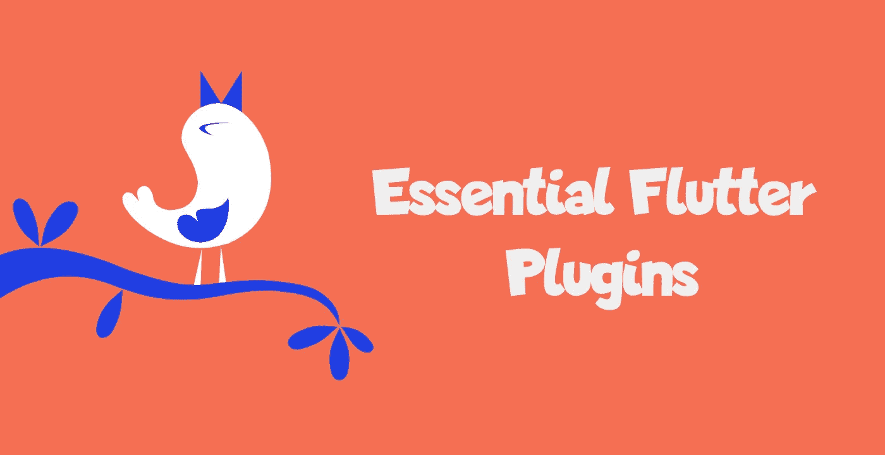

# 我在每个 Flutter 项目中使用的 5 个插件

> 原文：<https://blog.devgenius.io/5-plugins-that-i-use-in-every-flutter-project-ab2f3dc1bfc2?source=collection_archive---------1----------------------->

## 发现最好的插件，开始一个可扩展的颤振项目！

Flutter 是一个神奇的工具，它从各个方面增强了开发者的能力。它背后有一个伟大的社区，我喜欢我不确定使用哪个插件来满足特定的需求。pub.dev 上的一些插件使我们的开发更加高效和有条理。在这篇文章中，我将列出我在所有项目中经常使用的五个插件，并用实用术语解释它们。

## 依赖注入— [颤振模块](https://pub.dev/packages/flutter_modular)

**依赖注入(DI)** 对我来说是一个至关重要的概念，可以让我的代码组织良好，耦合度更低。当我开始使用一种新的语言或框架时，我做的第一件事就是寻找一个合适的 DI 框架。

简而言之，我们有一个被称为**控制反转(IoC)** 的设计原则。术语**控制**在本文中主要指**对象创建**。通常，我们使用 new 关键字创建对象，但是使用阿迪框架，我们将对象创建的控制委托给一个更高的类——阿迪容器。这有很多好处，给了我们很多控制和可维护性。如果你对这个话题感兴趣，你可以阅读我的另一个故事。

Flutter 有几个依赖注入选项，但是我最喜欢的是 [Flutter Modular](https://pub.dev/packages/flutter_modular) 。这个插件不仅方便了 DI，还改善了你的项目的结构。它还允许您以更易于维护的方式管理大型项目。

我是这样定义模块化绑定的。

如您所见，接口可以绑定到具体的实现。你也可以改变它是否是一个单例对象或者是否应该被延迟创建。我可以用**modular . get<ICommandOperator>()**来注入 **CommandOperator** 类，但我不是这种调用注入的粉丝。在我使用的其他语言中，关键字是 **Inject** ，比 *get* 更有意义。结果，我为自己创造了这个简单的方法。

这样，每当我需要注入**命令操作符时，我就可以使用**注入<ICommandOperator>()**。**

模块化处理路由以及内存管理的一些方面。这是一个非常有用的插件，我建议您在项目中经常使用它。

## 状态管理— [提供者(作用域模型)](https://pub.dev/packages/provider)

**状态管理**对于使用[反应式设计模式](https://en.wikipedia.org/wiki/Reactive_programming)的框架来说是必要的。因此，你需要找到一个好的状态管理插件来帮助你保持代码整洁。

术语**“state”**指的是小部件呈现后保留的本地数据。当状态改变时，Flutter 基于新状态重新构建小部件。如您所料，您可能有大量数据的小部件，在这种情况下，调用 *setState* 方法会非常难看、混乱和不可读。因此，我们需要一个解决方案来更好地管理状态。

对于状态管理，我使用的是 [**作用域模型**](https://pub.dev/packages/scoped_model) 。这是一个非常小的插件，做了出色的工作。另一方面，作用域模型已经被弃用，并被 [**提供者**](https://pub.dev/packages/provider) 所取代。这是一个很棒的库，它不仅仅涵盖范围模型，而且您管理状态的方式也是相似的。尽管我目前正在使用范围模型，但我打算在我的下一个项目中使用 Provider。

下面是一个作用域模型的例子；

我通常是这样建立模型的。如您所见， *setContentText* 调用了在内部处理 *setState* 调用的 *notifyListeners* 方法，小部件被重新构建。您使用 *ScopedModel* 作为父小部件，它在其构造函数中接受一个*模型*和一个*子模型*。这个小部件将子小部件绑定到给定的模型。我发现这非常简单，并且比默认的 ***setState*** 方法好得多。

## UI — [风格化小工具](https://pub.dev/packages/styled_widget)

在 Flutter 中，一切都是小部件，这是我喜欢的。然而，有时编写 UI 代码必然涉及大量代码。要简单地添加*填充*，您必须将小部件包装在*填充*小部件中。这可能会使您的 UI 代码看起来有点松散和嵌套。这显然是我的个人观点，如果你同意，你应该试试[风格的 Widget](https://pub.dev/packages/styled_widget) 。

这个插件由一堆有用的扩展方法组成，允许你使用链接的方法建立一个部件树。这里有一个例子:

这段代码生成了这个小部件；

它看起来很漂亮，不是吗？如果不使用*样式的小部件，*代码应该如下所示:

你来做判断。您仍然可以在同一个项目中使用这两种方法，没有问题。

## 坚持——[摩尔](https://pub.dev/packages/moor)

大多数项目需要使用本地数据库来存储和管理数据。当我第一次见到[摩尔](https://pub.dev/packages/moor)的时候，我就知道我会和它有长久的关系。这是一个很好的数据持久化工具。它适用于 Android 和 iOS，并且因为它是一个跨平台的插件，所以即使你不从事移动开发，Moor 也会覆盖你。

下面是一个简单的表定义示例；

定义数据表的一种非常简单的方法

基于您的表定义，Moor 为您生成大量代码，以便轻松管理应用程序中的数据。

Moor 不仅提供了持久化的方法，还考虑了代码的组织。它支持 DAOs，并为版本间的迁移提供了一种便捷的方法。因此，它是为大型或企业级项目准备的。它附带了足够的文档和一些很好的视频教程，可以帮助你入门。

## 响应— [响应框架](https://pub.dev/packages/responsive_framework)

您使用 Flutter 是因为您想轻松地使您的应用程序适应不同的平台。另一方面，让你的应用适应不同的屏幕尺寸是一件非常痛苦的事情。为了使这个过程更容易，我使用了响应框架 k。有许多其他插件和方法来处理 Flutter 中的响应问题。

你可以在不使用插件的情况下为你的应用程序创建一个响应式设计，但是使用一个插件会让事情变得容易得多。

## 奖励插件 1 — [谷歌字体](https://pub.dev/packages/google_fonts)

[谷歌字体](https://pub.dev/packages/google_fonts)插件允许你在你的 Flutter 应用中轻松使用来自[fonts.google.com](https://fonts.google.com/)的 977 种字体。如果你想给你的排版增添趣味，你可以试试。

## 奖励外挂 2 — [飞镖 FFI](https://dart.dev/guides/libraries/c-interop)

如果你有一个用 C 语言编写的库或某种代码，你仍然可以用 Flutter 来使用它。dart:ffi 库使您能够与本机 C 代码来回通信。它帮助您调用本机 C 函数，读取、写入、分配和释放本机内存。

当我需要为 flutter 编写一个 stockfish 象棋引擎客户端时，我可以在我的象棋练习应用程序中使用本机 stockfish 代码。您仍然需要广泛阅读文档，因为让它工作并不容易，但是一旦您这样做了，可能性是无限的。

我希望你会发现这些插件很有用，也许会在你的下一个项目中用到它们。我也很想听听其他开发者关于他们在每个 flutter 项目中使用的插件。感谢您的阅读。