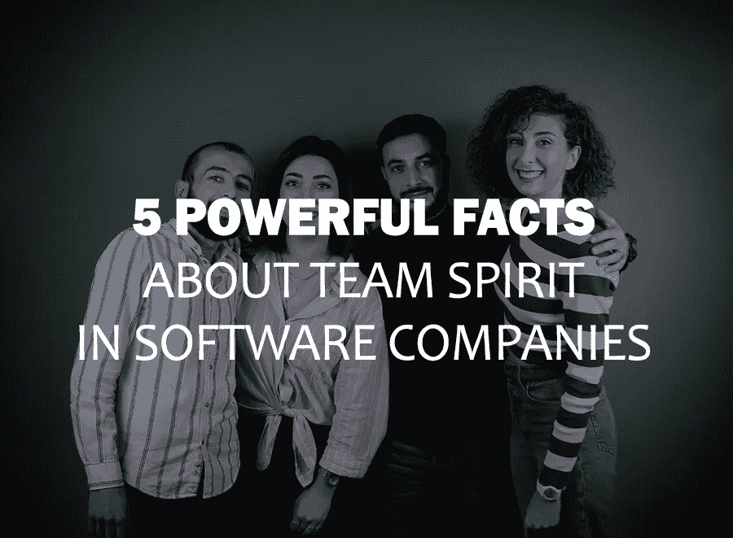

# 关于软件公司团队精神的 5 个有力事实

> 原文：<https://blog.devgenius.io/5-powerful-facts-about-team-spirit-in-software-companies-9a5fac248429?source=collection_archive---------11----------------------->

在雇佣你的软件供应商之前，你有没有考虑过检验他们的团队精神？与关心团队成功和自己成功的专业人士一起工作会有很大的不同。虽然有些工作确实单独完成更好，但在大多数情况下，公司的团队精神对单个软件开发人员或整个软件开发团队的顺利表现和成功起着至关重要的决定性作用。

一个成功的软件开发项目需要协作努力、团队精神和实现项目目标的动力。它解释了团队友好对于作为一个有凝聚力的单位茁壮成长的重要性。

在软件外包公司中，软件开发人员和其他 IT 专业人员在以下情况下工作效率最高:

●他们为一家友好的软件开发公司工作，乐于接受反馈。

●他们在一个鼓励协作和对话的团队中工作，因此每个人都有提升的机会。

●软件外包公司支持其员工获得新技能或改变经营领域的意愿。

●团队领导和上级真正关心员工的职业发展，并努力为此做出贡献。

●软件开发公司定期改善工作条件并审核工资

●相互信任、尊重和忠诚是软件开发团队的基础。

●团队成员愿意并肩走过职业阶梯的起伏。

遵循这些简单步骤的公司是友好的软件开发公司，具有高度的团队精神。否则，团队协作的基础很容易被打破。

我们所有人都在生活中的某个时候经历过自信和自尊危机，这对我们的工作表现产生了直接的负面影响。我们大多数人都能回忆起两家对我们的个人生活和职业生涯产生重大影响的公司或团队。

●这家公司促使我们寻找一个拥有友好、家庭般氛围的团队，并让我们意识到这一点有多重要。

●一家具有强烈座右铭和团队精神的公司，展示了作为团队的一部分工作意味着什么。

后者将永远被铭记，因为它是我们成为一名强大、有技能、抗压、总体上快乐的员工的大门。在不健康的工作环境中工作过的软件工程师或其他专业人士明白，选择一家拥有健康、友好、家庭般团队的软件开发公司是多么重要，并且真正关心员工的福祉和满意度。这基本上是他们工作质量的保证。

在 [CodeRiders](https://www.coderiders.am/) ，我们是一个软件开发团队，我们认识到人是成功公司中最有价值的资产。员工必须感到被欣赏和认可，才能被激励更加努力地工作，并相信他们的努力会有所作为。团队 CodeRiders 由软件工程师、技术专家和 IT 爱好者组成，他们努力为我们的客户创造健壮和高质量的产品。我们首先是亲密的朋友和/或家庭成员，因为一个共同的目标而团结在一起:使用尖端技术和创新来构建简单而强大的系统，以实现业务流程的自动化。

[我们的愿景很简单](https://www.coderiders.am/company-why-us):时间很宝贵，自动化可以节省时间。我们的座右铭是鼓舞人心的:我们渴望，我们一起实现！作为一家软件开发公司，我们重视卓越、真诚的关怀，当然还有团队精神。

而强队，不是偶然形成的！CodeRiders 也不是。我们的团队成员都有独特的个性，这是我们共同的努力和强烈的愿望，帮助我们在其他亚美尼亚软件开发公司中脱颖而出。

让我们来看一些统计数据，这些数据证明了在选择下一家软件开发公司时，团队精神在一家公司中的重要性。

根据美国领先的员工折扣网络的文章[“员工参与度&忠诚度统计:终极收集”](https://blog.accessperks.com/employee-engagement-loyalty-statistics-the-ultimate-collection#engagement)，访问津贴:

●28%的员工表示他们的公司善于根据反馈采取行动，相比之下，44%的员工表示他们的公司不善于根据反馈采取行动，他们打算找份新工作。

● 90%的员工表示，他们更倾向于留在一家听取他们的建议并采取行动的公司。

●孤独的员工考虑放弃工作的可能性是非孤独员工的两倍多。

● 74%的受访者表示，如果他们最好的朋友离职，他们不会更有可能离职。

●根据 3200 万份 LinkedIn 个人资料，那些感觉自己被赋予权力、受到重视、并为自己有所作为而自豪的员工，比那些感觉不到的员工留在公司的可能性高 35%。

**为什么与团队精神强的软件外包公司合作很重要？**

**1。团队合作培养相互信任和信心**

*“的确，成功的最好、最快的方法就是帮助别人成功。”拿破仑·希尔*

在团队中展示“我们”而不是“我”,是开放和诚实沟通的强大动力。它让团队对工作质量负责，而不是玩责备游戏。

可以理解，不是每个人都是团队成员，但这是一项软技能，对提高个人和团队的成功至关重要。即使是最不善于沟通的员工也可以通过在重视友好员工关系的公司工作来发展人际沟通技巧。它培养关系，打开新的视野和机会。建立在信任基础上的团队互相帮助，弥补对方的不足，增强对方的优势。我们都知道，在这样的团队中工作可以加速职业自我提升，对每个项目的成功都至关重要。

例如，在软件开发领域，当你在一家有着友好家庭氛围的软件开发公司工作时，从初级软件开发人员转到中级软件开发人员，或者从中级软件开发人员转到高级软件开发人员，要容易得多，也快得多。

**2。团队精神提高了软件开发项目的绩效**

毫无疑问，集体的表现确保了软件开发项目的成功。在一个非协作团队中，即使是一个团队成员的失败也会影响你项目的质量。因此，在一个愿意互相了解并在工作之外建立联系的团队中工作，有望产生更好的结果。找到一家强调团队精神和友谊的软件外包公司是很关键的。

我们已经知道，强烈的团队意识可以激励员工，促进工作场所的协同作用。团队精神等同于情感依恋、共同的信念和目标以及鼓励，所有这些都有助于工作场所的协同作用。

在 CodeRiders，我们非常重视员工满意度。我们每周至少召开一次会议，询问有关员工工作条件的问题，创建匿名投票，努力纠正缺陷(如果有)，并不断组织团队建设活动。

**3。团队精神有助于减少团队成员之间的误解**

在职业生涯的某个阶段，我们都可能对同事的某个行为感到不满。问题是，“我们是如何处理这件事的？”真正关心彼此的同事不会以自我为中心。他们乐于讨论问题，并渴望找到一个对团队中的每个人都有利的解决方案，并增加项目的成功。

另一方面，好朋友不会贪婪地与同事分享新获得的技能；他们不隐藏任何信息和流言蜚语，这些都是成功沟通的主要杀手。

在我们的软件开发团队中，透明的沟通是必须的。如果团队成员不知道如何相互沟通，他们将如何处理与客户的关系？在 CodeRiders 中，如果我们中的一个人不高兴，它会立即被清除。与此同时，我们的目标是提高我们的软件开发人员和 IT 专业人员的意识和声誉，证明每个人都是合格的专业人员和他们领域的大师。

需要一个能力强、组织严密的团队来提供出色的客户服务。这种情况下是双赢。通过这种方式，员工和公司都获得了可靠和高质量服务提供商的声誉。

**4。心满意足的员工更健康**

压力对健康有害。压力会降低员工工作的质量和速度。与此同时，团队中不愉快的气氛不断引发负面情绪，阻碍了工作场所的乐观情绪。虽然没有人能免受压力和负面情绪的影响，但工作中的压力会火上浇油。

如果你的员工有个人问题，但工作愉快，后者会帮助和激励他们更快更容易地解决个人问题，反之亦然。在这两个领域经历困难会造成完全的混乱。

**5。团队精神增加创造力，发掘员工的新才能**

当同事们处在一个友好的团队环境中时，他们会更开放地讨论各种问题并表达他们的想法。他们不怕被团队成员误解，不怕被挑毛病，或者只是觉得自己很蠢。毕竟，在高团队精神的软件开发公司中，同事首先是朋友，他们不会根据一个愚蠢的错误或仓促形成的意见来评判对方。

公开而彻底的讨论会产生伟大的想法，发现新的人才。分配不同的任务，开发小组项目，举行头脑风暴会议是一些鼓励团队创造力的方法，但当员工相处时效果最好。安全的工作环境、友好的关系和积极的同事都是有助于工作成功和最令人兴奋、最棒的想法和隐藏的才能诞生的因素。

**如何找到一家友好的、家庭式的软件开发公司？**

选择一个家庭式的定制软件开发团队是一个简单而又具有挑战性的过程。要弄清楚一个公司是否真正重视团队合作，或者这只是一种营销伎俩，需要时间、努力和思考。另一方面，如果你事先知道这些简单的提示，找到一个友好的软件开发团队并不太困难:

●一家友好的软件开发公司组织下班后的喝酒和活动。例如，我们 CodeRiders 的软件开发团队喜欢下班后的小聚会。我们可以聚在一起喝杯酒或吃块甜蛋糕。我们也有一个单独的房间，用于游戏机游戏和电影之夜。此外，我们的员工喜欢全天短暂休息。这提高了他们的工作效率，理清了他们的思路。我们还有一个台球室和一个桌上足球/足球场。

●友好的软件开发团队组织办公室外的团队建设活动。CodeRiders 最近的一次访问是去亚美尼亚的北部省份 Shirak。我们参观了亚美尼亚第二大城镇和文化中心久姆里，以及亚美尼亚最高的瀑布 Trchkan 瀑布。

●友好的软件外包团队找到共同的爱好，花更多的时间在一起。例如，我们的软件工程师是超级足球迷。除了关注他们喜欢的球队的联赛之外，他们还喜欢一起踢足球。星期四，他们有特别的菜单。这是他们的比赛日。

●远程办公并不妨碍友好的软件开发公司玩得开心。虽然 CodeRiders 足够灵活，可以为员工提供远程或内部工作条件，但我们仍然确保我们的远程员工不会被遗漏。例如，我们可能会组织快速的远程咖啡休息，并在特殊的日子聚集在一起，如电影之夜、员工生日或其他节日。

总之，一个分享价值观的团队将会团结一致度过繁荣时期和艰难时期。一家具有强烈职业道德和团队精神的定制软件开发公司基于团结的努力和动机交付下一代软件解决方案。这些公司还拥有市场上最优秀的软件工程师和其他 IT 专业人员。