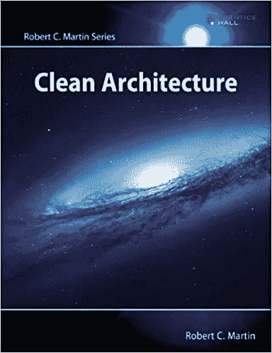

# 5 条原则将使你的代码健壮

> 原文：<https://blog.devgenius.io/5-principles-will-make-your-code-robust-65ff6e306bf7?source=collection_archive---------7----------------------->

希瑟·福特在 [Unsplash](https://unsplash.com?utm_source=medium&utm_medium=referral) 上的照片

我将要谈到的 5 个原则仍然和以前一样适用。

根据鲍勃的说法，自从 1945 年图灵为电子计算机写下第一行代码以来，T8 软件并没有改变多少。

软件仍然是`if`语句、`while`循环、赋值语句:*序列*、*选择*和*迭代*。

因此，让我们一个一个地了解这些原则。

## 1-单一责任原则(SRP)

> 把因为同样的原因而改变的东西聚集在一起。将因不同原因而改变的事物分开。

我们不会将业务规则与 GUI 代码混合在一起。

我们不会将 SQL 查询与通信协议混合使用。

我们将因不同原因而更改的代码分开，这样对一部分的更改不会破坏其他部分。

我们确保因不同原因而改变的模块没有使它们纠缠在一起的依赖关系。

## 2-开闭原则(OCP)

> 模块应该对扩展开放，但对修改关闭。

它是关于创建无需修改就能扩展的模块。

您能想象在一个没有设备独立性的系统中工作吗？在这个系统中，写入磁盘文件与写入打印机、屏幕或管道有着根本的不同。

我们希望看到`if`语句分散我们的代码去处理所有的小细节吗？

还是要把抽象的概念和详细的概念分开？

我们希望将业务规则与 GUI 的讨厌的小细节、微服务通信协议以及数据库的任意行为隔离开来。

## 3-利斯科夫替代原理( **LSP** )

> 使用接口的程序不能被接口的实现所混淆。

我们犯了一个错误，这是关于继承。

它不是。它是关于打字的。接口的所有实现都是接口的子类型。

这个原则是关于保持抽象清晰和定义明确。很难相信这是一个过时的概念。

## 4-接口隔离原则( **ISP** )

> 保持小界面，这样用户就不会依赖他们不需要的东西。

我们仍然使用编译语言。

我们仍然依靠修改日期来决定哪些模块应该重新编译和重新部署。

只要这是真的，我们将不得不面对这样的问题:当模块 A 在编译时依赖于模块 B，而不是在运行时，那么对模块 B 的改变将迫使模块 A 重新编译和重新部署。

这个问题在 Java、C#、C++等静态类型语言中尤为突出。

## 5-依存倒置原则(**倾角**)

> 依赖于抽象的方向。高级模块不应依赖于低级细节。

很难想象一个架构不充分利用这个原则。

我们不希望我们的高级业务规则依赖于低级细节。

我们希望将高层次的抽象与低层次的细节隔离开来。

这种分离是通过仔细管理系统内的依赖关系来实现的，这样所有的源代码依赖关系，尤其是那些跨越架构边界的依赖关系，都指向高层抽象，而不是低层细节。

# 结论:

遵循 S.O.L.I.D .原则的代码可以更容易地与合作者共享、扩展、修改、测试和重构，没有任何问题。

**如果你觉得这个有用，点击那个**👏**按钮:)**

**奖励:**

通过应用软件架构的通用规则，您可以在任何软件系统的整个生命周期中极大地提高开发人员的生产率。

现在，基于他的畅销书 *Clean Code* 和 *The Clean Coder 的成功，*传奇软件工匠 Robert c . Martin(“Bob 叔叔”)揭示了这些规则并帮助你应用它们。

使用以下链接获取您的副本:

## [干净的架构:软件结构和设计的工匠指南(Robert C. Martin 系列)](https://amzn.to/35etgMt)

一些您可能感兴趣的相关文章:

1-OOP 现在是计算机科学的基础

[有史以来最好的 2- 6 名程序员](https://selcote.com/2020/10/27/6-best-programmers-of-all-time/)

未来编程最有前途的领域

[4-网络开发中最常用的 5 种语言](https://selcote.com/2020/10/20/the-5-most-used-languages-for-web-development/)

[5-提高你编程技能水平的最佳方法](https://selcote.com/2020/10/16/the-best-way-to-improve-your-programming-skill-level/)

[6-推荐初学者先学的编程语言](https://selcote.com/2020/10/13/recommended-programming-language-for-beginner-to-learn-first/)

与我联系:[博客](https://selcote.com/)， [Youtube](https://www.youtube.com/channel/UCU_LhClyNOtEQw7R0q9ovoQ?view_as=subscriber) ，[脸书](https://www.facebook.com/zelakioui)，[推特](https://twitter.com/zelakioui)

来源:[selcote.com](https://selcote.com/2020/11/09/5-principles-will-make-your-code-robust/)