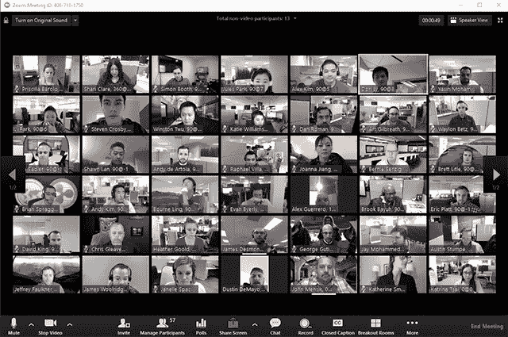
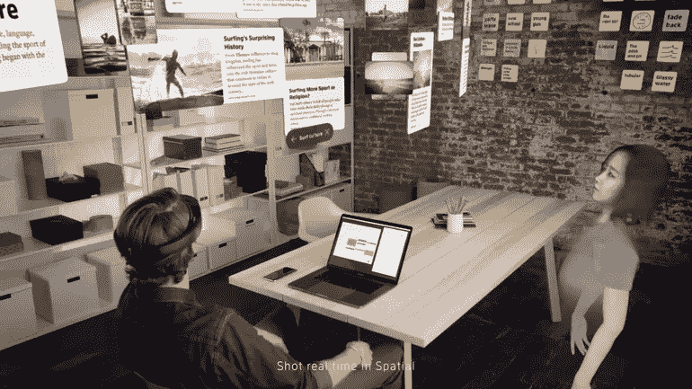

# 视频会议的 5 个问题！

> 原文：<https://blog.devgenius.io/5-problems-with-video-conferencing-e2e583675faa?source=collection_archive---------25----------------------->

## 随着远程会议成为新常态，这些问题必须得到解决..

我们现在比以往更多地使用视频会议应用程序。这导致了现有应用程序的迅速流行，也导致了多个新应用程序的发布。在所有现有的应用中，Zoom 已经变得非常受欢迎，紧随其后的是微软团队、Google Meet、思科 WebEx 和蓝战士。随着越来越多的公司适应远程工作，有更多的应用程序在争夺市场份额。这些应用程序之间的功能列表有一定的差异，但所有现有的应用程序都有相似的界面和相同的功能。

# 1.不自然的界面

这些模仿真实世界中的面对面对话吗？不。当你参加会议的时候，这种体验和-

焦点通常在说话的人身上，每个人都看着他们，而不是看着所有这些微小的块。这使得互动保持自然，并促进有效的沟通。如果你看看视频会议应用的演变，最初的重点更多地是个人交流，主要是与朋友和家人进行一对一的对话。当相同的接口被扩展以支持更大的会议时，问题就出现了。就是不一样！

当你参加一个有很多人参加的会议，或者甚至与一群朋友或家人进行视频通话时，使用这个界面是不自然的。

# 2.你静音了吗？

另一个恼人的或不自然的事情，只适用于远程会议，是静音和取消静音之前，你说话。你经常忘记取消静音，当别人看到你的嘴唇在动，但听不到你的声音时，你会重复自己的话。

另一个原因是，当你和别人说话或接到电话时不要静音。

# 3.所有的会议都不一样

在工作中，你一天中会有许多类型的互动。你与一个或几个人随意交谈，你参加人数较少的会议，在那里你有更多的互动对话，你参加有一个人主导对话的大团体会议，你参加有一个演讲者的演讲或辅导，等等。对于所有这些不同类型的对话，你不可能有相同的用户界面。当有人演讲时，你不需要看到 50 个小方块，界面必须完全不同。

# 4.嘿！你的声音变弱了..

似乎是网上会议中的常用语。到目前为止，视频会议应用消耗了大量的互联网带宽，因为它需要传输视频和音频。在不稳定的互联网上，你通常会遇到音频/视频不清晰的问题。这些应用程序需要迎合低带宽用户，以便能够在移动网络上和网速较低时使用。随着 5G 的发展和未来，互联网速度可能不是问题，但这可能仍然有点遥远。

# 5.安全，安全，安全…

如今，有很多技术正在侵犯个人隐私。视频会议应用的责任甚至更大，因为公司将它用作官方沟通手段。如果存在安全漏洞，泄露公司机密的风险更大。鉴于过去几个月这些应用程序的使用越来越多，出现了各种各样的问题。需要具备的一个基本功能是端到端加密(同时修复其他安全问题)，这甚至不允许应用程序公司查看对话。

# AR/VR 是视频会议的未来吗？

尽管增强现实和虚拟现实处于相对早期的阶段，仍然需要渗透，但它们非常适用于视频会议应用。借助增强现实，it 人员可以体验模拟真实会议室的体验，还可以使用增强的界面来呈现内容。

鉴于人们对虚拟会议越来越感兴趣，spatial([https://spatial.io/](https://spatial.io/))、HTC Vive([https://enterprise.vive.com/eu/solutions/vive-sync/](https://enterprise.vive.com/eu/solutions/vive-sync/))和更多的应用程序正在这个领域出现。虽然这可能会有更好的体验，但 AR/VR 应用程序的更广泛采用仍需要时间。