# Linux 上的 Python 设置:Python 完整教程—第 5 部分

> 原文：<https://blog.devgenius.io/5-python-setup-on-linux-c111fd93982f?source=collection_archive---------17----------------------->


照片由 [Soumil Kumar](https://www.pexels.com/@soumil-kumar-4325) 在 [Pexles](https://www.pexels.com/search/linux%20pc/?size=medium) 拍摄

**在我们开始之前，让我告诉你:**

*   这篇文章是 Python 完全初学者到专家课程
    的一部分，你可以在这里[找到它](https://medium.com/@samersallam92/python-complete-beginner-to-expert-course-f7626916df30)。
*   这篇文章也可以作为 YouTube 视频[在这里](https://www.youtube.com/watch?v=XnQJUbskCs4)获得。

[https://www.youtube.com/watch?v=XnQJUbskCs4](https://www.youtube.com/watch?v=XnQJUbskCs4)

## 介绍

要开始学习 Python，你应该在你的机器上安装 **Python** 。另外，你需要一个**编辑器**来编写和运行你的代码。

如果您是 Linux 用户，这篇文章是为您准备的。以下文章针对 Windows 和 macOS 用户。

[[4]Windows 上的 Python 设置](https://medium.com/@samersallam92/4-python-setup-on-windows-e5e2a810fa43)

[[6]MAC OS 上的 Python 设置](https://medium.com/@samersallam92/6-python-setup-on-macos-e1a39e8c25d0?source=your_stories_page----------------------------------------)

**本文将涵盖以下要点:**

1.  [Linux 上的 Python 设置](#e200)
2.  [Linux 上的 PyCharm IDE 设置](#5f64)

## 1.Linux 上的 Python 设置


照片由 [cottonbro](https://www.pexels.com/@cottonbro) 在 [Pexles](https://www.pexels.com/search/pycharm/?size=medium) 上拍摄

要在您的 Linux 上安装 Python，请遵循以下步骤:

1.  用 **Ctrl+Alt+T** 打开终端并键入:

```
sudo apt-get install python3.6
```

点击**进入**并确认输入 3。不然就要装 Python 2.7 了。

2.之后，你必须输入当前用户的密码。

3.完成后，只需输入:

```
Python3.6
```

然后**进入**。

4.如果你找到了 **Python 3.6** ，那意味着你现在已经准备好使用 Python 了。参见图 1。

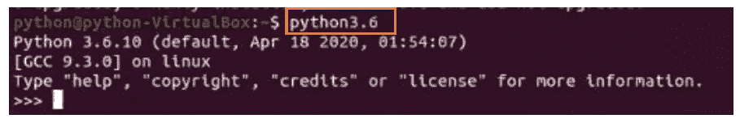

图 1: Python 安装成功(作者截图)。

5.最后，通过运行 **Ctrl-z** 退出 Python shell，然后**进入**。

让我们继续安装 PyCharm IDE。

## 2.Linux 上的 PyCharm 设置


由[法布里西奥·特鲁希略](https://www.pexels.com/@fabtruji)在[上](https://www.pexels.com/search/programming/)拍摄的照片

**简单来说，按照步骤:**

1.  从您的互联网浏览器访问 PyCharm 官方网站 [**PyCharm 下载页面**](https://www.jetbrains.com/pycharm/download/) 。
2.  在 Linux 下，从下载页面选择**社区**版本。然后点击**下载。**参考图 2。

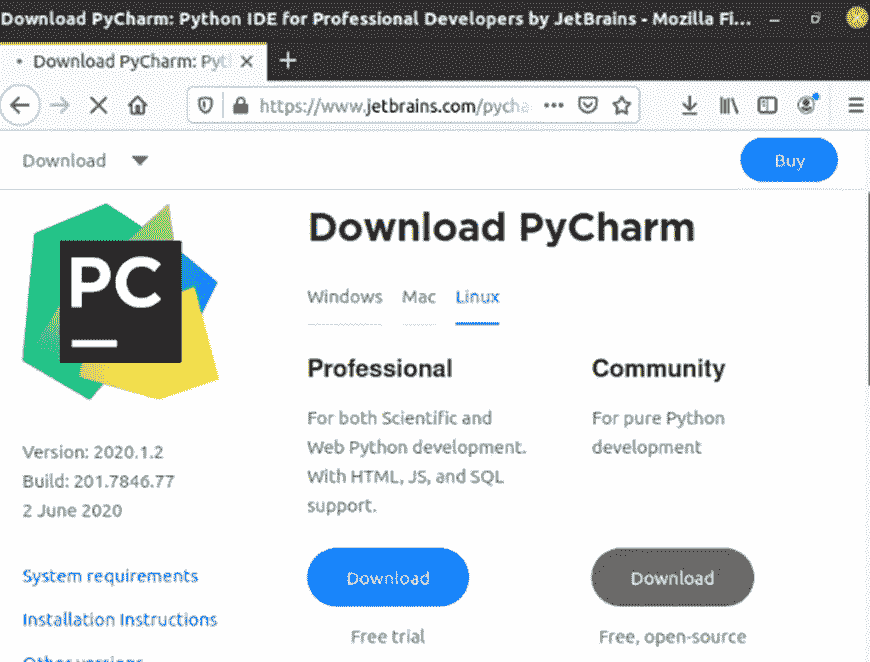

图 Linux 版 PyCharm 下载页面(作者[https://www.jetbrains.com/pycharm/download/#section=linux](https://www.jetbrains.com/pycharm/download/#section=linux)截图)。

3.一旦**tar.gz**文件下载到你的电脑上，解压**下载的文件**。参考图 3。

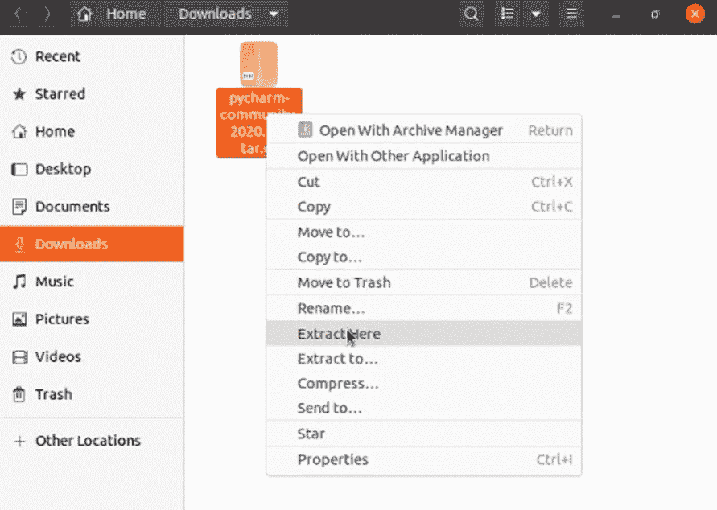

图 3:提取下载的文件(作者截图)。

4.一旦它被提取，你会发现多个文件夹和文件。
有一个文件，在 **bin 文件夹**里面，它的名字 **PyCharm.sh** 。参考图 4。

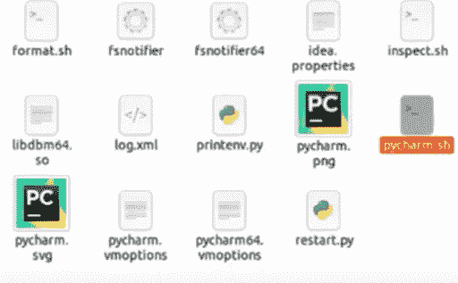

图 bin 文件夹内的 PyCharm.sh 文件(作者截图)。

5.启动位于 bin 文件夹中的 **pycharm.sh** 文件脚本。为此，请打开您的终端并导航到脚本文件位置。

```
cd Downloads/pycharm-community-2020.1.2./pycharm.sh
```

然后按**回车。**参考图 5。

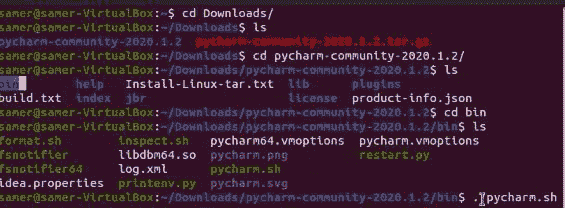

图 5:安装 Pycharm 的步骤(作者截图)。

6.接受隐私政策并点击**继续。**参考图 6。

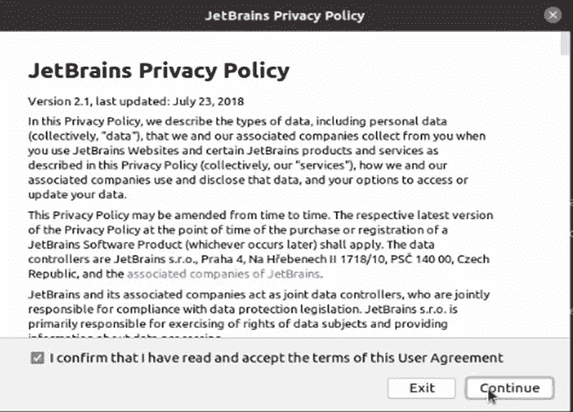

图 6: JetBrains 隐私政策(作者截图)。

7.共享或不共享您环境中的一些数据由您决定。参见图 7。

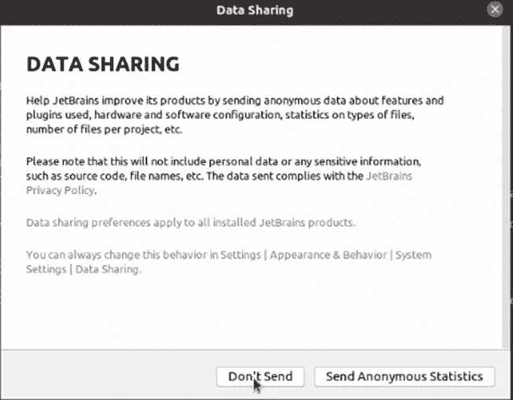

图 7: JetBrains 数据分享(作者截图)。

8.现在我们可以开始定制我们的 PyCharm 环境了。选择你喜欢的 **UI 主题**，然后点击**下一个**。参见图 8。

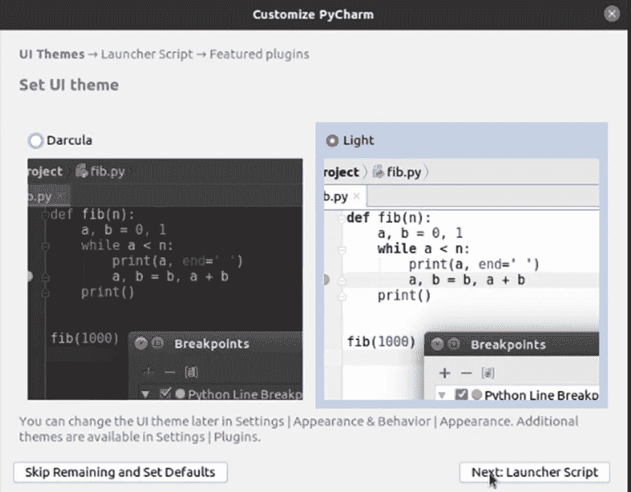

图 8:自定义 PyCharm 环境-UI 主题(作者截图)。

9.选中复选框(创建脚本…)，点击**下一步。**参考图 9。

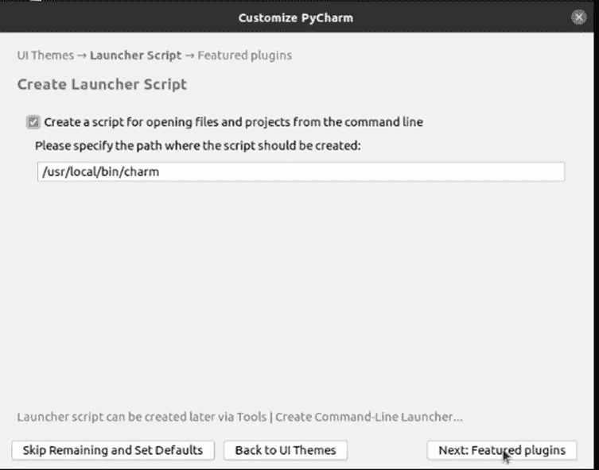

图 9:启动器脚本框(作者截图)。

10.你可以下载并安装任何 PyCharm 插件或者跳过它，点击**开始使用 PyCharm** 。参见图 10。

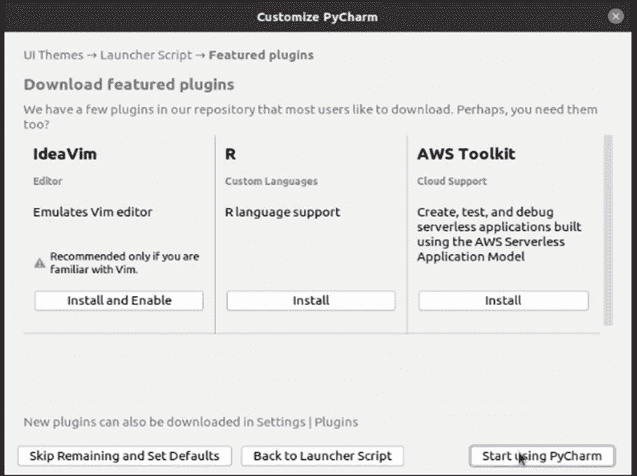

图 10:下载特色插件(作者截图)。

11.安装程序会要求您输入用户密码。输入密码，然后点击**确定**。将出现一个欢迎窗口。在这里，您可以开始并创建您的第一个项目。参见图 11。

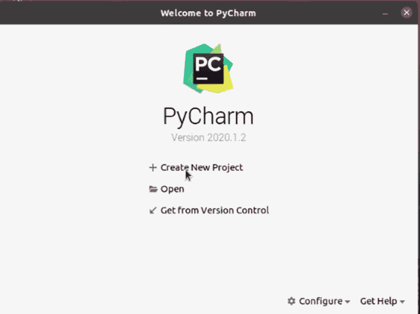

图 11:欢迎来到 PyCharm 窗口(作者截图)。

**恭喜你！
你可以在你的电脑上开始编码……**

## 现在，让我们总结一下我们在这篇文章中学到的内容:


照片由[安 H](https://www.pexels.com/@ann-h-45017/) 在[像素](https://www.pexels.com/)上拍摄

在这篇文章中，我们谈到了:

*   如何在 Linux 上设置 Python？
*   如何在 Linux 上设置 Pycharm IDE？

***附言*** *:万分感谢您花时间阅读我的故事。在你离开之前，让我快速地提两点*

*   *首先，要直接在您的收件箱中获得我的帖子，请在这里订阅*[](https://medium.com/@samersallam92/subscribe)**，您可以在这里关注我*[](https://medium.com/@samersallam92)**。***
*   ***第二，作家在媒介上制造了几千个****$*$***。为了无限制地访问媒体故事并开始赚钱，* [***现在就注册成为媒体会员***](https://medium.com/@samersallam92/membership)**，其中* *每月只需花费 5 美元。报名* [***有了这个链接***](https://medium.com/@samersallam92/membership) *，可以直接支持我，不需要你额外付费。****

**

[萨梅尔萨拉姆](https://medium.com/@samersallam92?source=post_page-----c111fd93982f--------------------------------)** 

## **Python 初学者到专家的完整课程**

**[View list](https://medium.com/@samersallam92/list/python-complete-beginner-to-expert-course-32d3a941c05e?source=post_page-----c111fd93982f--------------------------------)****21 stories**************

**要回到上一篇文章，您可以使用以下链接:**

**[第 4 部分:Python 在 Windows 上的设置](/4-python-setup-on-windows-e5e2a810fa43)**

**要阅读下一篇文章，您可以使用以下链接:**

**[第 6 部分:MacOs 上的 Python 设置](/6-python-setup-on-macos-e1a39e8c25d0)**