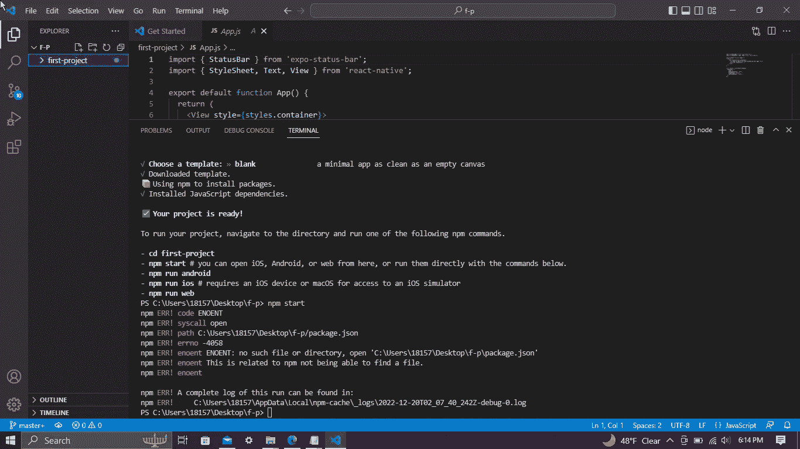

# 5 应对本地 Expo 错误及其解决方案

> 原文：<https://blog.devgenius.io/5-react-native-expo-errors-and-their-solutions-5775ce1daeab?source=collection_archive---------10----------------------->

编程可能很难。尤其是在你对 JavaScript 一无所知的情况下，尝试用 React Native 编写 android/iOS 应用的时候。

在创建我的第一个 react native 项目时，我遇到了许多自发的错误。为了避免您在浏览器中搜索它们、滚动浏览文章、尝试那些小的命令提示符/终端片段直到发生其他事情的麻烦，我将它们全部放在本文中，为您节省了两天或更多令人沮丧的时间。



npm 错误！代码 ENOENT

# 1.npm 错误！代码 ENOENT

npm 无法打开执行命令所需的文件或目录。在我的例子中，命令是“npm start”。

我通过更改项目目录修复了这个错误。我将我的项目命名为‘first-project ’, package . JSON 就在那里。我试图从我的项目文件夹中执行“npm start”。如果这是您的问题，请用“cd”更改项目目录

```
cd first-project
```

如果没有，你就错过了包！有什么解决办法？

尝试清除您的 npm 缓存。

在您计算机上的文件中，转到

C:\users\(您的用户名)\AppData\Roaming

并删除 npm 文件(和 npm 缓存，如果有的话)。删除后，在命令行/终端运行

```
npm cache clean
```

或者

```
npm cache clean --force
```

如果 npm 安装失败，代码为 ENOENT，请尝试更新您的 npm 版本，

```
npm install -g npm@latest
```

删除节点模块和包锁，

```
npm rm -rf node_modules && rm package-lock.json
```

和重新安装依赖项

```
npm install
```

在此 [StackOverflow 页面](https://stackoverflow.com/questions/17990647/npm-install-errors-with-error-enoent-chmod)上找到更多解决方案。

# 2.npm 错误！代码 ENOLOCK

你看到这样的东西了吗

```
npm ERR! code ENOLOCK
npm ERR! audit This command requires an existing lockfile.
npm ERR! audit Try creating one first with: npm i --package-lock-only
npm ERR! audit Original error: loadVirtual requires existing shrinkwrap file
```

?

我运行“npm 审计”时也是如此。我尝试了几件事。

首先，我再次尝试清除我的 npm 缓存:

```
npm cache clean
```

或者

```
npm cache clean --force
```

，但这种解决方案并不总是有效。其次，我尝试在目录中添加一个新的 package.json 和 package-lock.json 文件:

```
npm init -y
```

```
npm i --package-lock-only
```

我以为这样就解决了令人讨厌的埃诺洛克错误，但事实并非如此。所有创建 package.json 和 package-lock.json 文件的工作都是创建文件；然而，错误依然存在。

什么对我有效？我重新启动了 Visual Studio 代码窗口。一旦我打开一个新的终端，错误就消失了。我为你节省了三十分钟的挫败感。不客气

在此 [StackOverflow 页面](https://stackoverflow.com/questions/65573579/how-to-fix-npm-audit-error-with-loadvirtual-and-enolock)上找到更多解决方案。

# 3.此系统上禁止运行脚本

是的，又一个。我劝你不要关上电脑就走开。下面先来解一下。

首先，让我问你是否得到了这个错误

```
expo : File C:\Users\saka\AppData\Roaming\npm\expo.ps1 cannot be loaded because running scripts is disabled on this system. For more 
information, see about_Execution_Policies at https:/go.microsoft.com/fwlink/?LinkID=135170.
At line:1 char:1
+ expo --version
+ ~~~~
    + CategoryInfo          : SecurityError: (:) [], PSSecurityException
    + FullyQualifiedErrorId : UnauthorizedAccess
```

在 Visual Studio 代码的终端中尝试命令“expo - version”时？尝试以管理员身份打开 PowerShell 并运行:

```
Set-ExecutionPolicy RemoteSigned
```

如果失败了，试试看

```
Set-ExecutionPolicy -Scope CurrentUser -ExecutionPolicy unrestricted
```

.

默认情况下，在 Visual Studio 代码的终端中运行“expo start”是未经授权的。尝试在计算机的命令提示符/终端中运行“expo start”或“expo - version”(非 vscode)。

在此 [StackOverflow 页面](https://stackoverflow.com/questions/60410285/expo-version-command-shows-running-scripts-disabled-on-this-machine)上找到更多解决方案。

# 4.错误:0308010c:数字信封例程::不支持

为此，我必须安装 [nvm](https://www.freecodecamp.org/news/node-version-manager-nvm-install-guide/) ，这是一个节点版本管理器(nvm)。问题是节点 I 使用的版本( [18.12.1](https://nodejs.org/en/download/) )。如果你下载了最新的版本，你会像我一样得到这个错误。尝试降级节点版本。

我试过 node [14.20.1](https://nodejs.org/uk/blog/release/v14.20.1/) ，但是这个版本对于 expo 来说太老了，所以我卸载了那个，试了 [16.18.1](https://nodejs.org/en/blog/release/v16.18.1/) ，对我来说是管用的。

如需帮助降级您的 nvm 节点版本，请查看此 [StackOverflow 页面](https://stackoverflow.com/questions/9755841/how-can-i-change-the-version-of-npm-using-nvm)。

为了节省你更多的时间，这里有一个 [YouTube 视频](https://www.youtube.com/watch?v=6z26PYacCLc)帮助我降级了我的 node 版本。

# 5.chokidar 错误(c:\):错误:EBUSY:资源忙或被锁定，lstat 'c:\DumpStack.log.tmp '

这个电子商务错误是我在本文中讨论的最后一个错误。如果您希望我在以后的文章中涵盖更多错误，请留下评论。

此外，如果这篇文章节省了你的时间，避免了挫折，通过分享来帮助别人。

如果你得到“chokidar 错误…”这可能不是你原来的错误。再次查看终端，找到这条消息之前的错误消息。package.json 或 App.js 中可能有错误。

在此 [StackOverflow 页面](https://stackoverflow.com/questions/61936085/error-from-chokidar-c-error-ebusy-resource-busy-or-locked-lstat-c-dump)上找到更多解决方案。

谢谢你的滚动。记住，如果你觉得这篇文章有用，请分享。评论更多的解决方案以进一步帮助他人，如果您想要更多关于常见编程错误的文章。


照片由[法希姆·蒙塔希尔](https://unsplash.com/@f12r?utm_source=medium&utm_medium=referral)在 [Unsplash](https://unsplash.com?utm_source=medium&utm_medium=referral) 上拍摄