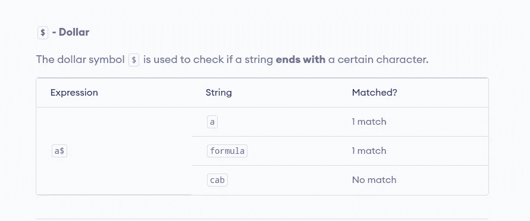

# QA 需要了解的 5 种资源

> 原文：<https://blog.devgenius.io/5-resources-qa-need-to-know-about-92befc21e7f1?source=collection_archive---------2----------------------->

[Zan](https://unsplash.com/@zanilic?utm_source=medium&utm_medium=referral) 在 [Unsplash](https://unsplash.com?utm_source=medium&utm_medium=referral) 上的照片

你好，QA 同仁，

让我告诉你一个秘密，我发现了一些让你作为测试人员的生活变得更容易的方法…

你知道这从来都不容易，无论你如何试图简化它，但是这个博客有趣的地方在于，它更多的是关于扩大你的测试范围和获得一系列测试方面的新信息。

这些资源被开发人员在做自己的测试(单元测试阶段)时广泛使用，我和开发人员很久了，所以我开始和他们混在一起。如果你想知道的话，为了了解他们是如何发展的，我并不想改变职业😆 😆但它只是给了我一些内部信息，告诉我将来可以从他们的代码中得到什么(仍在学习过程中)。

这是在学习过程中，因为我还不太擅长阅读代码，但至少我在努力，不是吗？

关于我说得够多了，让我们进入博客的重要部分。因此，当看到开发人员在做测试时，我注意到他们开始使用一些资源来帮助他们产生预期的早期部署(未成熟部署)问题。

老实说，以前我用自己的测试方式产生了这种问题，但是创建测试数据需要时间和精力，尤其是当我们有很好的开源资源可以帮助我们在几秒钟或几分钟内创建所有这些信息的时候。

> 效率和专注是成功的关键——罗伯特·克里斯

当有一种更简单的方法来创建数据时，你为什么要从你的测试用例以及测试场景中转移注意力呢？但是这个博客不仅仅是在说数据创造，让我更确切地说，这里是这篇文章的目标。

目前，我们的目标是 QA 完成测试所必须做的最耗时的领域，a)数据创建& b)对测试结果的理解。

如上所述，数据创建是指测试人员创建测试数据来测试和覆盖他们的测试场景。但是理解测试结果是另一回事，我们通常在任何项目开始测试的时候就忘记了时间，去理解我们从中获得的结果。

# 历元转换器

Epoch converter 是开发人员主要用来从 Epoch 格式或 UNIX 时间戳中获取正确的人类日期的工具。这个工具不仅给你一般的人类日期，也给你所在位置的人类日期。

这个工具还可以将秒转换为分钟、小时或天，反之亦然，这里有许多开发者使用的功能，这些功能都集中在日期和时间戳部分。

为什么会这样？

在建议的工具中，您可以看到开发人员以 UNIX 或 epoch 格式显示的人类日期或时间戳，以查看其值是否正确。

他们甚至有一个文档部分，让 QA 和开发人员更容易理解他们需要什么，以及如何使用它来改善他们的工作范围。

请在下面找到该工具的链接。

 [## 历元转换器

### 计算机程序员用的简单的 epoch/Unix 时间戳转换器。包括纪元解释和转换语法…

www.epochconverter.com](https://www.epochconverter.com/) 

# 使虚弱

Vuetify 是用于从开发的前端和后端获得所有预期行为的工具。当你已经知道将要做的开发的基础时，作为一个 QA，你将更容易调试和检测错误，以帮助提高你正在工作的产品的质量。

如果你正在做前端测试，那么这个工具的好处是涵盖了 FE 开发团队使用的所有组件，我说的是文本字段、表单、复选框、提醒、头像、横幅、导航和许多其他组件。一旦你已经有了这个工具，你就可以准备好了解预期的结果，并将其与现有的测试结果进行比较。

如果您正在进行后端测试，那么 Vuetify 至少涵盖了它的 API 方面，但这一部分对于那些在后端使用 JavaScript 或 JS 语言(如 Node.js)的人也很有用，那么这个工具可能有助于提示您在触发某个 API 时应该得到什么样的预期操作或反应。

要了解更多和探索，请查看下面的链接。

 [## vue tify-vue . js 的材料设计框架

### Vuetify 是一个用于 Vue.js 的材料设计组件框架。它旨在提供所有必要的工具来创建…

vuetifyjs.com](https://vuetifyjs.com/en/components/text-fields/#full-width-with-counter) 

# 临时邮件

这是我最喜欢的，因为当我们做测试时，我的测试需要创建多个不同的帐户和帐户类型。如果你的平台是基于电子邮件的，你需要很多电子邮件账户，如果是的话，我告诉你这是给你的。

这个工具拥有一切，从随机电子邮件生成和邮箱的电子邮件连续和长期使用。

我不会在过去的 10 个月或更长时间里撒谎，我已经用这个工具生成了大约 1000 封随机电子邮件，它非常有效，真正涵盖了临时电子邮件使用和长期使用的情况。

有一段时间，我需要每天创建 25 个帐户，我尝试了很多工具，这是最突出的。尤其是当我使用其他工具(没有说明名字)时，它们在连续创建 10 到 15 封电子邮件后崩溃了。

要了解更多并使用这个神奇的工具，请点击链接[此处](https://temp-mail.org/)。

# Regex101

该工具主要关注开发团队在产品中使用的正则表达式。如果您想了解更多关于这个正则表达式的知识，或者想在将它发送到您的产品之前进行测试，看看结果是否匹配，或者想知道会发生什么，这个工具就是为您准备的。

我们一直在使用它，因为我们的产品对正则表达式使用了很多验证，所以它是一个有用的工具，我们可以使用正则表达式编辑器测试我们发送的内容，然后检查我们的平台是否有相同的结果。

这些工具有不同的种类，但是我分享我所使用的，而不是推荐一些我不知道的和谈论它。这是个谎言，对吗？

如果你不知道什么是正则表达式？下面是一个由 [progamiz](https://www.programiz.com/javascript/regex#:~:text=In%20JavaScript%2C%20a%20Regular%20Expression,for%20defining%20a%20search%20pattern.) 给出的示例。

要了解更多并练习使用它，您可以使用下面的链接。

 [## Regex101:构建、测试和调试 Regex

### 正则表达式测试器，语法高亮，解释，PHP/PCRE，Python，GO，JavaScript 的备忘单…

regex101.com](https://regex101.com/) 

# 生成数据

这个很简单，你作为一个测试人员想要测试任何产品中的标准或定制字段。如果您正在输入文本、数字、电子邮件或 URL 格式值，那么您不能选择任何其他工具，这个工具是您应该使用的工具。

当我尝试生成随机的名称、国家和许多其他数据时，我使用这个工具来提供随机数据，这个工具最大的优点是它不仅专注于生成简单的随机数据，而且您可以选择想要使用这些数据测试的编程语言格式。

支持的数据格式有:
JSON、CSV、SQL、XML、HTML、PHP、JavaScript、Typescript、Perl、C#、Ruby 和 Python

在选择了日期的类型和格式之后，您只需要点击“Generate”按钮来获得您的测试所必需的测试数据。

您甚至可以在您的自动化中使用它来为您的连续自动化运行生成随机数据，有一点开发或 CI/CD 经验的您可以设置和配置它。

此产品的链接附在下面。

 [## generatedata.com

### generatedata.com:免费的随机测试数据生成器

generatedata.com](https://generatedata.com/) 

这将是博客的结尾，我希望你喜欢它，不仅如此，在阅读后还学到了一些新的东西。更多知识分享博客即将推出…

> 知识是一种可以分享的商品。为了让知识产生效益，它不应该继续为少数人所垄断。Moutasem Algharati