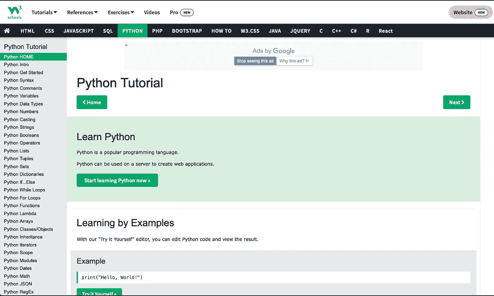
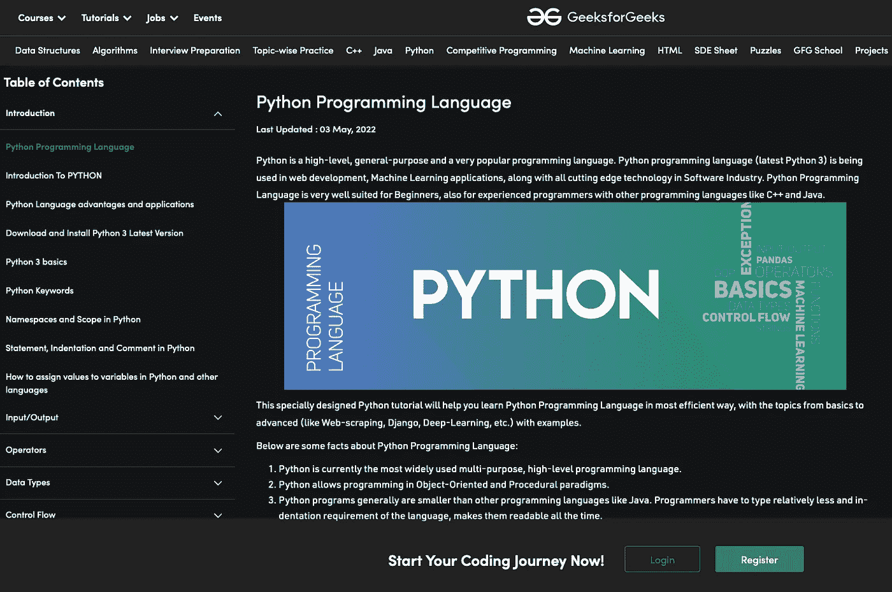
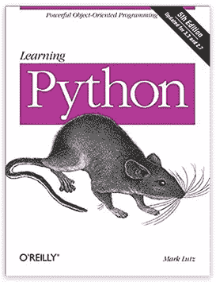

# 从 Python greenhorn 到 PRO 的 5 个资源🔥

> 原文：<https://blog.devgenius.io/5-resources-to-get-you-from-python-greenhorn-to-pro-29acbc33b247?source=collection_archive---------8----------------------->

## 这些资源将帮助您了解 Python🚀

欢迎阅读另一篇关于进入编码游戏的文章👨🏽‍💻我很高兴你找到了回到我的频道的方法。根据 Stackoverflow 的调查，Python 是 2021 年最受欢迎的编码语言。如果这种情况会随着时间的推移而改变，我会很兴奋。然而，学习 Python 可能是一个非常安全的赌注。因此，让我们来看看我为你准备了什么，让编码游戏在⚡️运行起来

戴维·克洛德在 [Unsplash](https://unsplash.com?utm_source=medium&utm_medium=referral) 上的照片

# YouTube ⚡️

我准备了两个频道，算是我的最爱。当然，外面还有很多。很多新的正在出现——太好了！知识在我看来应该是免费的。这就是为什么我喜欢 YouTube 和这个平台上的伟大教程。

## ⬇️自由代码营

第一个 YouTube 频道是 FreeCodeCamp。他们还有一个网站——这真的取决于你更喜欢哪种格式。两个人都很聪明🔥

## Python 工程师⬇️

与 FreeCodeCamp 不同，这个频道只提供 Python 内容。你可以找到关于 Python 的所有高质量的东西！老实说，我是你的超级粉丝。这个频道是我几年后想要达到的目标的榜样。这与追随者无关，但我的目标是让更多人了解我的内容，并帮助尽可能多的人进入编码领域🔥

# ⚡️网站

也有一些网站支持互动学习。特别是，作为一个初学者，您可能不熟悉所有不同的 ide，也不知道哪一个是您的最佳选择。无论如何，你想要开始——因此，一个你可以直接练习编码的网站可能是一个好的开始。

## w3 学校⬇️

这正是我刚才所说的。不仅可以练习 Python，还可以练习其他编码语言。如果你是一个正在进步的数据科学家，你可能也会喜欢关于 SQL 的部分(强烈推荐)。

链接:【https://www.w3schools.com 

w3 学校

## 极客⬇️

这是另一个非交互式的网站，但是提供了很多关于 Python 的东西。自从我开始学习 Python 以来，我在他们的网站上发现了很多技巧和窍门。真高兴我找到了那个平台。🙏

链接:[https://www.geeksforgeeks.org](https://www.geeksforgeeks.org)

# ⚡️图书公司

虽然我没有时间真正阅读，但我经常听说有些人仍然喜欢通过书本学习。对我来说，通过阅读来学习是很困难的，因为我一天的时间表都很紧。我要么通过听来消耗知识，要么通过做来学习。即使我不能完全理解一个主题，我也知道如何在现实生活中应用某些概念，这直接在我的大脑中建立了必要的联系🧠.

不过，我在网上找到了一本推荐的书。

## 学习 Python，第五版，作者马克·卢茨·⬇️

学习 Python，第五版，作者马克·卢茨。

无论你在网上看到什么关于学习 Python 的信息，什么是最好的方法——你真的需要自己找出哪种媒介最适合你。对我来说，最好的媒介是通过 YouTube 上的教程来学习。对你来说，它可能是一个互动网站或一本好书——去找吧🚀

今天到此为止——快乐编码和学习🔥

*感谢您阅读这篇文章！如果你想支持我，你可以这样做。请在 Medium 或 Twitter、Instagram、抖音或 YouTube 上关注我。
2。为文章
3 鼓掌。留个短评*

我真的很感谢每一种支持！随着时间的推移，您与内容的每一次互动都将帮助我成长并提供更好的内容。🚀

*谢谢，VEGXCODES*