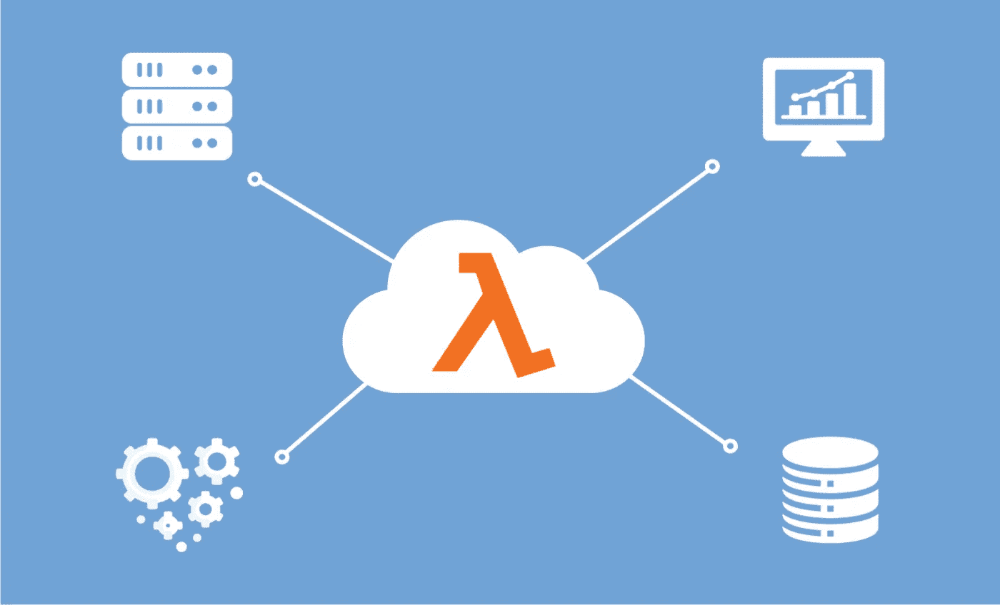
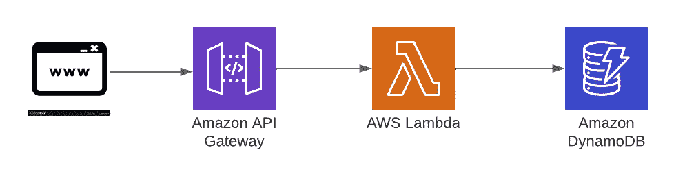
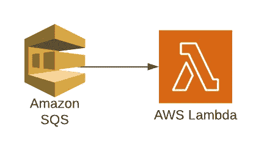
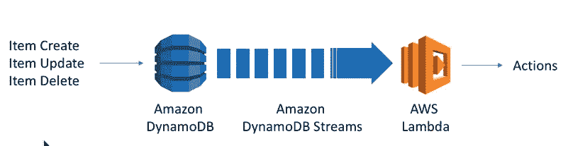
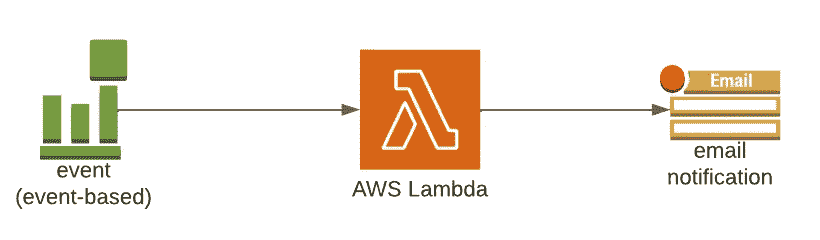
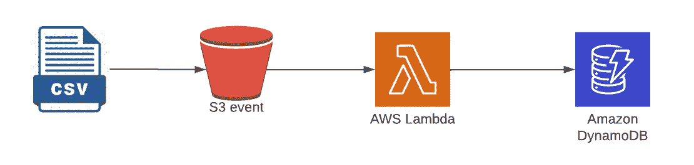

# AWS 上的 5 个无服务器用例

> 原文：<https://blog.devgenius.io/5-serverless-use-cases-on-aws-1cc077b9dc50?source=collection_archive---------9----------------------->

## 带模板的无服务器配方

无服务器编程的乐趣就在于编码和运行它。但是你的平台必须适应它。由于 AWS 是无服务器技术的创新者，AWS 平台非常适合无服务器。让我们看看在 AWS 平台上使用无服务器技术有什么可能。为了让您开始，我包含了我自己的有见解的模板，以便为特定用例启动您的无服务器项目。

# 1.无服务器网站

客户端单页面应用通过 [API 网关](https://aws.amazon.com/api-gateway)与[AWSλ](https://aws.amazon.com/lambda)REST API 通信。Lambda 可以处理应用程序逻辑，并将数据持久化到一个完全托管的数据库服务中(关系数据库用 RDS，非关系数据库用 DynamoDB)。

*AWS 云组件:Lambda，API 网关*

> 模板:[https://github . com/cyberwork z/server less-templates/tree/main/AWS-nodejs-typescript-restapi-nest](https://github.com/cyberworkz/serverless-templates/tree/main/aws-nodejs-typescript-restapi-nest)

另见我之前关于建立你的第一个无服务器项目的帖子。

# 2.异步消息传递

AWS SQS 的异步消息传递帮助您分离应用程序部分，增加您的架构的容错能力。

*AWS 云组件:Lambda，* [*AWS SQS*](https://aws.amazon.com/sqs)

> 模板:[https://github . com/cyber work z/server less-templates/tree/main/AWS-nodejs-typescript-SQS](https://github.com/cyberworkz/serverless-templates/tree/main/aws-nodejs-typescript-sqs)

# **3。更新外部服务**

通过在 DynamoDB 中持久化数据，您可能还想更新您的架构中使用的外部服务。有了 Amazon DynamoDB 流和 AWS Lambda 触发器，您就可以做到这一点。

*AWS 云组件:Lambda、*[*Amazon DynamoDB Streams*](https://docs.aws.amazon.com/amazondynamodb/latest/developerguide/Streams.html)

> 模板:[https://github . com/cyber work z/server less-templates/tree/main/AWS-nodejs-typescript-dynamo db-streams](https://github.com/cyberworkz/serverless-templates/tree/main/aws-nodejs-typescript-dynamodb-streams)

例子见这个[故事](/how-to-use-dynamodb-streams-to-feed-algolia-search-2f1de8eba64d)。

# 4.日志警报

对 Cloudwatch 日志事件采取行动，向您的运营团队发出有关您系统的特定错误或警告的警报。

*AWS 云组件:Lambda，*[*Cloud watch Log*](https://docs.aws.amazon.com/lambda/latest/dg/services-cloudwatchlogs.html)

> 模板:[https://github . com/cyber work z/server less-templates/tree/main/AWS-nodejs-typescript-cloud watch-log](https://github.com/cyberworkz/serverless-templates/tree/main/aws-nodejs-typescript-cloudwatch-log)

有关示例，请参见本[故事](https://betterprogramming.pub/how-to-let-slack-notify-you-on-cloudwatch-errors-with-aws-lambda-c98f1193ce59)。

# 5.CSV 从 S3 导入数据库

将上传到 S3 的 CSV 文件(或任何其他格式)中的数据导入您的数据库或 DynamoDB。

*AWS 云组件:Lambda，* [*S3 触发器*](https://docs.aws.amazon.com/lambda/latest/dg/with-s3.html)

> 模板:[https://github . com/cyber work z/server less-templates/tree/main/AWS-nodejs-typescript-S3](https://github.com/cyberworkz/serverless-templates/tree/main/aws-nodejs-typescript-s3)

例如，请看这个[故事](/s3-trigger-serverless-csv-upload-into-dynamodb-8877c770fb32)

希望这能启发你开始使用无服务器。祝编码愉快！

# 海科·范德沙夫

*   ***如果你喜欢这个，请*** [***跟随 Serverlesscorner.com 上媒***](https://serverlesscorner.com/about) ***。***
*   ***爱情*** ❤️ ***阅读*** ***我的故事和其他关于媒？*** [***如果你还没有成为会员***](https://serverlesscorner.com/membership) ***。***
*   ***想阅读更多无服务器？报名我的*** [***月报***](https://serverlessconsulting.org/newsletter) ***📬关于无服务器技术和使用案例的启发性和深刻的故事。***