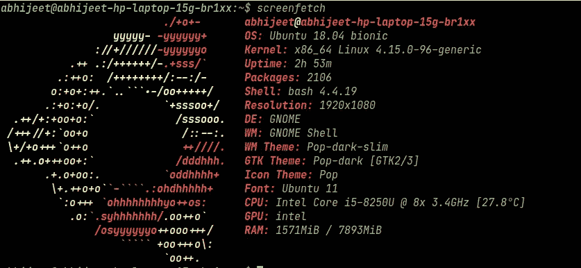
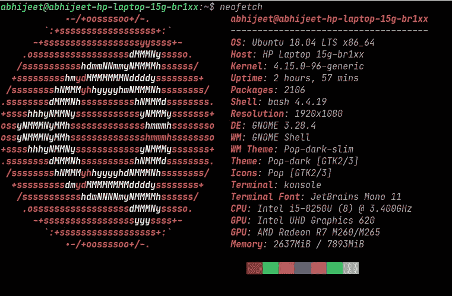
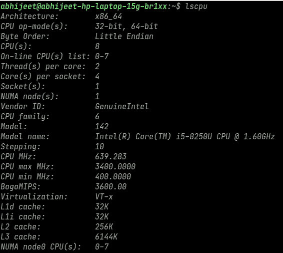
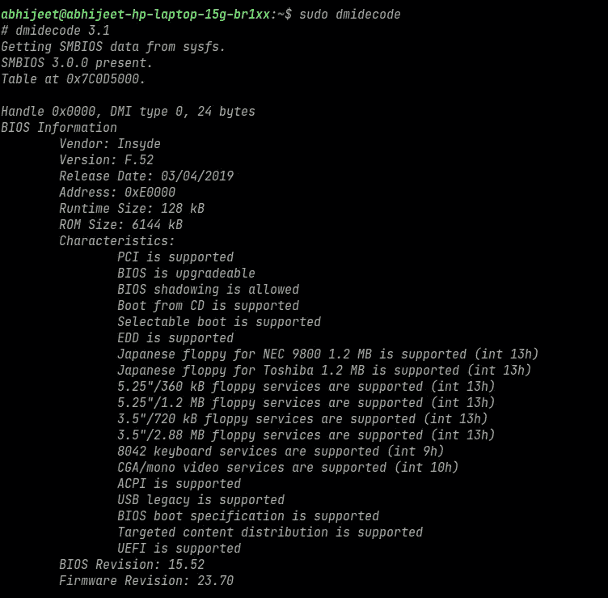
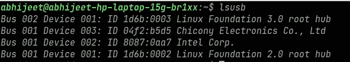

# 列出系统配置的 5 个 Shell 命令

> 原文：<https://blog.devgenius.io/5-shell-commands-to-list-down-systems-configuration-cd4438b00c58?source=collection_archive---------5----------------------->

## 在当今世界，可能有很多情况会询问您系统的配置。不管你是想玩市场上那款全新的育碧或者 Rockstar 游戏，还是想和硬件打交道。首先，你需要准备好系统(计算机)配置的细节。

有两种方法可以找到您的台式机或笔记本电脑的配置。在 GUI 中四处搜索，在各种随机窗口中按下一些按钮，对系统组件有一个抽象的概念。或者快速打开命令行(终端)，发出一个命令，发出的命令会以光速列出完整的规格。让我们开始逐一查看这些命令。

1.  screenfetch 是一个 bash 命令行工具，它可以生成一个非常漂亮的系统配置截图，并打印运行时间、操作系统名称和版本、桌面环境、主题等信息。

2. **neofetch** 与 screenfetch 十分相似，除了它提供了关于主机、终端和终端字体的信息。根据一些消息来源，screenfetch 是混乱的，缓慢的，硬编码的。引用和测试语法不一致。而 neofetch 干净快速。

3. **lscpu** 如果你想了解你电脑的 cpu(处理器)。 ***lscpu*** 就是答案。 **lscpu** 从 sysfs 和/proc/cpuinfo 中收集 cpu 架构信息。

4.***sudo DMI decode***该命令需要超级用户访问权限，但会列出 DMI 表中的内容。 *dmidecode* 命令用于用户检索系统硬件相关信息，如处理器、RAM(DIMM)、BIOS 详情、内存、序列号等

5. ***lsusb*** 这是一个实用程序，用于显示系统中 usb 总线以及与之相连的设备的信息

***奖金***

***acpi*** 命令用于列出电池百分比和电池充放电率