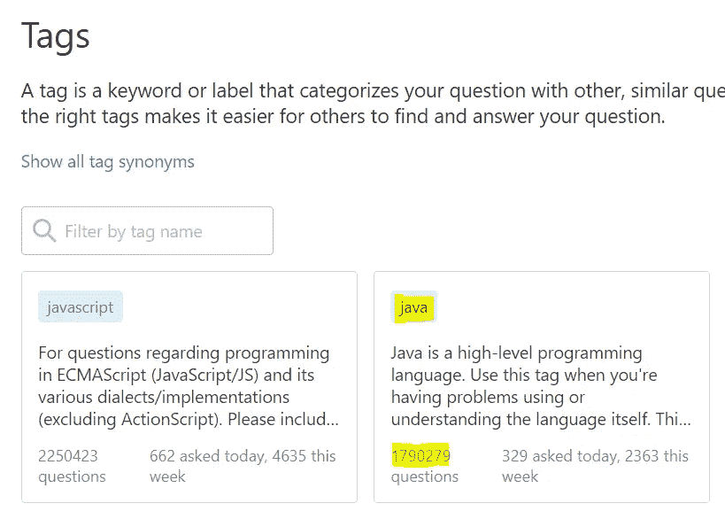
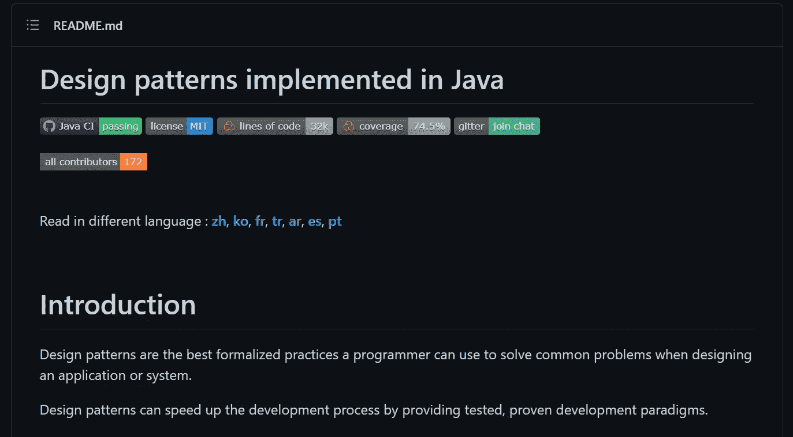
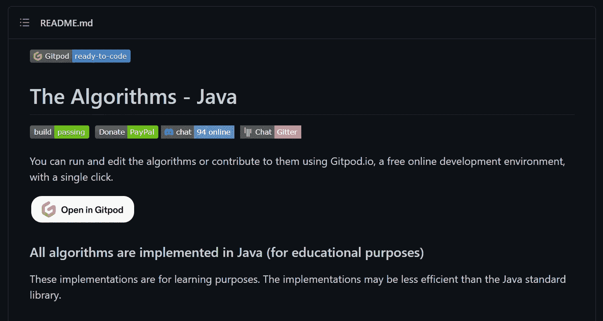
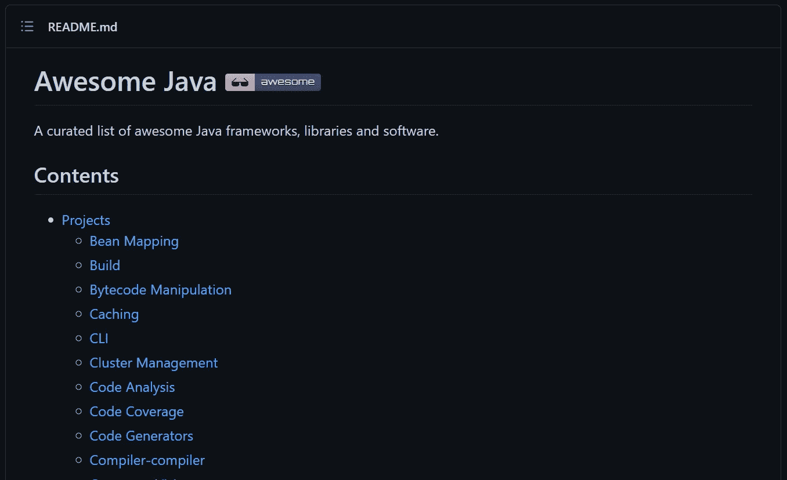
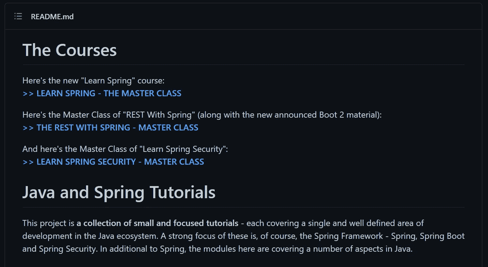
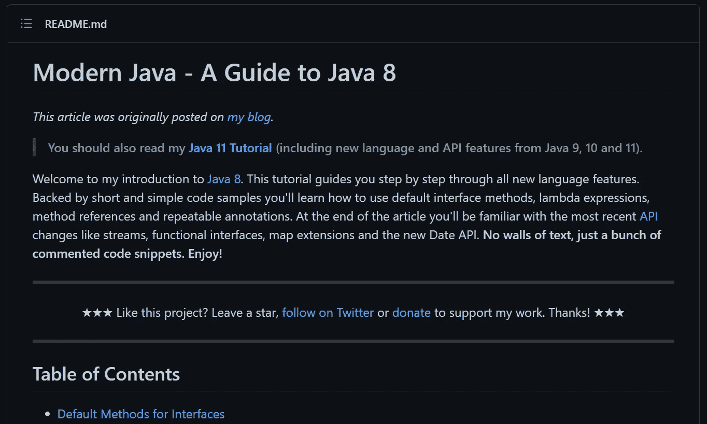

# 每个 Java 开发人员都必须知道的 5 个极好的 GitHub Repos

> 原文：<https://blog.devgenius.io/5-superb-github-repos-that-every-java-developer-must-know-about-29402a5072f1?source=collection_archive---------3----------------------->

## 关于高性能、广泛使用、企业首选的编程语言的一切。

图片来自[的希拉里·克拉克](https://pixabay.com/?utm_source=link-attribution&utm_medium=referral&utm_campaign=image&utm_content=1202021)

在过去的十年中，随着大量编程语言的产生和在开发项目中的使用，已经有了巨大的增长。然而，每种语言都有自己的优缺点。对于开发企业应用程序，Java 仍然是开发人员和程序员最喜欢的编程语言。

Java 的武器库中有一些强大的武器，包括*高性能*、*强内存管理*、*高安全性*。它还拥有世界上最成熟的开发者社区之一。事实上，截至今天， [*Java 是 StackOverflow 上仅次于 JavaScript 的第二大流行标签*](https://stackoverflow.com/tags) 。

StackOverflow 上的[标签展示了一个主题的流行程度，Java 是仅次于 JavaScript 的第二大流行标签](https://stackoverflow.com/tags)

就我个人而言，我已经用 Java 编程超过 6 年了，据我所知，更大的组织更喜欢他们的 web 应用程序的性能和安全性，这是 Java 被认可的。它用于为各种平台创建软件。它是一种静态类型的编程语言，这使得它比 Python 或 JavaScript 等其他语言运行得更快。这种语言写起来简单明了。Java 最大的优点是它是独立于机器的。

考虑到这一点，我创建了一个 GitHub 库的列表，我发现这个列表非常有用，对于任何想要学习这门语言的开发人员，无论是经验丰富的还是新手，都会有很大的帮助。

# Java 设计模式

*回购环节:***[***https://github.com/iluwatar/java-design-patterns***](https://github.com/iluwatar/java-design-patterns)
*明星:****69.3k*** *分叉:* ***21.6k*****

**这个报告包含了由具有丰富专业知识的开源程序员和架构师创建的 Java 设计模式的解决方案。这些模式可以通过阅读它们的高级描述或者检查它们的源代码来查看。源代码示例有很好的文档记录，可以看作是实现某种模式的编程经验。这个 repo 包含了最广泛使用和久经考验的开源 Java 技术。**

# **算法— Java**

****

***回购环节:*** **明星:****39.8k*** *分叉:* ***13.1k********

*****顾名思义，这个存储库包含用 Java 编写的算法。它还包括 Gitpod.io，这是一个免费的在线开发环境，允许您在几秒钟内修改和执行代码。学习算法是每个软件开发人员工作的重要方面，Java 开发人员也不例外。*****

# *****牛逼的 Java*****

**********

******回购环节:***[***https://github.com/akullpp/awesome-java***](https://github.com/akullpp/awesome-java)
*明星:****29.4k*** *分叉:* ***6.4k**********

*****这个存储库包含精选的优秀 Java 框架、库和应用程序。由于我经常在我的企业项目中使用 Java，这是我收藏的第一批资源之一。这个回购对于有抱负的 Java 开发人员来说是一座金矿。*****

# *****贝尔东教程*****

**********

******回购环节:***[***https://github.com/eugenp/tutorials***](https://github.com/eugenp/tutorials)
*明星:****26.9k*** *叉子:* ***43.3k**********

*****尤金的博客 Baeldung 是世界上访问量最大的博客之一，据 alexa.com*统计，迄今为止，他已经发表了超过 [*1200 篇博客。这个 GitHub 库包含了大量关于 Java 和 Spring 编程主题的简短和有针对性的教程。它还包含指向指导性文章的链接，在该文章中对代码进行了更详细的描述。*](https://www.alexa.com/siteinfo/baeldung.com)******

# *****现代 Java——Java 8 指南*****

**********

******回购环节:*** **明星:****14.9k*** *分叉:* ***3.6k***********

******Java 8 的发布改变了该语言及其开发者社区的游戏规则。其中，它将面向对象的 Java 语言引入了函数式编程的世界。 [*这些特性显著提升了性能，简化了开发流程，让 Java 变得更加高效*](https://medium.com/swlh/comprehensive-notes-for-java-8-features-every-developer-must-have-c08efc8ba39) 。******

******这个存储库以清晰易懂的方式提供了许多简短而有用的函数式编程原则的代码片段。如果您是 Java 函数式编程的新手，这个库将会非常有用。******

******多年来，GitHub 一直被认为是最值得学习的网站之一。我希望您发现这些 Java 存储库很有用，并加以利用。我相信你也可能遇到过其他一些不可思议的仓库。******

******注意:当你阅读这篇文章时，星星和叉子的数目可能会改变。******

******如果你喜欢读这篇文章，你可能也会发现下面的文章值得你花时间去读。******

****** [## 每个软件开发人员都必须知道的设计模式

### 这些久经考验的解决方案提高了编程效率。

python .平原英语. io](https://python.plainenglish.io/design-patterns-that-every-software-developer-must-know-ac71f575e68)  [## 每个开发人员都必须知道的关于 Spring Boot 的特性

### 该框架通常被称为“类固醇上的弹簧”，的确如此。

blog.devgenius.io](/features-that-every-developer-must-know-about-spring-boot-c1c0d7f1c0a8) 

*如果你喜欢阅读有助于你更好地学习、生活和工作的故事，可以考虑* [*成为订阅者*](https://viveknaskar.medium.com/subscribe) *。成为会员后，你可以无限制地阅读 10000 篇故事、文章和作家。每月只要 5 美元。如果你用我的链接* *注册，我会赚一点佣金，帮助我写更多的文章。*******