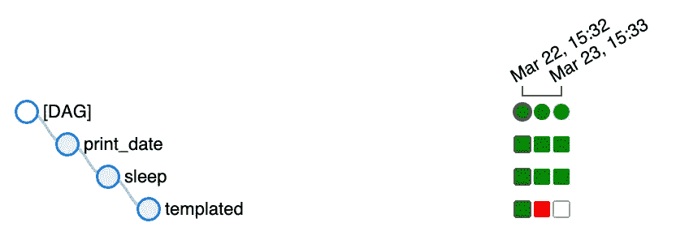
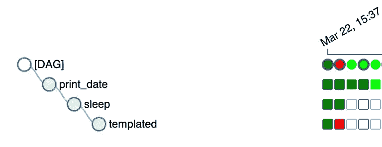

# 关于阿帕奇气流，我希望知道的 5 件事

> 原文：<https://blog.devgenius.io/5-things-i-wish-i-knew-about-apache-airflow-c03e09084cf4?source=collection_archive---------4----------------------->

在旅程开始时，气流可能很难理解。阅读这些提示来加速你的学习曲线。


## 任务回调

一个常见的请求是设置一个警报(无论是在空闲时间、团队等。)如果你的任务失败了。这可以使用`on_failure_callback`轻松完成。您只需要传递一个函数，这个函数稍后将使用`context`字典参数来调用。
以同样的方式，气流现在提供`on_success_callback`、`on_retry_callback,`和`sla_miss_callback`。如果您感兴趣，请查看官方文档，包括一个不错的示例。

**Pro 提示**:也可以使用`functools.partial`支持回调的附加参数:

## 触发规则

现在你可能会问*我可以运行一个单独的运营商作为回拨*？答案是*没有*，但是有办法做到。
一个用例示例是在一个步骤中建立一个集群，在第二个步骤中运行作业，最后拆除集群。这些步骤中的每一步都应该是单独的气流任务。但是您希望确保群集根据您的作业结果独立地被清除。默认情况下，Airflow 会等待所有上游任务成功，您可以使用`trigger_rule`来更改行为。

`all_success`是默认的触发规则。在上面的小例子中，我们将简单地使用`all_done`规则。

气流提供了更多的触发规则设置，去查看文档。

## 过去的依赖关系

除了任务相关性(用运算符`>> / <<`或`set_downstream / set_upstream`设置)，您还可以设置过去的相关性。这意味着一个任务实例将依赖于前一个任务实例的状态。气流提供了两种可能性:

`depends_on_past` —如果设置为`True`，则导致任务实例依赖于其前一个任务实例的成功。



依赖于过去的例子

在上面的例子中，我们为`templated`任务设置了`depends_on_past=True`。最后一个`templated`任务实例将不会被调度，因为前一个`templated`实例没有成功完成。

`wait_for_downstream` —如果设置为`True`，任务 X 的一个实例将等待任务 X 的前一个实例下游的任务*成功完成后再运行。*



等待下游示例

在这个例子中，我们为`sleep`任务设置了`wait_for_downstream=True`。我们可以观察到第三个`sleep`任务没有被调度，因为第二个`templated`任务失败了。

专业提示:如果你不确定为什么你的任务没有被安排好，去 Airflow UI 点击`Task Instance Details,`，在顶部你会看到`Dependencies Blocking Task From Getting Scheduled`。

## 模板和宏

Airflow 支持 Jinja 模板，这被证明对编写 Dag 非常有用。

大多数情况下，您可能会利用`{{ ds }}`，它是逻辑(以前的执行)日期的模板化变量。不要忘记，逻辑日期是你的时间表间隔的开始。其他一些有用的宏有:

`{{ dag }}` — dag 对象

`{{ task }}` —任务对象

`{{ var.value.my_var }}` —具有全局定义变量的字典

Airflow 引入了新的模板来实现更好的数据间隔处理，例如，如果您希望使用 SQL 查询来获取整个 dag 间隔的数据，这将非常有用:

数据间隔模板

对于更高级的用法，可以考虑使用宏。有了宏，你就可以使用一堆 python 库(`datetime`、`random`、`dateutil`等等)。)在你的模板里面。选中此示例，它将打印比逻辑日期早四天的年份:

```
{{ (execution_date — macros.timedelta(days=4)).strftime('%Y') }}
```

和往常一样，我建议查看关于模板的[文档。](https://airflow.apache.org/docs/apache-airflow/stable/templates-ref.html)

请注意，不是每个运算符的所有参数都可以使用模板。您只能对注册在`template_fields`操作符 *'* s 属性中的参数执行此操作。点击`Task Instance Details`->-`template_fields`，可以在操作员定义或气流界面中找到模板化的字段。

## 丰富的 CLI

Airflow 附带了一组非常丰富的 CLI 命令。从我的经验来看，令人惊讶的是只有少数用户知道它。以下是我的最爱:

`airflow config list/get-value` —查看当前气流配置

`airflow dags next-execution` —获取 dag 的下一次执行日期时间

`airflow dags show` —将 dag 的图形渲染为 PNG 或点文件

`airflow dags test` —使用调试器执行给定 dag 和执行日期的单个 dagrun

`airflow variable list/get` —查看当前气流变量

更多信息，请查看关于气流 CLI 的[文档。](https://airflow.apache.org/docs/apache-airflow/stable/cli-and-env-variables-ref.html)

感谢您阅读这个故事。别忘了订阅我的频道，获取来自数据工程和云的最新新闻和提示&技巧。