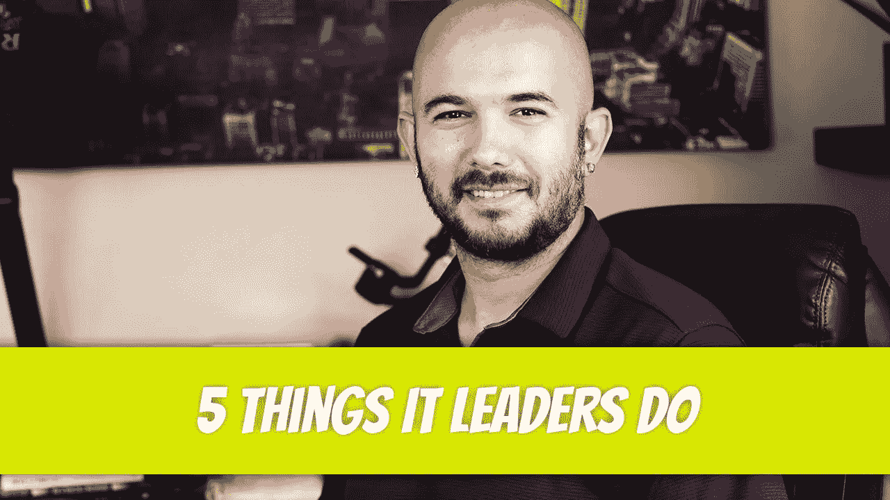

# IT 领导者做的 5 件事

> 原文：<https://blog.devgenius.io/5-things-it-leaders-do-c4cad55d86c7?source=collection_archive---------16----------------------->

IT 领导的日常工作总是不同的。没有哪两天是完全一样的，这就是为什么有时候会很有趣，有时候会很有压力。有几十个重复的日常任务，但是在本文中我们只讨论其中的 5 个。

## 购买请求

我最喜欢收到的电子邮件是购买请求。一切总是进展顺利。IT 部门得到了他们想要的东西，财务部门毫无疑问地批准了它，采购部门迅速创建了采购订单。我希望你能感受到讽刺。我每天至少有五次公关，这绝对是一种享受。

## 董事会会议

除了常规会议之外，如果你的公司由一家私人股本集团所有，你将参加相当多的董事会会议。这通常是您向董事会成员更新您的组织正在进行的各种 IT 项目的时间。这与在此期间发生的各种销售和财务演示结合在一起。在你参加董事会之前，你必须为董事会做准备。这意味着准备好您的幻灯片，并将其发送给首席执行官，以便他们可以审阅，并确保它们符合当前的讨论范围。一旦你到了那里，通常会有一个轻松的环境，你可以向董事会成员展示他们的投资花在了哪里。对一些人来说，董事会会议可能会很有压力，但我觉得很愉快。

## 网络安全

这是一件很严肃的事情，通常是日常讨论的话题。无论是与系统管理员、公司领导层、私募股权公司还是第三方审计人员，您的日常工作都会将网络安全视为一个话题。一些示例包括员工培训、模拟网络钓鱼攻击、执行渗透测试、了解如何优化基础架构以提高安全性，以及查找代码中的漏洞、过时的固件，甚至审查公司使用的所有第三方软件和硬件。必须密切关注第三方软件/硬件公司，尤其是在网络安全爆发时。希望补丁已经到位，或者至少很快实现。网络安全在任何组织中都是一件大事。如果你觉得不是，那是因为你还没被黑。

## 培养

每当你把新软件带进公司，就由你来培训个人如何使用它(大多数时候)。假设您正在跨不同的分支机构聚合数据，并且您希望通过 Tableau 或 Phocas 之类的软件整合并使用这些数据来执行商业智能。即使你不做分析，也要由你和你的团队来培训会做分析的员工。大多数时候，IT 团队会聚在一起，决定谁来领导这个项目。接下来就要靠个人来学习软件和培训他人了。我将帮助安排会议，做介绍，展示到目前为止已经实施的内容，然后让领导接手并与他们正在培训的个人讨论细节。这部分需要很大的耐心，因为大多数人不喜欢改变。他们的 excel 表格中已经有了他们的公式。他们为什么想要尝试不同的东西？这是您介入并消除任何紧张的地方，这样他们就可以将软件融入他们的日常生活。一段时间后，他们意识到这实际上比他们一直在做的要好。

## 容量规划

这一点经常被 IT 领导忽视。拥有高质量的项目经理是绝对必要的，因为他们可以决定你的能力规划工作的成败。一旦理解了能力，那么通常你就有责任向其他领导传达你正在同时进行的项目，并帮助他们进行优先级排序。每个人的项目当然是他们最优先考虑的，但是与他们交流并告诉他们在项目时间表中的位置通常会很好。我喜欢使用米罗板，让它更加丰富多彩，而不是仅仅展示甘特图，因为大多数人会忽略它们。每个项目都展示了里程碑，并展示了参与该项目的团队成员。通过这种方式，他们确切地知道资源何时可用于他们的项目。

迪诺·卡伊奇目前是 [LSBio(生命周期生物科学公司)](https://www.lsbio.com/)、[绝对抗体](https://absoluteantibody.com/)、 [Kerafast](https://www.kerafast.com/) 、[珠穆朗玛生物](https://everestbiotech.com/)、[北欧 MUbio](https://www.nordicmubio.com/) 和 [Exalpha](https://www.exalpha.com/) 的 IT 主管。他还担任我的自动系统的首席执行官。他有十多年的软件工程经验。他拥有计算机科学学士学位，辅修生物学。他的背景包括创建企业级电子商务应用程序、执行基于研究的软件开发，以及通过写作促进知识的传播。

你可以在 [LinkedIn](https://www.linkedin.com/in/dinocajic/) 上联系他，在 [Instagram](https://instagram.com/think.dino) 上关注他，或者[订阅他的媒体出版物](https://dinocajic.medium.com/subscribe)。

[*阅读迪诺·卡吉克(以及媒体上成千上万其他作家)的每一个故事。你的会员费直接支持迪诺·卡吉克和你阅读的其他作家。你也可以在媒体上看到所有的故事。*](https://dinocajic.medium.com/membership)