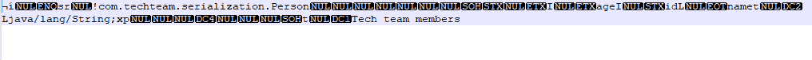
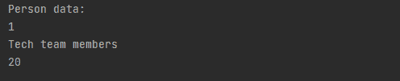
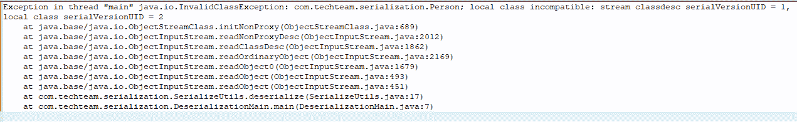
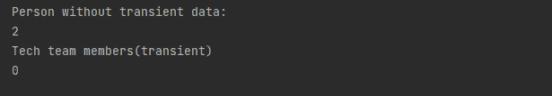
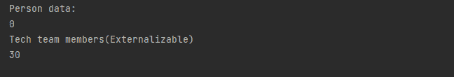

# 关于 Java 中的序列化和反序列化，你必须知道的 5 件事

> 原文：<https://blog.devgenius.io/5-things-you-must-know-about-serialization-and-deserialization-in-java-b7fbb580b472?source=collection_archive---------4----------------------->

## 软件工程之旅

## Java 序列化和反序列化软件工程师必须知道


来自 unsplash.com[的](https://unsplash.com/)图片

# 概观

Java 中的序列化有助于将现有对象转换成字节流。相反，反序列化使序列化字节流成为对象。通过使用 Java 中的序列化和反序列化，对象的信息可以从一个 JVM 传输到另一个 JVM。让我们转到文章的细节来理解序列化和反序列化是如何工作的。

# #1 序列化

在开始详述本文之前，我想提供一个 SerializeUtils.java 和 Person.java 类，它们将帮助我们处理本文中所有示例的序列化和反序列化。

【SerializeUtils.java 

```
package com.techteam.serialization;

import java.io.*;

public class SerializeUtils {
    public static <T> void serialize(T input, String fileName) throws IOException {
        FileOutputStream file = new FileOutputStream(fileName);
        ObjectOutputStream out = new ObjectOutputStream(file);
        out.writeObject(input);
        out.close();
        file.close();
    }

    public static <T> T deserialize(String fileName) throws IOException, ClassNotFoundException {
        FileInputStream file = new FileInputStream(fileName);
        ObjectInputStream in = new ObjectInputStream(file);
        T result = (T) in.readObject();

        return result;
    }

    public static void externalSeialize(Externalizable e, String fileName) throws IOException {
        FileOutputStream file = new FileOutputStream(fileName);
        ObjectOutputStream out = new ObjectOutputStream(file);
        e.writeExternal(out);
        out.close();
        file.close();
    }

    public static void externalDeseialize(Externalizable e, String fileName) throws IOException, ClassNotFoundException {
        FileInputStream file = new FileInputStream (fileName);
        ObjectInputStream in = new ObjectInputStream (file);
        e.readExternal(in);
        in.close();
        file.close();
    }
}
```

**Person.java**

```
package com.techteam.serialization;

import java.io.Serializable;

public class Person implements Serializable {
    private static final long serialVersionUID = 1L;

    private int id;
    private String name;
    private int age;

    public int getId() {
        return id;
    }

    public void setId(int id) {
        this.id = id;
    }

    public String getName() {
        return name;
    }

    public void setName(String name) {
        this.name = name;
    }

    public int getAge() {
        return age;
    }

    public void setAge(int age) {
        this.age = age;
    }
}
```

正如概述中提到的，更改对象的序列化变成了字节流。这意味着对象的所有信息都被转换成字节流，比如方法、属性和数据。让我们来看看如何序列化一个对象的例子:

```
package com.techteam.serialization;

import java.io.IOException;

public class SerializationMain {

    public static void main(String[] args) throws IOException {
        Person p = new Person();
        p.setId(1);
        p.setName("Tech team members");
        p.setAge(20);

        SerializeUtils.serialize(p, "/person.txt");
    }
}
```

在序列化过程之后，我们有一个内容如下的文件:



# #2 反序列化

在序列化部分，我们通过序列化一个对象创建了一个字节流。根据流数据给出的信息，让我们看看如何通过下面的例子返回到带有反序列化的对象:

```
package com.techteam.serialization;

import java.io.IOException;

public class DeserializationMain {
    public static void main(String[] args) throws IOException, ClassNotFoundException {
        Person p = SerializeUtils.deserialize("/person.txt");

        System.out.println("Person data:");
        System.out.println(p.getId());
        System.out.println(p.getName());
        System.out.println(p.getAge());
    }
}
```

以下是反序列化过程后的数据:



# #3 系列版本 UID

serialVersionUID 表示序列化和反序列化过程的每个版本的唯一标识号。这个数字用于确保序列化和反序列化的对象都使用兼容的类。对于 person.txt，我想将 serialVersionUID 增加到 2，现在让我们看看反序列化 person.txt 文件时的输出。



# #4 瞬态关键字

对于序列化和反序列化过程，有时我们不需要序列化一个对象的所有信息。通过对变量使用 transient，它将忽略可序列化对象之外的那些变量。下面的例子将帮助你更清楚地了解它:

```
package com.techteam.serialization;

import java.io.IOException;
import java.io.Serializable;

public class PersonWithTransient implements Serializable {

    private static final long serialVersionUID = 1L;

    private int id;
    private String name;
    private transient int age;

    public int getId() {
        return id;
    }

    public void setId(int id) {
        this.id = id;
    }

    public String getName() {
        return name;
    }

    public void setName(String name) {
        this.name = name;
    }

    public int getAge() {
        return age;
    }

    public void setAge(int age) {
        this.age = age;
    }

    public static void main(String[] args) throws IOException, ClassNotFoundException {
        PersonWithTransient p = new PersonWithTransient();
        p.setId(2);
        p.setName("Tech team members(transient)");
        p.setAge(50);

        SerializeUtils.serialize(p, "/person_transient.txt");

        PersonWithTransient deserializeP = SerializeUtils.deserialize("/person_transient.txt");
        System.out.println("Person without transient data:");
        System.out.println(deserializeP.getId());
        System.out.println(deserializeP.getName());
        System.out.println(deserializeP.getAge());
    }
}
```

在上面的代码中，我们为 age 变量使用了 transient 键，现在让我们看看序列化和反序列化过程后的输出。



# #5 外部化接口

在 Java 中，当我们想要定制一个序列化和反序列化过程时，我们可以使用 transient 来忽略那些我们不希望在序列化和反序列化过程中使用的变量。另一种使它更容易并获得更高性能的方法是使用可外部化接口，而不是直接使用可序列化接口。为了证明这一点，让我们看看下面的例子:

```
package com.techteam.serialization;

import java.io.Externalizable;
import java.io.IOException;
import java.io.ObjectInput;
import java.io.ObjectOutput;

public class PersonExternalizable implements Externalizable {
    private static final long serialVersionUID = 1L;
    private int id;
    private String name;
    private int age;

    public int getId() {
        return id;
    }

    public void setId(int id) {
        this.id = id;
    }

    public String getName() {
        return name;
    }

    public void setName(String name) {
        this.name = name;
    }

    public int getAge() {
        return age;
    }

    public void setAge(int age) {
        this.age = age;
    }

    @Override
    public void writeExternal(ObjectOutput out) throws IOException {
        out.writeUTF(this.name);
        out.writeInt(this.age);
    }

    @Override
    public void readExternal(ObjectInput in) throws IOException, ClassNotFoundException {
        this.name = in.readUTF();
        this.age = in.readInt();
    }

    public static void main(String[] args) throws IOException, ClassNotFoundException {
        PersonExternalizable p = new PersonExternalizable();
        p.setId(3);
        p.setName("Tech team members(Externalizable)");
        p.setAge(30);

        SerializeUtils.externalSeialize(p, "/person_externalizable.txt");

        PersonExternalizable deserializeP = new PersonExternalizable();
        SerializeUtils.externalDeseialize(deserializeP, "/person_externalizable.txt");
        System.out.println("Person data:");
        System.out.println(deserializeP.getId());
        System.out.println(deserializeP.getName());
        System.out.println(deserializeP.getAge());
    }
}
```

正如你所看到的，使用 Externalizable，我们可以很容易地编写自定义逻辑，忽略变量，并获得比直接使用 Serializable 更高的性能。现在，让我们用上面的代码来看看我们的流程的输出:



# 结论

通过这篇文章，我想你可以了解序列化和反序列化在 Java 中是如何工作的。有了上面的那些例子，它也可能对你的实践经验有所帮助。这就是我想与您分享的关于序列化和反序列化的全部内容。希望内容对你有帮助。谢谢大家！