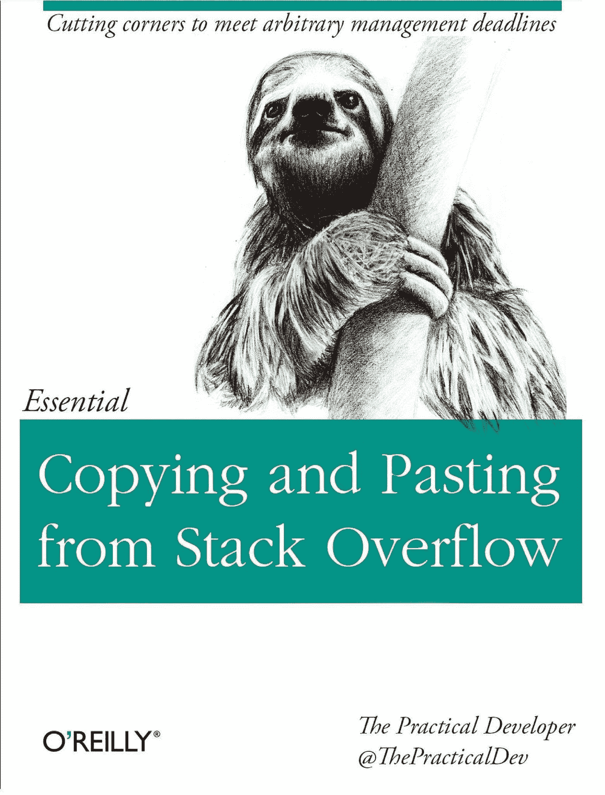

# 作为 Python 初学者，你需要学习的 5 件事

> 原文：<https://blog.devgenius.io/5-things-you-need-to-learn-as-a-python-beginner-e08a291501eb?source=collection_archive---------10----------------------->

你好世界！

今天，我们将看看作为 Python 初学者需要学习的 5 件事，以便快速提高。当学习一项新技能时，第一步可能是最困难的，这同样适用于学习一门新的编程语言。

Python 是作为你的第一个编码语言学习的完美语言，但是有一些东西可以帮助你快速理解它。

这将与我通常的帖子略有不同，因为不会涉及任何代码。我希望你会觉得有趣。

我要把这篇文章分成几个段落，所以你可以随意跳过。

# 1.选择/学习您的 IDE

这似乎是显而易见的，但是很多时候我看到有人在代码中挣扎是因为不知道如何正确使用 IDE。

## 选择 IDE

对于初学者来说，选择要使用的 IDE 可能是一项相当复杂的任务。外面有很多可能性。我的建议是，作为一个初学者，要避免不断地改变你的 IDE。试着理解每个开发环境做什么，并选择一个最适合你的。在我早期使用 Python 的时候，我已经修改了 4 次，浪费了我本可以用来学习其他东西的宝贵时间。

如果你是一个绝对的初学者，你不知道从哪里开始，我的建议是 VSCode(这是免费的):

 [## Visual Studio 代码-代码编辑。重新定义的

### Visual Studio Code 是一个重新定义和优化的代码编辑器，用于构建和调试现代 web 和云…

code.visualstudio.com](https://code.visualstudio.com) 

VSCode 是一个非常通用的代码编辑器，可以管理无限量的语言和文本格式。在过去的 6 年里，我一直把它作为我的主要代码编辑器，我不愿意改变它。请注意，虽然 VSCode 功能丰富，但对于全栈 Python 开发人员来说，其他工具可能更好(请看 ad Jetbrains PyCharm)。

如果你想学习如何在 VSCode 中开始用 Python 编程，看看我的教程(你只需要 5 分钟):

 [## 如何开始用 Python 编码

### 如何正确安装 Python 和 VSCode 并设置运行您的代码！

python .平原英语. io](https://python.plainenglish.io/how-to-start-coding-in-python-5a56cf8b8e26) 

## 学习 IDE

在你选择了你的 IDE 之后，花点时间学习如何正确地使用和设置它。在网上看看如何为你的编码会议做准备。查看使用您将要学习的 IDE 的其他人制作的教程也很有用。

# 2.从一个基础项目开始

学习一门新的编程语言的最大障碍之一是记住你需要学习的大量基本概念。我的建议是学习这门语言的基础，一旦你知道如何移动，就开始做一个简单的项目。

做一个有趣的项目是学习基础知识的一种更快的方式，不会让你精疲力竭。你可以在网上找到很多想法，只要找到一个你感兴趣的，然后开始编码。

当从事个人项目时，有一个风险是初学者必须不惜一切代价避免的，这就把我们带到了下一点。

# 3.不要只是复制和粘贴

我们都知道互联网上到处都是已经为你做了这项工作的了不起的人，但是如果你要复制和粘贴一些代码，你必须首先理解它。作为初学者，这是你必须克服的最大障碍之一。

复制一段代码片段可能是有用的，但是如果你不理解这段代码是如何工作的，你就无法学习如何使用它。所以每次你从 Stackoverflow 上的同事那里复制东西的时候，在你把它粘贴到你的项目之前，试着研究一下这个片段。

# 4.从他人的项目中学习

如果你在学校或工作环境中学习 Python，询问你的同事对你的代码有什么看法是非常重要的。从一个更有经验的程序员那里获得技巧是快速提高你的编码技能的一个不可思议的方法。

你也可以要求他们与你分享他们来自其他项目的代码(或者如果你是一个自学的程序员，只需看看 Github)。从他人的项目中学习不仅可以提高您对语言的理解，还可以改变您编写和管理代码的方式。

# 5.不要陷入循环

当你开始学习某样东西的时候，另一个大的障碍是擅长某项特定的技能，而从不尝试学习其他的技能。例如，当你完成了一个网页抓取项目，不要开始一个新的！试着做些别的事情，它仍然可以和你所学的一些东西相关，但是如果你继续重复同样的事情，你将永远不会在其他方面有所提高。

走出“安全区”，学习新的东西，真的很重要。

如果您愿意支持我，请考虑使用我的推荐订阅 Medium:

 [## 通过我的推荐链接加入媒体-翁贝托格兰多

### 作为一个媒体会员，你的会员费的一部分会给你阅读的作家，你可以完全接触到每一个故事…

medium.com](https://medium.com/@inzaniak/membership) 

# 其他 URL:

个人网址:[https://inzaniak . github . io](https://inzaniak.github.io/)
社交链接:[https://inzaniak.github.io/links.html](https://inzaniak.github.io/links.html)Linkedin:[https://www.linkedin.com/in/umberto-grando-a8527b150/](https://www.linkedin.com/in/umberto-grando-a8527b150/)