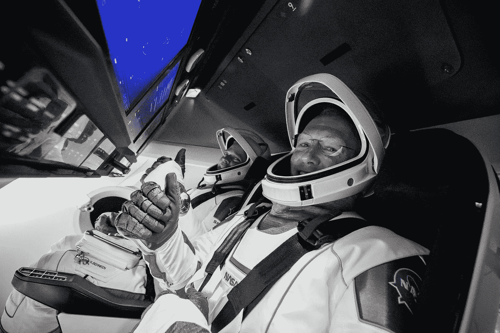
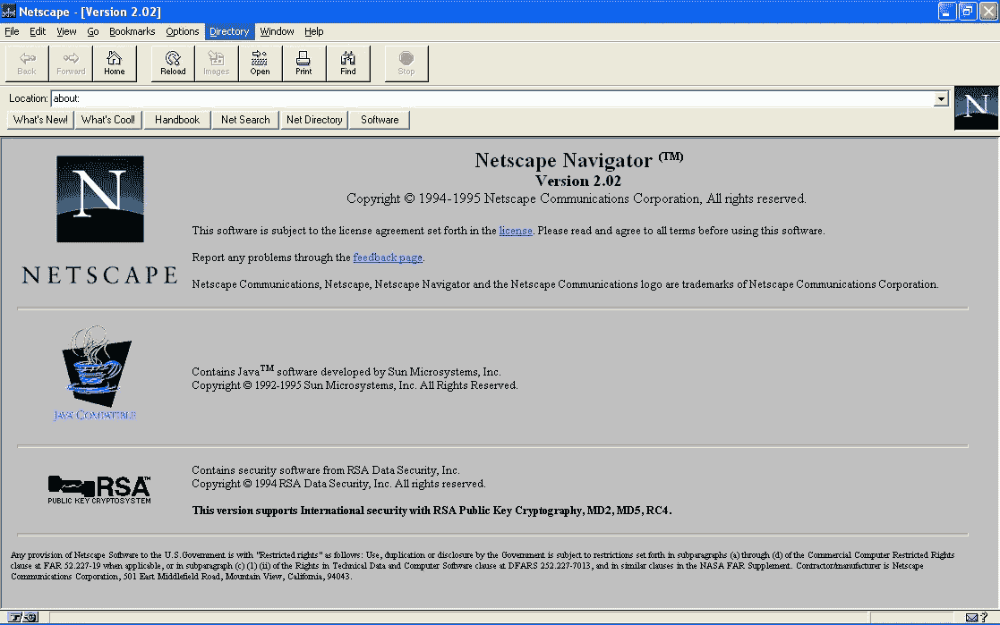
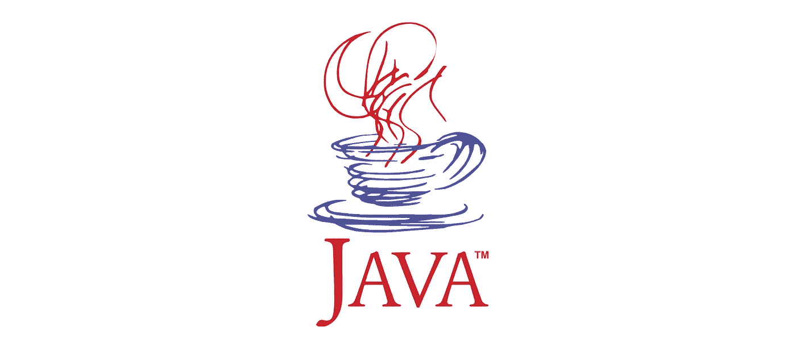

# 关于 JavaScript 你可能不知道的 5 件事

> 原文：<https://blog.devgenius.io/5-things-you-probably-didnt-know-about-javascript-5383a41f6f55?source=collection_archive---------29----------------------->

SpaceX 的船员龙，图片:SpaceX

在无数个小时记忆特殊语法之后，你终于发现自己是选择节点和修改 DOM 的高手，但是你对 JavaScript 了解多少呢？

这里有五件关于 JavaScript 你可能不知道的事情。

# 网景诞生

网景浏览器，图片:维基百科

在成为今天无处不在的编程语言之前，Javascript 可以追溯到现已倒闭的 Netscape 公司。正是在网景公司，Brendan Eich 负责编写 JavaScript，为网络浏览器创造更加动态的体验。艾希只用了 [10 天](http://speakingjs.com/es5/ch04.html)就完成了 JavaScript 的原型。

# 一个脚本没有名字

原 Java logo，图片:Oracle

JavaScript 以代号 Mocha 开始了它的生命，这个名字是由网景公司的联合创始人 Marc Andreesen 创造的。它最终被市场营销部门改成了 LiveScript，最后被重新命名为 JavaScript，以利用 Java 编程语言的流行。“JavaScript”这个名称本身是开发 Java 的甲骨文公司的商标。

# 火狐系列

原火狐 logo，图片:Mozilla

JavaScript 之父布伦丹·艾希(Brendan Eich)后来共同创立了 Mozilla 基金会，这是开发 Firefox 浏览器的母公司。艾希将在该组织担任各种角色，包括 Mozilla 公司的首席执行官，后来因反对同性婚姻引发争议而辞职。

# Microsoft 改造

原始 Internet Explorer 徽标，图像:微软

微软 1995 年推出的 ie 浏览器最终导致了与网景公司的浏览器大战。它对网景 JavaScript 的回答是他们的“完全非逆向工程”语言 JScript。

# **到无限远处**

图片:皮克斯

尽管 JavaScript 主要用于为互联网创造动态体验，但它也被重新用于载人航天飞行操作。JavaScript 是用于为 SpaceX 的龙 2 载人飞船变体 Crew Dragon 编写飞行界面的语言之一。