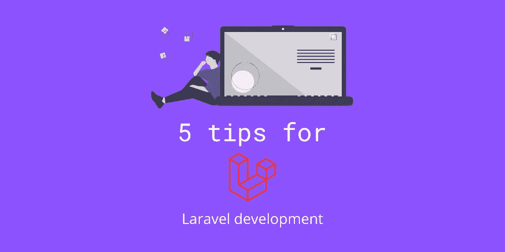

# Laravel 开发的 5 个技巧

> 原文：<https://blog.devgenius.io/5-tips-for-laravel-development-e3cdde9bc235?source=collection_archive---------12----------------------->



标志设计者——[沃特·范·马鲁姆](https://twitter.com/wottavm)

[Laravel](https://laravel.com) 是一个快速发展的 PHP 框架，以其简单著称。它的目标是让开发变得更加愉快。我想让你多学一些技巧和窍门，也许有一天能帮到你。

在这篇文章中，我将向你展示五个你可能不知道在 Laravel 中可以做到的技巧。

# #1 定义关系上的列

想象一下，调用一个关系，但是只需要几个字段。通常情况下，人们不会太在意口才的作用，但是确保我们只得到我们需要的列是很有帮助的。

```
User::*with*('package:id,name,created_at')
    ->find($userId);
```

上面的代码做了以下事情:

1.  它急切地加载包关系。
2.  因为关系字符串包含“:”，所以它将创建一个包含以下列约束的选择。([引用](https://github.com/laravel/framework/blob/7.x/src/Illuminate/Database/Eloquent/Builder.php#L1124-L1151) )
    a. id(如果要引用正确的型号我们需要这个)
    b .名称
    c. created_at

# #2 插入带有关系的模型。

插入模型是你在很短的时间内可能要做几百次或者几千次的事情。我还发现，当一个模型有多个必需的关系时，人们更经常保存同一个模型 2 或 3 次。

这可以用一种非常聪明的方式来完成。

```
$action = Auth::user()->actions()->make($request->except('category_id')); 
$action->category()->associate($request->input('category_id'));
$action->save();
```

下面的事情正在这里发生。

1.  我们根据用户模型上的 HasMany 关系“制定”一个动作。([参考](https://laravel.com/api/7.x/Illuminate/Database/Eloquent/Relations/HasMany.html#method_make))
2.  我们把类别和已经发生的行为联系起来。
3.  我们保存我们的动作和它所需要的关系。

这解决了什么问题？嗯，您不需要在数据库中将“必需的”关系设置为可空，因为它将一次性保存完整的查询。

# #3 使用本地化资源路线。

如果您想创建一个 web 应用程序，使用您的语言作为资源路由，而不是默认的英语，您可以通过一些“小”调整很容易地做到这一点。

首先，您需要告诉 Laravel 默认的路由动词是不同的。

```
Route::*resourceVerbs*([
    'create' => 'nieuw',
    'edit' => 'bewerk',
]);
```

你现在唯一需要做的事情就是用你的语言获取你的资源路径。

```
Route::resource('gebruikers', 'UserController', ['names' => 'users'])
    ->parameters(['gebruikers' => 'user']);
```

['names' => 'users']将改变您在`route`功能中使用的路线名称。
和` parameters([' gebruikers ' =>' user '])`将模型绑定参数改回您在应用程序中最可能使用的英文单词。

# #4 使用路由:列表命令

我认识的许多开发人员都知道 route:list 命令的作用，但是他们没有充分利用它的潜力。

当你有一个大的代码库时，我建议你开始养成习惯，指定你要搜索的内容，并限制屏幕上显示的信息。这可以通过下面的命令来完成。

```
php artisan route:list --name users. --columns name,uri,action
```

这将产生以下输出。
[https://web . tinker well . app/#/snippets/00068866-7263-401 c-9123-ff 2 E3 BC 1913 e](https://web.tinkerwell.app/#/snippets/00068866-7263-401c-9123-ff2e3bc1913e)

# #5 运行功能测试时禁用 Mix。

您很有可能在应用程序中使用 Laravel 的 Mix。更多信息参见[参考](https://laravel.com/docs/7.x/mix#running-mix)。

这个特性很棒，但是在运行特性测试时可能是一个挑战。但是幸运的是，有一种快速简单的方法可以在测试中禁用 Mix。

这可以通过将以下内容添加到 TestCase.php 文件中的设置函数来实现。

```
*// Spy mix, we don't need css/js during testing* $this->spy(Mix::**class**);
```

# 谢谢你。

有了这五个小技巧，我希望你学到了一些你以前不知道自己能做到的新东西。如果你有一些建议想与他人分享，请务必发表评论。

如果您有任何反馈、问题或希望我写另一个与 Laravel 相关的主题，请随时发表评论。