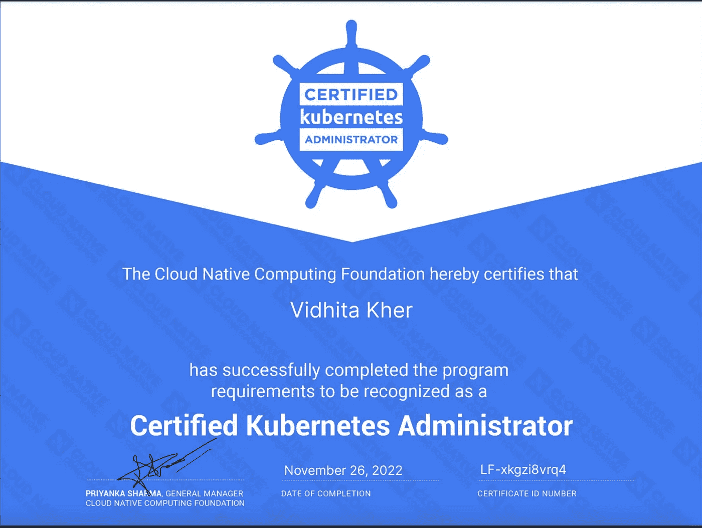
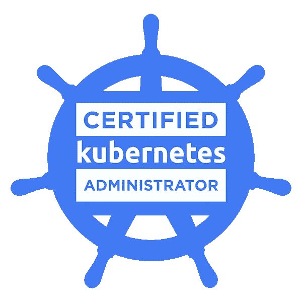

# 通过 Kubernetes 认证管理员(CKA)考试的 5 个技巧

> 原文：<https://blog.devgenius.io/5-tips-to-clear-certified-kubernetes-administrator-cka-exam-2577b876aa33?source=collection_archive---------5----------------------->

> 我在 CKA 考试结束前一周通过考试的故事



我在 CNCF 的 CKA 证书

首先向我所有可爱的读者问好，我已经很久没有在 Medium 上写博客了。我想分享很多，但我正忙着搬到一个新的城市定居，并为我最近通过的最新认证学习，即[**【CKA】**](https://www.cncf.io/certification/cka/)。在这个博客中，我将分享我的五大技巧来通过[这个](https://trainingportal.linuxfoundation.org/learn/course/certified-kubernetes-administrator-cka/exam/exam)考试。我也有一个关于这个的 Youtube 视频，下面是链接。请务必观看并评论您的任何问题。

## [清除 CKA 的 5 个视频提示——vid hita Kher](https://www.youtube.com/watch?v=cB7vN57GO24)

## **我给 CKA 考试的动机**

我从 2018 年 12 月开始参加 kubernetes journey，我在 k8s 的第一个认证是 2021 年 6 月的 CKAD。关于如何清除[**CKAD**](https://medium.com/@vidhitakher/how-i-got-ckad-certified-my-preparation-journey-cf54c01b841a)**我有详细的博客，一定要看。在清除 CKAD 之后，我热情地投入到理解 k8s 架构和 k8s administrator 如何错综复杂地工作中。幸运的是，我在工作中广泛使用 k8s，这一经历也帮助了我准备认证。因为这是一次动手操作考试，所以在编写考试之前必须具备 k8s 的工作知识。让我们来看一下我的 5 大通关技巧。**

> **提示 1——良好的学习材料**

**由于我已经在 k8s 上有了一些工作经验，它帮助我以一种更流畅的方式快速掌握课程主题，并且提前进行 CKAD 考试无疑增加了对考试问题和时间管理的一些接触。对于一些与 CKA 相关的特定主题，我在 Udemy 应用程序上购买了 Mumshad 的 CKA 课程，详细浏览了特定主题，并复习了 CKAD 的其他重叠主题。**

> **秘诀 2——好好练习**

**完成课程主题后，我通过 Udemy Lab 和模拟考试彻底练习了所有概念，以了解我的准备水平。与此同时，我还练习了从 [**LINUXFOUNDATION**](https://trainingportal.linuxfoundation.org/learn/course/certified-kubernetes-administrator-cka/exam/exam) 网站购买考试时，我们与考试捆绑一起使用的 [**杀手外壳**](https://killer.sh/linuxfoundation?code=959d6a2c-013e-4220-90d9-1e97527070ea&type=CKA) 免费会话。这包含 25 个问题，比实际考试更难，但花时间理解每一个问题是值得的。**

**在练习过程中，确保尽可能使用命令式命令，并尝试为常用命令创建别名以节省时间。我还在考试中使用了下面的变量，以便每次创建和删除 k8s 资源时节省几秒钟的输入时间。**

```
export do="--dry-run=client -o yaml"
export now="--force  --grace-period=0"
```

> **技巧 3—了解您的考试浏览器**

**2022 年 6 月后，考试浏览器更改为远程桌面，远程桌面中的浏览速度比平时慢。复制粘贴的快捷方式不同。远程机器只有一个浏览器，即 Firefox 浏览器，该浏览器中的搜索选项卡位于页面底部，因此请确保您精通所有这些内容，并且它们不会在考试当天给你带来惊喜。检查每个问题顶部提到的上下文，并尝试与问题中预期的上下文保持一致。**

> **技巧 4——提前计划考试时间**

**因为这是一个基于实验室的实践考试，所以时间在这里起着至关重要的作用。你将在 2 小时内解决 15 到 20 个问题。我总共有 17 个问题，我能够在 1 小时 15 分钟内完成 13 个问题，并有 45 分钟的时间尝试剩下的 4 个问题，并检查所有问题，确保它们被正确标记。我能够明智地利用这段时间完成 4 个难题中的 2 个，并修改我剩下的问题。**

**只有当你以限时的方式练习模拟考试，以确保你掌握了在 2 小时内回答 20 个问题的速度时，这种情况才会发生。有一些 [killercoda CKA](https://killercoda.com/killer-shell-cka/scenario/playground) 的练习场景，你可以在实际考试前尝试作为练习场地，以获得真正考试的感觉，并匹配你的速度和考试时间。**

> **秘诀 5——保持冷静和一致**

**这是最被低估的建议，但是相信我，它对你有好处。由于 CKA 的课程太多，准备时间太长，所以保持每天和每周的努力是很重要的，直到你深入了解每个主题。在考试当天，保持冷静和集中注意力直到考试结束是非常重要的，因为有时您可能会面临考试浏览器的连接或速度慢的问题。用 [LinuxFoundation](http://trainingsupport.linuxfoundation.org) 开一张票，以防你遇到任何此类不经意的问题。他们真的很有帮助，反应迅速。**

****

**来自 CNCF 的 CKA 认证标志**

****结论** —总而言之，CKA 是一个非常具有挑战性的认证，你必须保持专注和冷静来回答每个问题，并至少取得 66%的分数才能通过考试。如果一次没有通过，不要灰心，记下你认为需要更多关注和理解的主题，因为你可以免费购买考试卷进行第二次尝试。在 LinkedIn、Twitter 或任何你觉得舒服的平台上向学生社区在线提问，我相信你的问题会得到解决，并顺利通过考试。永远记住这不是世界末日，明天是新的一天:)为您的认证干杯并祝您好运！**

**如果你对 CKA 或 CKAD 考试有任何疑问，请在下面评论我。我很乐意帮忙。万事如意！**