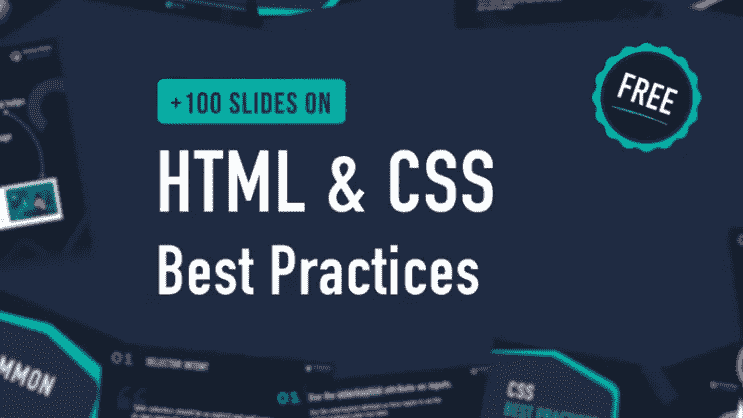
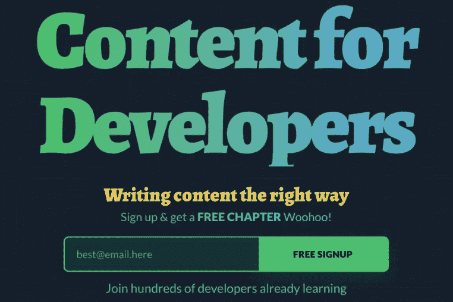

# 对软件开发人员有用的 5 本书

> 原文：<https://blog.devgenius.io/5-useful-books-for-software-developers-a5f405efe33e?source=collection_archive---------2----------------------->

## 帮助你成为一名成功的开发人员的优秀书籍列表。

安东尼·里埃拉在 [Unsplash](https://unsplash.com?utm_source=medium&utm_medium=referral) 上的照片

读书仍然是提高知识和学习新技能的好方法。作为一名软件开发人员，阅读专门为开发人员编写的书籍也是有益的。你可以学习许多技能，并随时了解科技行业的最新变化。

开发者书籍绝对可以帮助你成长事业，成为一名成功的开发者。这就是为什么在这篇文章中，我会给你一个软件开发人员的 5 本书的列表。所以让我们开始吧。

# 1.有效的开发组合

[构建有效的开发投资组合](https://www.joshwcomeau.com/effective-portfolio/)是乔希·科莫写的一本非常有用的书。它包含许多见解和技巧，帮助您创建一个令人印象深刻的开发者组合。Josh 在本书中分享了他审查数百个投资组合的所有知识和经验。

作者截取自 [joshwcomeau](https://www.joshwcomeau.com/effective-portfolio/) (外链)。

# 2.AWS 的优点

《AWS 的优点》是丹尼尔·瓦萨洛和乔希·普肖尔所写的一本很受欢迎的书。如果你不知道 AWS 控制台如何工作，这本书是给你的。

作者截取自 [Gumroad](https://dvassallo.gumroad.com/#MsVlG) (外链)。

# 3.10++作为开发者赚钱的方法

[开发人员赚钱的十种++方法](https://florinpop17.gumroad.com/l/makemoneydev)是由开发人员和内容创建者 Florin pop 编写的一本非常棒的电子书。弗罗林在这本电子书中介绍并解释了作为一名开发者获得收入的 10 种方式。

作者截取自 [Gumroad](https://florinpop17.gumroad.com/l/makemoneydev) (外链)。

# 4.100 张关于 HTML 和 CSS 最佳实践的幻灯片

乔治·莫勒的这本电子书附带了非常有用的幻灯片，帮助你在编写 HTML 和 CSS 代码时遵循最佳实践。如果你想提高你的 HTML 和 CSS 代码，这是一本很好的电子书。

由作者从 [Gumroad](https://georgemoller.gumroad.com/l/hQWSH?recommended_by=search&_ga=2.99154206.1055078509.1631917341-982968582.1599663920) (外链)截取。

# 5.面向开发者的内容

如今，写作是一项被严重低估的技能。作为一名开发人员，写作有助于提高你的知识，跟上时代，并建立一个在线形象。

[Content for Developers](https://writy.io/) 是一本很棒的书，它给你一些提示和见解，帮助你作为一名开发者开始以正确的方式编写内容。

由作者从[文字中截取](https://writy.io/)(外链)。

# 结论

正如你在上面的列表中所看到的，这些都是很棒的书籍，可以帮助你学习技能，提高知识，并作为一名开发人员发展你的职业生涯。这是一个巨大的有价值的内容，你可以消费成为一个成功的开发人员。

*感谢您阅读本文。此外，如果你发现我的内容有用，而你不是一个媒体成员，你可以抓住你的媒体成员* [*这里*](https://mehdiouss.medium.com/membership) *(媒体推荐链接)获得所有内容的无限访问和支持我们作为作家。*

**延伸阅读:**

 [## 面向所有前端开发人员的 6 个优秀网站

### 你可能不知道的有用网站列表。

javascript.plainenglish.io](https://javascript.plainenglish.io/6-awesome-sites-for-all-front-end-developers-d15835790796)  [## 解决编码问题的 7 个有用的 JavaScript 代码片段

### 您经常需要使用的 JavaScript 代码片段。

javascript.plainenglish.io](https://javascript.plainenglish.io/7-useful-javascript-code-snippets-for-solving-coding-problems-c146e768bb41)