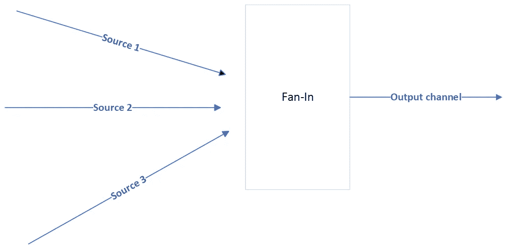
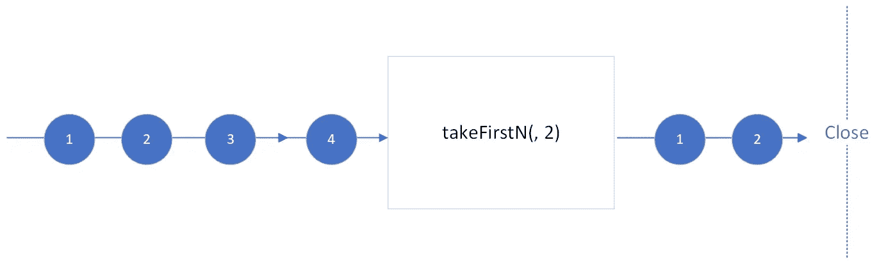
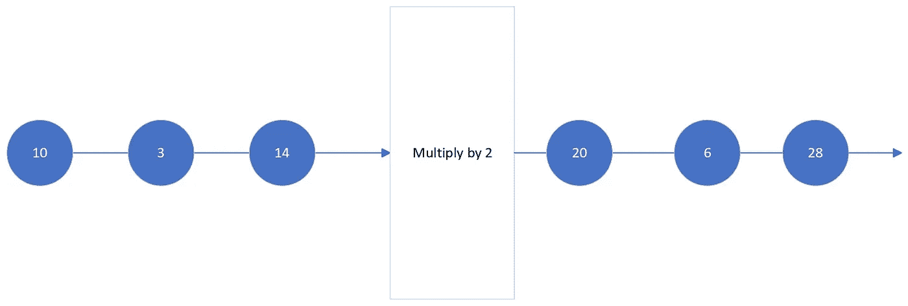
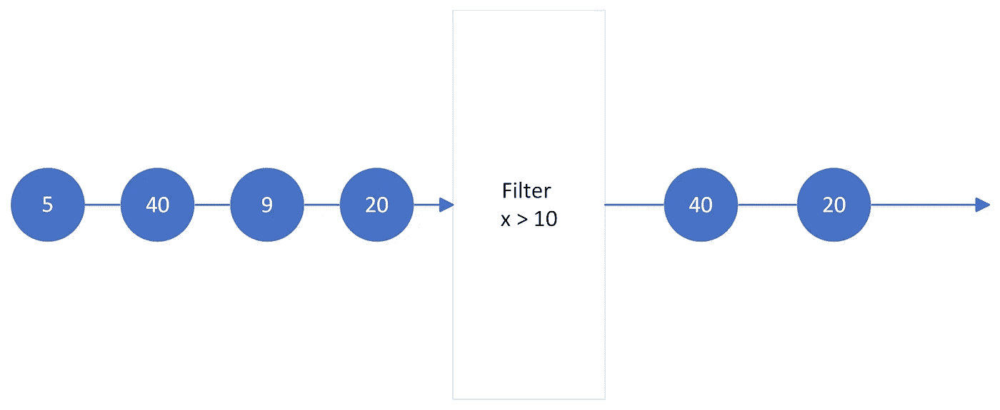

# GO 中的 5 种并发模式来增强您的下一个项目

> 原文：<https://blog.devgenius.io/5-useful-concurrency-patterns-in-golang-8dc90ad1ea61?source=collection_archive---------0----------------------->


照片由 [Fotis Fotopoulos](https://unsplash.com/@ffstop?utm_source=unsplash&utm_medium=referral&utm_content=creditCopyText) 在 [Unsplash](https://unsplash.com/s/photos/developer?utm_source=unsplash&utm_medium=referral&utm_content=creditCopyText) 上拍摄

并发编程是 Golang 提供的最有趣的特性之一。

并发背后的思想是同时处理不同的任务，它减轻了诸如在需要很长时间运行或完成的任务中被阻塞的问题。在 GO 中利用这一特性的主要工具有:

*   GO 例程:它由一个独立运行的函数组成。我们可以把它想象成运行在另一个轻量级廉价线程中的进程。
*   通道:它们提供了一种在并发运行的函数之间进行通信的方式，并在必要时使它们同步。

GO 例程与通道相结合，提供了一种执行独立任务并在它们之间进行通信的简单方法。

在我做 GO 开发人员的时候，我遇到过一些并发模式，它们解决了我们通常会遇到的常见问题。在这篇文章中，我将与你分享其中的五个，我相信它们可能会到来。

**待选完成结构**

在讨论模式本身之前。我认为将您的注意力吸引到一个相对简单的结构是很重要的，这个结构将在本文中广泛使用。

当我们运行和管理多个例程时，我们需要小心防止程序中的任何泄漏。一般来说，当一个 GO 例程留在我们的程序中，即使我们不再需要它，也会发生泄漏。解决方案是向例程发送一个信号，让它知道它可以退出。

实现这一点最常见的方法是将 for-select 循环与一个单独的通道结合起来，该通道向 GO 例程发送关闭信号。通常我们称之为 **done** 通道。

在本例中，当我们在单独的 GO 例程中运行函数 **printIntegers** 时，它将开始监听 **integerStream** 通道。每当我们不再需要后台运行的 **printIntegers** 函数时，我们可以通过简单地关闭 **done** 通道来消除它。

值得注意的是，我们可以使用上下文包来获得相同的效果:

你可以通过我关于如何在 Go 中使用上下文包的博客文章来了解更多关于上下文包的特性。

当上下文被取消时， **printIntegers** 函数将退出。考虑到这一点，我们可以开始探索其他模式，因为这个 for-select-done 结构将成为它们的构建块。

1.  **扇入模式**

假设我们从多个渠道接收数据。我们可能希望将来自几个源的数据重定向到一个流中。



扇入模式图。作者图片

最终，我们只需要管理一个数据源通道，而不是许多。这个模式出现在 Rob Pike 关于 *GO 的并发模式*的演讲中。你可以在 Youtube 上查看。

在实践中，可以通过设置一个新的输出通道并为每个数据源运行一个 GO 例程来实现，这只是另一个通道。

每个 GO 例程将负责监听特定的通道，并将接收到的数据转发到输出通道。通过这种方式，我们将所有的渠道整合成一个单一的渠道。下面的代码显示了实现细节:

分解上面的代码:

1.  一开始，我们设置了一个 **waitGroup** ，它应该等待 for 循环中生成的所有侦听器完成。
2.  在 for 循环中，我们将迭代 **n** 次，其中 **n** 是作为输入接收的 fetchers 的数量。在每一次迭代中，我们将启动一个新的 GO 例程来监听 fetcher。
3.  监听器例程由 for-select-done 结构组成。在每次迭代中，要么它将发送新数据到 **combinedFetcher** 通道，要么它将在上下文取消时退出。
4.  最后，我们运行另一个 GO 例程作为清理。在关闭 **combinedFetcher** 通道之前，它等待所有监听器完成。

2.**从流中取前 n 个值**

当我们只需要从通道中获取前 5、10 或前 **n** 值时，下一个模式可能会有用。



取前 N 个值。作者图片

想法是创建一个有限量输出的通道。假设我们正在从数据流中读取消息，我们只对前 5 条消息感兴趣。还有，让我们考虑一下，我们对数据源本身没有控制权，我们只能从中读取数据。这个模式给出了这个问题的解决方案:

分解函数**内部发生的事情 takeFirstN** :

1.  我们创建一个新的通道来传递接收到的数据。
2.  创建了一个新的 GO 例程。此外，它还会延迟**取料通道**的关闭。
3.  在 GO 例程中，for-select 和 done 模式已经过修改。我们不是运行无限的 for 循环，而是通过输入 **n.** 来限制它的迭代次数

工作示例:

```
0
1
2
3
4
```

我们能够从 **range10** 通道获得前 5 个输入，而无需关闭它或做任何类似的事情。

3.**认购模式**

这种模式基于 Google I/O 2013——高级 Go 并发模式对话(你可以在这里观看)。这种模式与这里展示的是一样的，只是做了一些修改，让我看得更清楚。

假设我们想听一个定期发生的事件。例如:我们需要每 15 秒从一个 API 获取更新。这种模式使用一个只负责交付新数据的订阅接口:

```
type Subscription interface {
  Updates() <-chan Item
}
```

另一方面，我们将使用另一个接口作为抽象来获取我们需要的数据:

```
type Fetcher interface {
  Fetch() (Item, error)
}
```

对于其中的每一个，我们都有一个具体的类型来实现它们。

对于订阅:

```
func NewSubscription(ctx context.Context, fetcher Fetcher, freq int) Subscription {
  s := &sub{
    fetcher: fetcher,
    updates: make(chan Item),
  }// Running the Task Supposed to fetch our data
  go s.serve(ctx, freq) return s
}type sub struct {
  fetcher Fetcher
  updates chan Item
}func (s *sub) Updates() <-chan Item {
  return s.updates
}
```

我们将更详细地介绍在 **serve** 方法中发生了什么。

对于 fetcher:

```
func NewFetcher(uri string) Fetcher {
  f := &fetcher{
    uri: uri,
  } return f
}type fetcher struct {
  uri   string
}
```

**内发球法**

**serve** 方法由 for-select-done 类型的循环组成:

让我们把它分解一下，以了解那里发生了什么:

1.  第一个 select case 将由 time ticker 定期激活。关于 fetcher，我们将在另一个 GO 例程中运行 fetch 作业，这样如果它花费的时间更长，我们就不会被阻塞。
2.  当获取结果最终准备好发送时，它将在第二个选择情况下被接收。如果有错误，它将从 select 语句中断，并等待下一次迭代。
3.  第三种情况是等待上下文终止的标准情况。

3.5 **订阅模式修改**

显示的订阅模式对我来说非常有效。实际上，它有一个不那么容易捕捉的 bug。

在第 26 行中，我们向**更新**通道发送数据，订户正在等待接收。问题是:如果订阅者没有准备好读取数据，那一行代码将保持阻塞状态。

幸运的是，有一种方法可以避免这个问题，那就是在 select 语句中将该行转换成一个单独的 case。

```
case s.updates <- fetched:
```

并在 for-select 循环之前声明提取的变量。

但是，如果提取的数据没有准备好发送呢？

事实证明，这里可以使用**零通道**的属性。每当我们试图写入一个零通道，它将保持阻塞。

```
var fetchResponseStream chan Item
fetched := Item{//Some data here//}fetchResponseStream <- fetched // it blocks here
```

此外，我们将创建一个布尔值 **pending** 来跟踪获取的项目是否可以发送:

```
var fetched Item
var fetchResponseStream chan Item
var pending bool...
for {
  if pending {
    fetchResponseStream = s.updates
  } else {
    fetchResponseStream = nil    
  }
  select {
  ...

  case: fetchResponseStream <- fetched:
    pending = false
```

将所有东西放在一起:

有了**待定**变量和 **fetchResponseStream** 通道，我们就能够降低在某个选择案例中被阻塞的可能性。

在主功能中:

**地图，滤镜**

当我们处理数据流时，我们可能希望对传入的值进行操作。乘法，除法，限制在一个固定的界限，有许多可能性。

在现代 Javascript 中，数组有一些内置的方法，如 **map** 和 **filter、**，用于操作或选择数组中的数据。为什么不应用这个概念来处理来自通道的流呢？

**4。地图图案**

在简单乘以 2 的例子中:



地图模式图。作者图片

为了简单起见，我们假设输入和输出的数据类型是整数通道。

代码解释:

1.  它首先创建一个新的通道，启动一个新的 GO 例程，并推迟通道关闭。
2.  for-select-done 循环监听**输入流**。
3.  我们检查 **inputStream** 是否关闭，如果是，函数返回。
4.  另一个 select 语句在里面，它将等待 **done** 信号或者能够将数据转发到 **mappedStream** 通道。这最后一步很重要，以确保当 done 通道发送其信号时，GO 例程将始终退出。

一个小的区别是，我们使用一个 done 通道来终止 GO 例程，而不是上下文。

当构建一个必须经过多个阶段的数据管道时，这种模式可能会派上用场。它允许我们将不同的操作逻辑分成几个步骤。

工作示例:

```
0
10
20
30
40
50
60
70
80
90
```

**5。过滤模式**

假设我们有一个整数流，我们只想得到大于 10 的值。我们可以应用这种模式让我们感兴趣的值通过:



过滤模式。作者图片

就像在 Map 模式中一样，我们将假设输入和输出类型是整数的通道，但是它可以扩展到任何其他类型:

这里我们基本上拥有与图**模式**相同的结构，唯一的区别是**操作符**函数返回一个布尔值。如果它返回 true，那么，把它发送到输出流，否则，我们就丢弃它。

工作示例:

```
0
2
4
6
8
```

**结论**

这五种模式是构建更大更复杂的 Golang 应用程序的基础。这些是解决您在 GO 中处理并发时可能遇到的问题的解决方案。此外，您可以修改、扩展和创建基于它们的新模式！

谢谢你坚持到最后！如果这篇文章对你有帮助，可以考虑在 [Medium](https://medium.com/@leonardo5621_66451) 上关注我，了解更多类似的故事！

**参考文献**

以下是我用来写这个故事的参考资料:

*   围棋中的并发性凯瑟琳·考克斯-布戴，第四章。Go 中的并发模式。可在:[https://www . oreilly . com/library/view/concurrency-in-go/9781491941294/ch04 . html](https://www.oreilly.com/library/view/concurrency-in-go/9781491941294/ch04.html)
*   Rob Pike 的 Google I/O 2012-Go 并发模式演讲。上市地点:[https://www.youtube.com/watch?v=f6kdp27TYZs](https://www.youtube.com/watch?v=f6kdp27TYZs)
*   Google I/O 2013—same er aj mani 的高级 Go 并发模式。可在:[https://www.youtube.com/watch?v=QDDwwePbDtw](https://www.youtube.com/watch?v=QDDwwePbDtw)