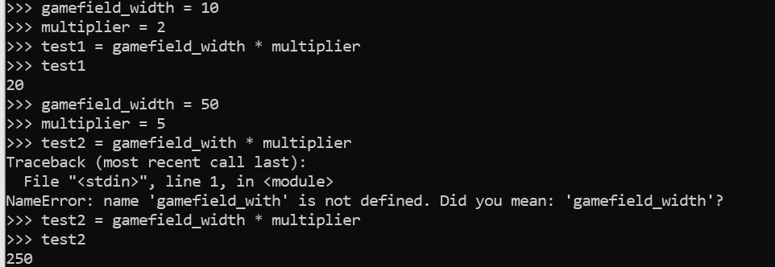

# Python 中的 5 个变量——Python 初学者

> 原文：<https://blog.devgenius.io/5-variables-in-python-python-for-beginners-2e615211a2e7?source=collection_archive---------7----------------------->

## Python 中最重要的东西

我将在本文中用简单易懂的方式向您解释它们！**我们开始吧！**

照片由[简·kopřiva](https://www.pexels.com/@koprivakart?utm_content=attributionCopyText&utm_medium=referral&utm_source=pexels)从[派克斯](https://www.pexels.com/photo/photo-of-a-red-snake-3280908/?utm_content=attributionCopyText&utm_medium=referral&utm_source=pexels)拍摄

## 如何初始化(定义)变量？

> 变量是一个占位符。比如 x = 1。然后你说 x + 2 = 3。现在你必须把方程转换成 x 是什么(x + 2 = 3|-2)。3 – 2 = 1.太好了，是 1！这是我们给 x 的值。

Python 中的变量也是如此。但是你可以用它们做更多的事情。在 Python 中，你可以把变量名想象成一个盒子。在此框中，您输入想要存储在变量(框)中的值。*在 Python 中，你可以通过写变量名、等号(=)和变量值来实现，例如可以是字符串或整数*(我们学过的两种数据类型，对吧？).但是在变量中存储其他数据类型也是可能的，我们将在本系列的后面学习它们。关于如何初始化(也称为定义)变量的几个例子:

几个关于如何初始化(定义)变量的例子

请记住，您可以再次使用上面的方案来覆盖变量的值。就像这样:

覆盖变量

供你想象:盒子(变量)扔掉旧值('杰夫')，得到一个新值('吉米')(可怜的杰夫)。

## 为什么以及如何使用变量？

**你可能想知道为什么要在 Python 中使用变量。**好吧，想一想这个例子:*你有几千行代码，写了一个有 gamefield 的游戏。假设游戏场的宽度在开始是 10，你想每一轮都乘以 2，所以游戏场变大了(10*2=20，20*2=40，…)。当然，你可以像上面这样写下来，但是你也可以使用一个名为 gamefield_width 的变量，将其设置为 10，并使用代码行 game field _ with * 2 = game field _ width。现在你将 gamefield_width 设置为自身乘以 2。那会节省你很多时间。另外，如果你想从 10 到 5 改变游戏区域，你可以只改变一行代码，让其他行保持原样。你还可以进一步说乘数= 2。现在你也有一个乘数变量，如果你想把它改成 5，你也可以用一行代码。那会节省你许多写作和计算的时间！相信我！*

将变量设置为自己的值乘以 2

图片中的例子——不要介意我拼错了变量名，现在这并不重要

太棒了。现在有几件事要给变量命名。

## 如何命名变量(规则和准则)？

*   变量名中不允许有空格(my variable)，允许使用下划线(my_variable)或大小写(my variable)；对于 Python，建议使用下划线
*   不允许使用特殊字符(my_$vari&able()，只能使用字母、数字和下划线(my_variable，my_variable2)
*   名称不允许以数字(54)开头，最好使用字母(number_54)或更好的名称来描述变量的使用情况(例如乘数)

另一件要记住的事情是，你应该用一种有用的方式给你的变量命名。 *不要取像 x 或 y 这样的名字(我知道我有时在本文中这样做，但那只是为了向您展示机制是如何工作的)。想象一下，一年后你回到代码中，只看到 x 和 y。代码会很难理解…* **所以用一种有用的方式命名你的变量。如果变量代表用户的余额，则使用 user_balance，如果变量代表用户的名称，则使用 user_name。要有创造性，但是也不要给变量取太长的名字(有时你还是要把它们写出来读一读)。**

为了了解变量，本文中还有很多东西我没有向您展示。我只是给你看了最重要最基本的东西。其他的事情也会随后发生。

同样，你会看到 Python 编码中的许多东西就像在“真实世界”中一样。

和往常一样，如果你有任何关于变量、Python 或一般编码的问题，请在下面的评论中提出。

**直到那时！**

*l0ckD2wN*