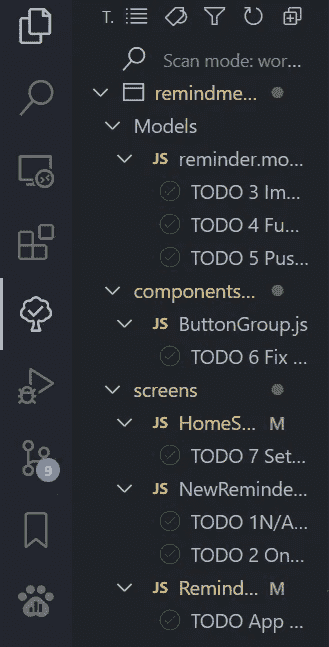
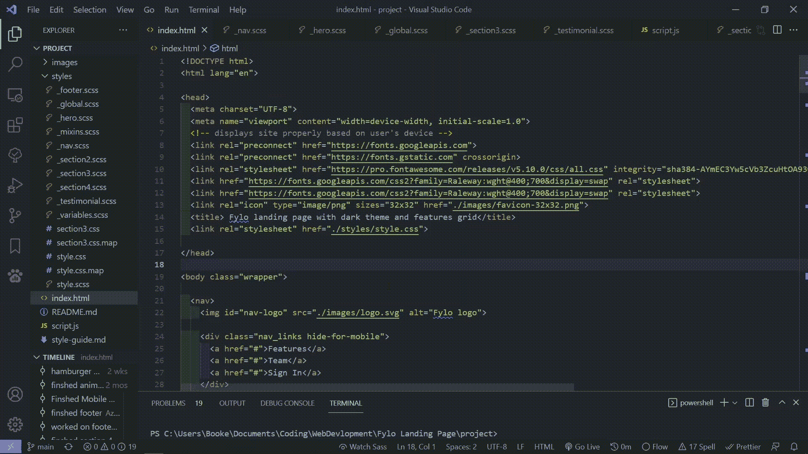
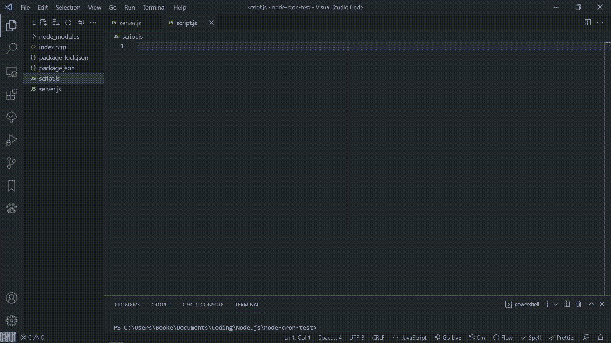
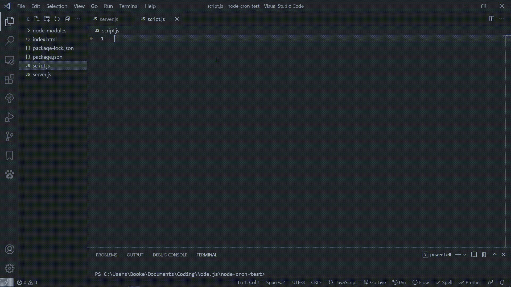

# 5 VS 代码扩展您需要提高您的生产力

> 原文：<https://blog.devgenius.io/5-vs-code-extensions-you-need-to-increase-your-productivity-d56eee4d9684?source=collection_archive---------8----------------------->

布莱克·康纳利在 [Unsplash](https://unsplash.com?utm_source=medium&utm_medium=referral) 上的照片

生产力是成为一名优秀开发人员的重要因素。

有时期限很紧(而且不切实际),重要的是我们要在最短的时间内完成最多的*质量*的工作

这就是为什么我编制了一个 5 个 VS 代码扩展的列表，它可以让你在不降低工作质量的同时提高工作效率

# 1.待办事项树

TODO tree 是帮助你组织和计划项目的一个很好的扩展。

这个扩展的作用是在 vs 代码中添加一个侧边栏，列出所有的 TODOs 和 FIXMEs 所在的文件。

如果你使用 TODOs 来记住所有需要完成的任务，并且不记得它们在哪里，这是很有帮助的。

[链接](https://marketplace.visualstudio.com/items?itemName=Gruntfuggly.todo-tree)

行动中的待办事项树

# 2.实时服务器

我认为 Live Server 是使用 VS 代码进行 web 开发时可以使用的最重要的***扩展之一！***

Live Server 允许您为静态和动态服务器启动本地开发服务器。

这使得 web 开发变得非常非常容易，因为你不必等待你的站点被托管来查看它将会是什么样子。

这大大减少了创建网站所需的开发时间。

哦，我有没有提到 Live Server 有一个热 Realod 功能，这意味着你可以看到你所做的改变？

[链接](https://marketplace.visualstudio.com/items?itemName=ritwickdey.LiveServer)

一键启动 LiveServer

# 3.Javascript(es6)代码片段

我相信任何减少实际编码量的扩展都是好的扩展。

这就是 Javascript(es6)代码片段的用武之地。

Javascript(es6)代码片段是 Javascript 的一个扩展，包含各种各样的代码片段。

这些代码片段可以让创建 forEach 循环和导入模块变得非常简单，因为您只需要键入 3 个字符，剩下的工作由 es6 代码片段来完成。

[链接](https://marketplace.visualstudio.com/items?itemName=xabikos.JavaScriptSnippets)

使用 Es6 片段

# 4.ES7 React/Redux/graph QL/React-本机代码片段

这个扩展与这个列表中的前一个扩展非常相似，只是它有 react、redux、grapql 和 react-native 的代码片段。

我主要使用这个扩展在 react 和 react-native 中快速创建功能组件。

使用 React/Redux/GraphQ/React-Native 片段

[链接](https://marketplace.visualstudio.com/items?itemName=dsznajder.es7-react-js-snippets)

# 5.瓦卡提时间

如果你需要自动跟踪你花在编码上的时间，WakeTime 是一个很好的扩展。

WakeTime 不仅仅是跟踪你花在编码上的时间。它还允许您查看使用什么编辑器、语言和操作系统来编码。

[链接](https://wakatime.com/vs-code)

# 结论

感谢您阅读完我的文章**‘5 VS 代码扩展你需要增加你的生产力**。如果你有任何问题，请随意提问，我会尽快回答。

我希望你有美好的一天。如果你是中级新手，你可以点击这里的链接[加入。](https://bookeraziz.medium.com/membership)

 [## 你可能想知道的 7 个备忘单

### 1.超赞的备忘单

blog.devgenius.io](/7-cheatsheets-you-might-wanna-know-about-6aa3adfa7909)  [## 6 VS 代码生命质量扩展

### 这些扩展可能不会让你更有效率，但是它们会让你的生活变得更加轻松

blog.devgenius.io](/6-vs-code-quality-of-life-extensions-acbfd1425561)