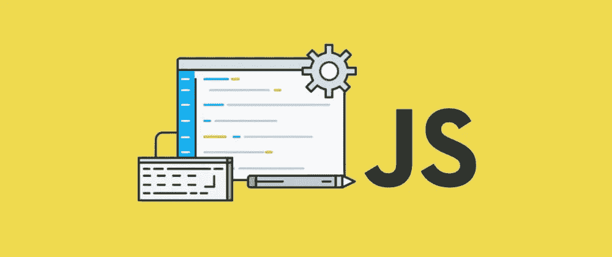

# 检查对象是否为空的 5 种方法

> 原文：<https://blog.devgenius.io/5-ways-to-check-if-an-object-is-empty-b501dab250e5?source=collection_archive---------3----------------------->

了解如何在 Javascript 中轻松检查对象是否为空。



今天你将学习如何在 Javascript 中检查一个对象是否为空/是否有任何值。

如果您是一名 FE 开发人员，您可能会大量使用对象，并且不时需要检查对象是否有任何值或为空。没有你应该使用的“黄金”金块，但是有许多方法可以做到这一点。我将向您展示如何在不使用 lodash 等库的情况下自己编写代码。

我们开始吧。

在开始展示这些方法之前，请注意，我将在整篇文章中使用以下对象:

```
const person = {
 firstName: 'Nicky',
  lastName: 'Christensen',
  age: 37,
  country: 'Denmark'
}
```

# Object.keys()

通过使用 Object.keys()并检查其长度，您可以很容易地确定一个对象是否有任何值:

```
const hasValueOne = Object.keys(person).length > 0; //true
```

# Object.entries()

除了使用 Object.keys()，您还可以使用 Object.entries()，同样通过检查长度来确定对象是否有任何值。

```
const hasValueTwo = Object.entries(person).length > 0; //true
```

# 函数和 for 循环

您还可以创建一个可以用您的对象调用的函数。在函数中，您可以遍历对象的所有属性:

```
function isObjectEmpty(object) {
  for (const property in object) {
    return false;
  }
  return true;
}
console.log('Three', isObjectEmpty(person)); //false
```

# 函数和 JSON.stringify()

另一个你可以利用的小东西是 JSON.stringify。如果你的对象是空的，它将返回{}。

```
function isEmptyObject2(obj){
    return JSON.stringify(obj) === '{}';
}
console.log('Four', isEmptyObject2(person)); //false
```

# Object.getOwnPropertyNames()

在对象上，您还可以使用 getOwnPropertyNames()并检查其长度，如下所示:

```
const hasValueFive = Object.getOwnPropertyNames(person).length > 0 //true
```

这就是了。检查对象是否为空的 5 种方法。我希望你喜欢它，并希望学到一点。

感谢你的阅读，我希望你喜欢这篇文章，如果是的话，请点击按钮支持我。

附注:首先，你应该收到我的邮件。 [***做到这里*** *！*](https://nickychristensen.medium.com/subscribe)

*其次，如果你自己喜欢体验媒介，可以考虑通过报名成为会员* *来支持我和其他成千上万的作家* [***。***](https://nickychristensen.medium.com/membership) *每月只需花费****【5】****美元，它极大地支持了我们，作家，你也有机会用你的写作赚钱。在过去的一个月里，我赚了 150 美元。通过这个链接* [***报名***](https://nickychristensen.medium.com/membership) *，你就直接用你的一部分费用支持我，不会多花你多少钱。如果你这样做了，万分感谢。*

[](https://medium.com/js-dojo/vue-3-tips-best-practices-54aec91d95dc) [## Vue 3 提示和最佳实践

### 我将分享我的知识，在使用 Vue 的最新版本 Vue3 时给你一些提示和最佳实践。

medium.com](https://medium.com/js-dojo/vue-3-tips-best-practices-54aec91d95dc) [](https://javascript.plainenglish.io/10-tips-for-frontend-developers-9c0dfc705b88) [## 前端开发人员的 10 个有用提示

### 通过这些技巧成为更好的前端开发人员。

javascript.plainenglish.io](https://javascript.plainenglish.io/10-tips-for-frontend-developers-9c0dfc705b88) [](https://javascript.plainenglish.io/how-to-become-a-great-developer-it-requires-more-than-being-able-to-write-code-d1f9e856f2dc) [## 如何成为一名优秀的开发人员——这需要的不仅仅是会写代码

### 成为一名优秀的开发人员不仅仅是写干净、好的代码！

javascript.plainenglish.io](https://javascript.plainenglish.io/how-to-become-a-great-developer-it-requires-more-than-being-able-to-write-code-d1f9e856f2dc) [](https://javascript.plainenglish.io/10-developer-tools-that-you-didnt-know-that-you-needed-8b61b3306b07) [## 10 个你不知道自己需要的开发工具

### 有用的开发工具，让您的开发生活更加轻松。

javascript.plainenglish.io](https://javascript.plainenglish.io/10-developer-tools-that-you-didnt-know-that-you-needed-8b61b3306b07) 

如果你想找个时间和我聊聊，可以关注我的 [*推特*](https://twitter.com/nickycdk)*|*[*LinkedIn*](https://www.linkedin.com/in/dknickychristensen/)*或者直接访问我的* [*网站*](https://nickychristensen.dk/) *。*