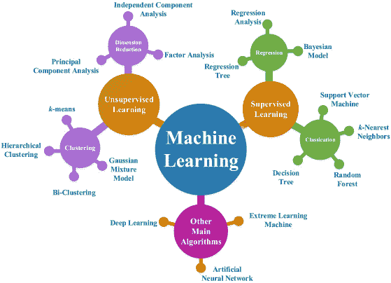
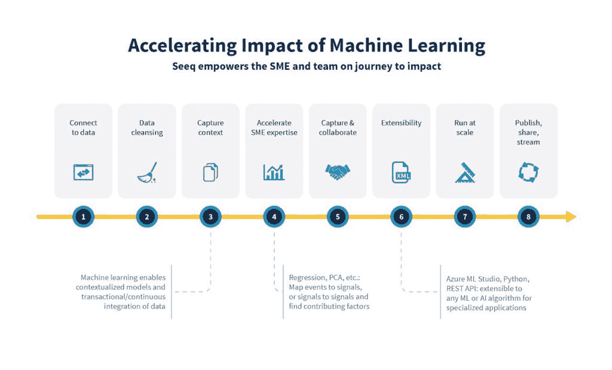
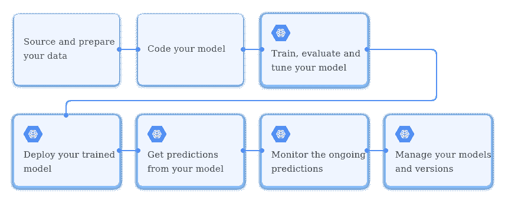

# 将机器学习融入商业模式的 5 种方法

> 原文：<https://blog.devgenius.io/5-ways-to-incorporate-machine-learning-into-your-business-model-cd92bb981d4e?source=collection_archive---------10----------------------->

机器学习已经成为主流，这是一件好事，因为它有可能以我们甚至无法想象的方式改善我们的生活。

***但是如何入门这个新兴领域呢？***

***它会给你的生意带来什么好处？***

这篇博客将让你了解如何将机器学习融入到你的商业模式中，并提供一些目前如何在现实世界应用中使用的例子。

通过将机器学习融入到你的商业模式中，你将能够更好地预测未来会发生什么，并相应地做好准备，这将使你的公司保持盈利，让你的客户满意。

**让我们简单介绍一下机器学习&的现状:**

每天产生的原始数据量呈指数级增长，这将使数据收集在不久的将来变得至关重要。此外，企业需要找到快速有效地处理所有数据的方法。

**机器学习就是答案。**

**Img src:**[谷歌](https://www.google.com/search?q=Incorporate+Machine+Learning+Into+Your+Business+Model&client=ubuntu&hs=zGc&channel=fs&sxsrf=AOaemvIfaL10RD1Hd-JeRbESiUwqi0C8mA:1642053413810&source=lnms&tbm=isch&sa=X&ved=2ahUKEwjYobrTha71AhXEH7cAHTGqAwQQ_AUoAXoECAEQAw&biw=1600&bih=731&dpr=1#imgrc=qMtHpK6S0KSQWM&imgdii=hHdmiORWIH0n1M)

它被称为人工智能的一个子集，赋予计算机无需显式编程就能学习的能力。机器学习通过帮助企业提高决策过程的准确性来增强企业的能力。

这有助于他们比竞争对手更好地预测未来，从而带来更高的收入增长。

**下面是一些不同行业的机器学习 app 的例子:**

->**医疗**中，通过皮肤科医生检查患者照片来识别皮肤癌。

->在**金融**中，机器学习通过跟踪不同地理区域的数据来分析价格。

->在**现场服务**中，机器学习用于优化技术人员的路线和时间表，从而提高他们的操作效率。

随着每天产生大约 25 万亿字节的数据，对机器学习应用的需求与日俱增。很明显，未来属于那些知道如何在业务运营中利用机器学习的企业。

在这里，介绍一些重要的步骤，你可以将机器学习融入你的商业模式。

**第一步——定义任务**

在将机器学习应用于业务流程之前，您首先需要定义您的应用程序试图做什么。它在执行什么任务？你如何衡量它的性能？它能满足你的什么需求？最后，你到底为什么要建造它？

在许多情况下，定义一项任务意味着将一些大问题分解成小问题。例如，如果您的应用程序使用机器学习进行客户服务(如 Zendesk)或欺诈检测(如 PayPal ),您必须回答以下问题:

客户和欺诈者的良好反应是什么？

在任何给定的情况下，我们的系统应该如何响应？

因此，你会想在这里深入挖掘，并确保在开始实现之前，你的机器学习解决方案的每一个部分都已经考虑清楚了。

***记住:*** *如果您的应用程序更复杂——例如，如果它涉及分析一段时间内的销售趋势——您可能会发现自己在整个开发过程中在确定任务和定义目标之间来回移动。*

为此，你需要对这些问题中的每一个给出明确的答案，这些答案可以被你团队中从事机器学习项目的每个人所利用——你将知道成功的结果是什么样的。

而且，你可以[**聘请可靠的机器学习 app 开发公司的机器学习开发者**](https://www.valuecoders.com/hire-developers/hire-machine-learning-experts?utm_source=mediumangn12&utm_medium=medium&utm_id=machinelearning) 。

**步骤 2——收集训练数据**

在第一步中，你通过回答几个重要问题来确定你的公司是否会从机器学习中受益。如果你决定是，那就该收集一些训练数据了。

首先要确保你的决策变量是以一种算法易于阅读的格式定义的。然后收集这些决策变量的历史数据，以便算法可以学习并做出准确的预测。

Img src: [谷歌](https://www.google.com/search?q=how+to+Incorporate+Machine+Learning+Into+Your+Business+Model&tbm=isch&ved=2ahUKEwi-m4bDia71AhVbjtgFHcOrAasQ2-cCegQIABAA&oq=how+to+Incorporate+Machine+Learning+Into+Your+Business+Model&gs_lcp=CgNpbWcQA1CvD1isFmDMF2gAcAB4AIABjQGIAYQIkgEDMC44mAEAoAEBqgELZ3dzLXdpei1pbWfAAQE&sclient=img&ei=NcPfYf6sCNuc4t4Pw9eG2Ao&bih=731&biw=1600&client=ubuntu&hs=zGc#imgrc=BzJkVSjtj0DFyM&imgdii=MC_OK3fWm_gTKM)

例如，如果你想帮助医生预测哪些病人可能需要在特定的医院接受特定的治疗，你就需要过去有类似情况的病人是如何被治疗的例子。

在这里，如果您的特定业务问题没有现成的数据集，那也没关系—现在就开始收集您自己的数据吧！虽然收集可能需要数年时间(积累所有谷歌搜索数据需要数十年时间)，但即使是小规模的收集也可以用于训练机器学习模型。

**步骤 3 —选择正确的算法**

首先考虑你希望你的机器学习算法做什么是很重要的。你在寻找一种可以进行更精确预测的算法吗？或者，您是否正在尝试构建一个预测模型，以便在新数据到来时能够从中学习？

一些算法有内在的优点和缺点，这取决于它们是为解决什么问题而构建的。例如，某些算法更擅长处理分类变量(即，归入类别的事物)，而其他算法则处理数值变量(例如，距离测量)。

一旦您了解哪种类型的算法最适合您的任务，就更容易确定它将如何与您现有的业务流程和技术平台集成。

**第四步——训练模型**

根据您的数据和手头的问题，您可以用许多不同的方式来合并机器学习。为了确定哪一个最适合你，问问你自己:我的变量是可量化的吗？有史料吗？

一旦你回答了上述问题，找到哪种类型的机器学习模型最适合你的用例应该是相当简单的。

IMg src: [谷歌](https://www.google.com/search?q=how+to+Incorporate+Machine+Learning+Into+Your+Business+Model&tbm=isch&ved=2ahUKEwi-m4bDia71AhVbjtgFHcOrAasQ2-cCegQIABAA&oq=how+to+Incorporate+Machine+Learning+Into+Your+Business+Model&gs_lcp=CgNpbWcQA1CvD1isFmDMF2gAcAB4AIABjQGIAYQIkgEDMC44mAEAoAEBqgELZ3dzLXdpei1pbWfAAQE&sclient=img&ei=NcPfYf6sCNuc4t4Pw9eG2Ao&bih=731&biw=1600&client=ubuntu&hs=zGc#imgrc=KdfvsKZKnjv_FM&imgdii=o1SrX8sfpoVkkM)

例如，如果您想要一个基于用户购买历史的推荐系统，那么像协作过滤器这样的推荐引擎就很适合您。

但是，如果你想要一个自动签名系统，当满足某些标准(例如不在办公室)时，可以通过电子邮件发送文档，那么人工神经网络可能就是你要的人。它的目标是使用模式识别对数据进行分类。

此外，如果机器学习听起来太复杂或风险太大(让我们面对现实吧——它可能会)，考虑用现有的工具简单地分析你现有的数据集，这些工具不需要专有知识，比如可视化软件。

**步骤 5——评估和部署**

最后一步比构建算法或撰写商业计划更抽象一些。如果不是最重要的步骤，这也可能是其中之一。

如果你没有先用某种可执行代码实现你的算法就一直做到了第五步，那么不要对自己太苛刻。

在这里，您需要首先进行评估，然后为其他人部署您的解决方案。所以，要确保它有效，确保人们喜欢它。

**重要的最后一步:雇佣机器学习专家**

你可能有全职的机器学习服务人员，他们拥有广泛的人工智能/人工智能知识，所以你可能能够利用他们的专业知识。

但如果你没有，你肯定会受益于专家的参与，即 [**从一家知名的**](https://www.valuecoders.com/hire-developers/hire-machine-learning-experts?utm_source=mediumangn12&utm_medium=medium&utm_id=machinelearning) **[**机器学习 app 开发公司**](https://www.valuecoders.com/ai-ml-development-services-company?utm_source=mediumangn12&utm_medium=medium&utm_id=machinelearning) 聘请机器学习开发者** 。

即使你有现场人才，也可以考虑使用外包合作伙伴来帮助你根据自己的需求定制特定的机器学习解决方案。像 ValueCoders 这样的小众专家很有可能找到你没有考虑过的应用。

# **结论:**

现在，你必须知道，机器学习将成为你的业务运营和接触客户的越来越重要的组成部分。

因此，确保你跟上了机器学习到底是什么，它如何适合你的行业，以及你如何才能最好地融入它。然而，可能需要花费一些时间和精力来充分理解 ML，以便在您的业务模型中使用。

但是，如果使用得当，它可以改善客户服务，通过对哪些产品或服务最适合个人客户进行更具预测性的建模来提高盈利能力。

最后，将机器学习整合到您的业务模型中起初会很有挑战性，但清楚地了解它的能力将有助于您根据需要进行调整，并就何时(或何时)将它整合到您的工作流程中做出明智的决定。